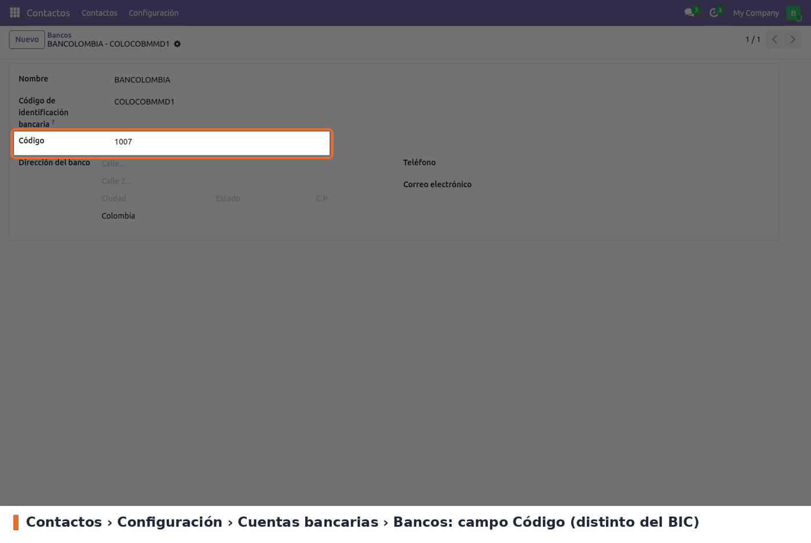
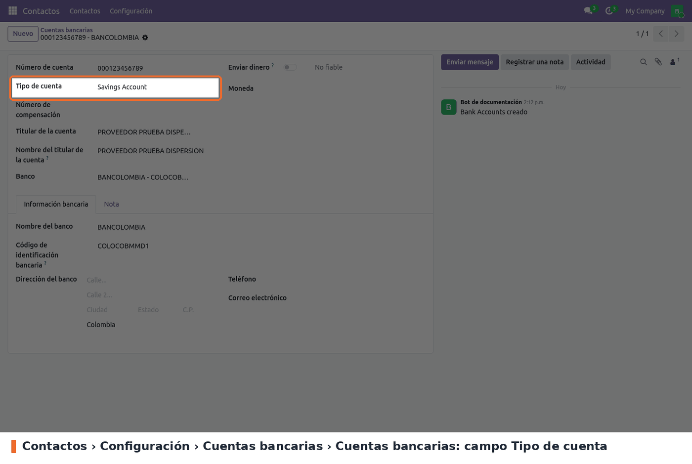
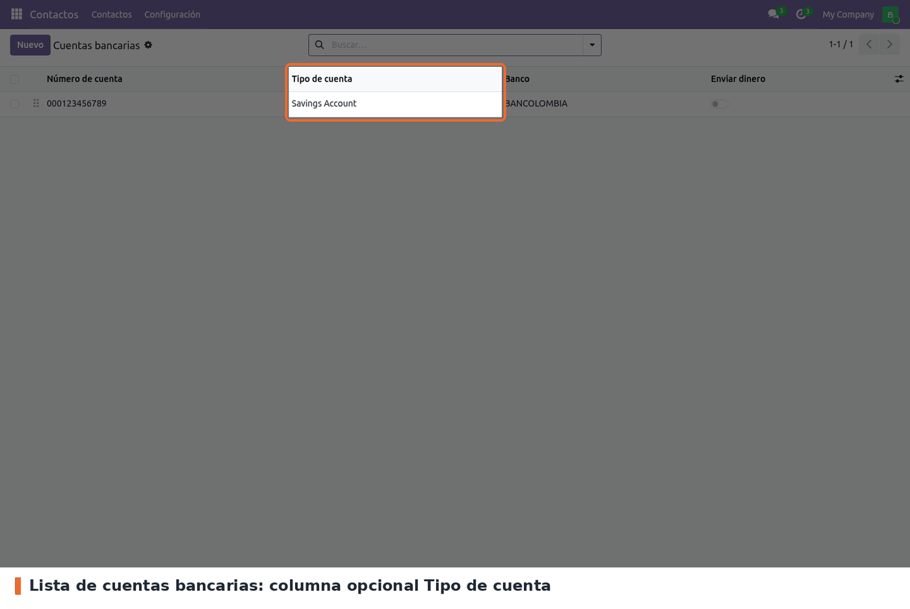

No hay ajustes que activar. Lo que hay que dejar bien cargado son los datos de bancos y cuentas.

**1. Código del banco.** Los 68 bancos colombianos se instalan con el código ya puesto. Para
revisarlo o cargarlo en un banco nuevo: *Contactos › Configuración › Cuentas bancarias › Bancos*,
campo **Código**.

**2. Tipo de cuenta del proveedor.** En cada cuenta bancaria de proveedor que se vaya a pagar por
dispersión: *Contactos › Configuración › Cuentas bancarias › Cuentas bancarias*, abrir la cuenta y
elegir el **Tipo de cuenta**. El banco de la cuenta tiene que ser uno con **Código**.

La lista de cuentas bancarias trae la columna **Tipo de cuenta** (opcional, visible por defecto),
para revisar de un vistazo qué cuentas faltan.

A tener en cuenta:

- **En Odoo 19 el tipo de cuenta no se ve en la ficha del contacto.** La pestaña *Facturación* del
  contacto muestra las cuentas bancarias como etiquetas, sin columnas. El tipo de cuenta se carga
  desde *Cuentas bancarias* (o abriendo la etiqueta).
- **Permisos.** Ver el historial necesita *Contabilidad / Facturación* (lee, crea y modifica, no
  borra) o *Contabilidad / Administrador* (todo). El menú de *Configuración* lo ve solo
  *Contabilidad / Administrador*.
