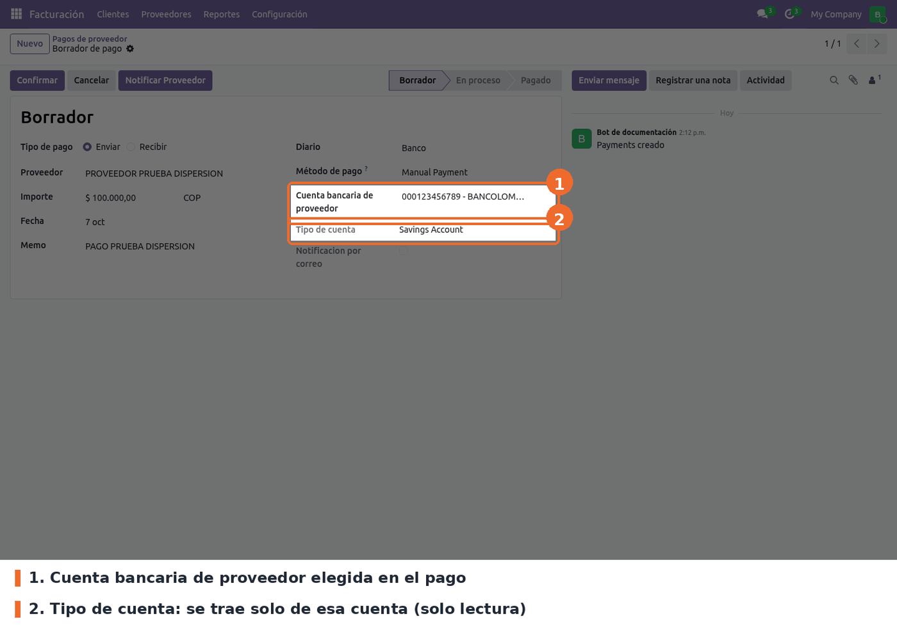
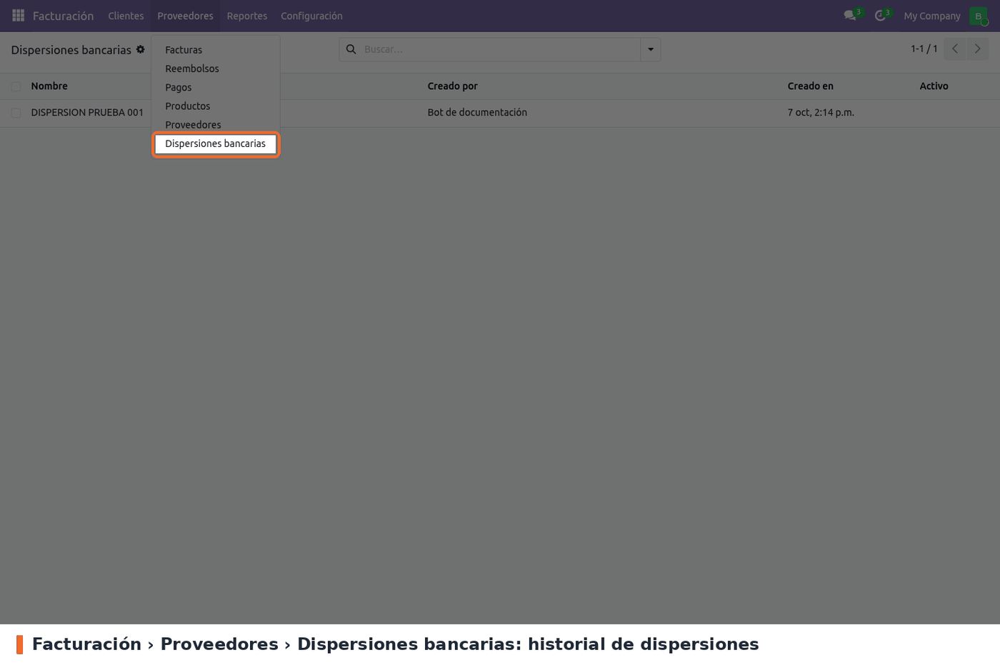
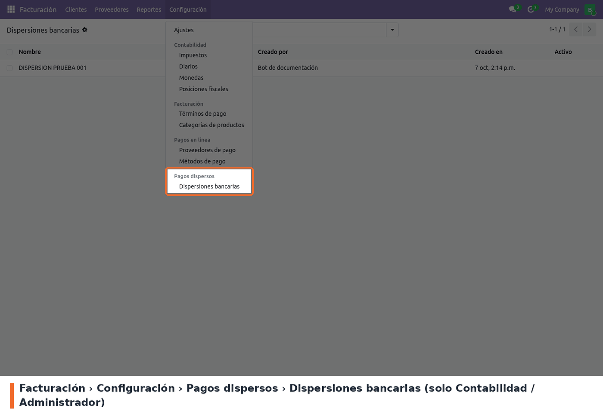
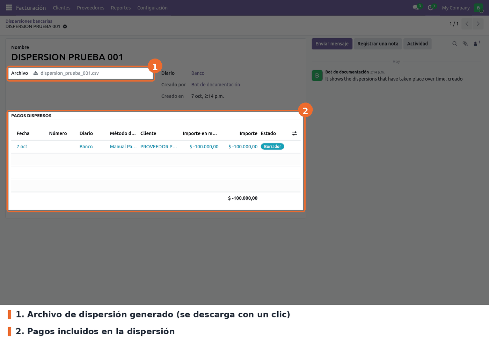

**En el pago a proveedor.** En *Facturación › Proveedores › Pagos*, un pago saliente con diario de
banco y un método que pida cuenta (por ejemplo *Manual Payment*) muestra la **Cuenta bancaria de
proveedor** y, debajo, su **Tipo de cuenta**. No se edita en el pago: viene de la cuenta bancaria.
Si sale vacío, hay que completarlo en la cuenta (ver *Configuración*).

El pago a proveedor trae además una zona de pestañas vacía (`dispersion_banks`) donde los módulos
de cada banco agregan sus datos. Con solo este módulo instalado no se ve nada ahí.

**Historial de dispersiones.** *Facturación › Proveedores › Dispersiones bancarias* lista las
dispersiones hechas, con quién y cuándo las creó.

El mismo historial está en *Facturación › Configuración › Pagos dispersos › Dispersiones bancarias*,
solo para *Contabilidad / Administrador*.

Cada dispersión guarda el archivo que se mandó al banco, el diario y los pagos que incluyó. Es de
solo lectura: no se crea ni se edita a mano, la crean los módulos de cada banco al generar el
archivo. Las dispersiones archivadas se ven con el filtro *Archivado* y una cinta roja.

