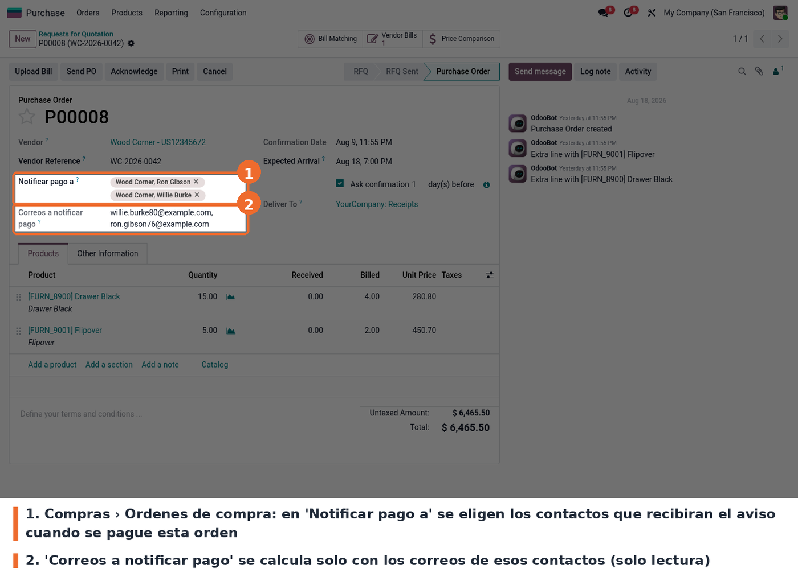

El módulo no agrega ninguna opción en Ajustes: se configura orden por orden. En **Compras ›
Órdenes › Órdenes de compra**, debajo de la referencia del proveedor, se indican los contactos que
deben enterarse cuando esa compra se pague.

- *Notificar pago a* acepta cualquier contacto de tipo *contacto*, no solo los del proveedor.
- *Correos a notificar pago* es de solo lectura: se arma con el correo de cada contacto elegido,
  así que un contacto sin correo simplemente no recibe nada.
- Para que el correo llegue de verdad hace falta un servidor de correo saliente configurado en
  **Ajustes › Técnico › Servidores de correo saliente**. Sin él el mensaje queda registrado en el
  historial del pago, pero no sale.
- La línea del método de pago del diario tiene que tener **cuenta de pagos pendientes**
  configurada. Ver `ROADMAP` antes de registrar el primer pago.
