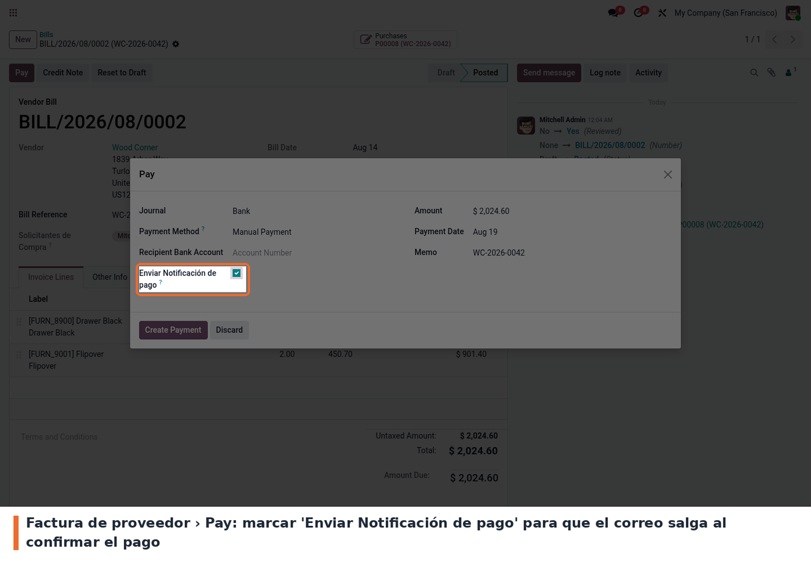
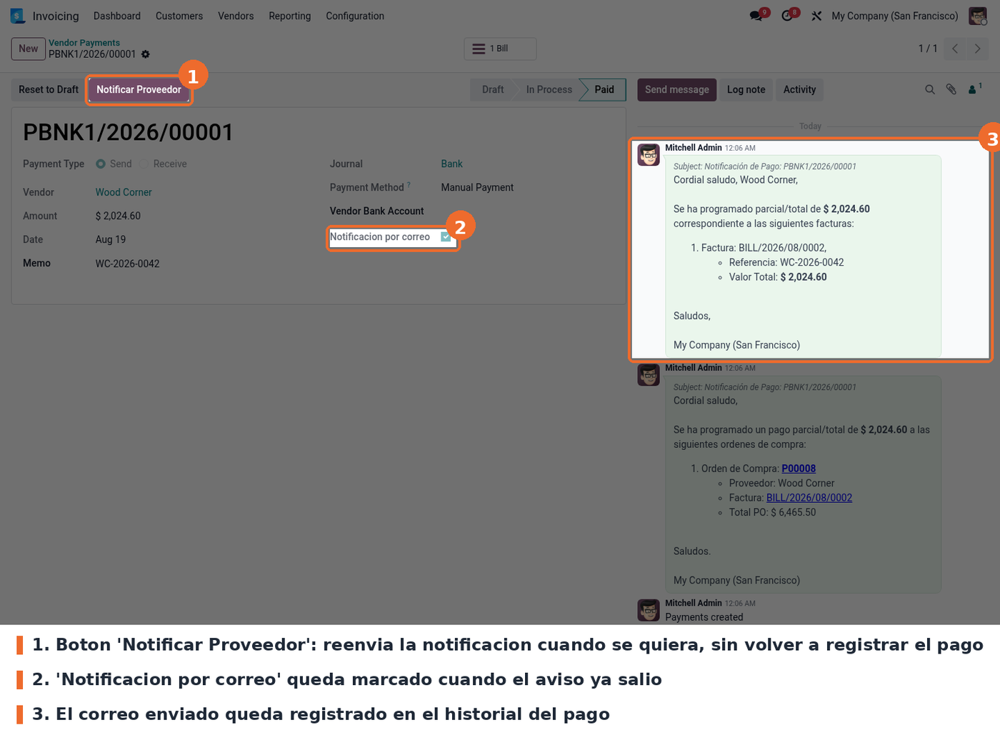
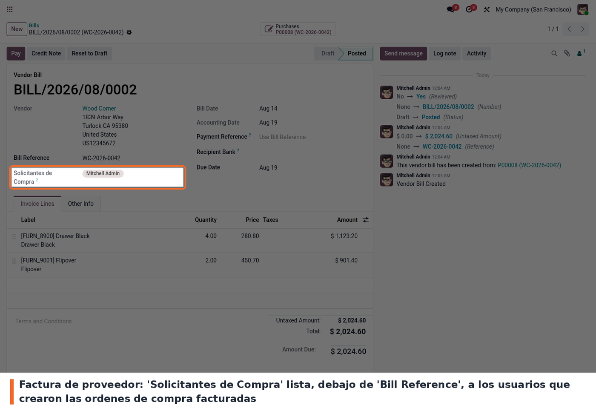

## Registrar el pago avisando

En la factura de proveedor se pulsa **Pay** y en el asistente aparece la casilla *Enviar
Notificación de pago*. Con la casilla marcada, al pulsar **Create Payment** el correo sale solo. La
casilla se oculta en los cobros de cliente: solo aplica a pagos salientes.

## El pago queda marcado y el correo registrado

El pago creado muestra *Notificación por correo* marcado y los correos enviados en su historial:
uno al proveedor con el detalle de las facturas y otro a los contactos de la orden de compra. El
botón **Notificar Proveedor** permite reenviar el aviso en cualquier momento.

## Quién pidió lo que se factura

En la factura de proveedor, justo debajo de *Bill Reference*, el campo *Solicitantes de Compra*
lista los usuarios responsables de las órdenes de compra facturadas. Es de solo lectura y se
calcula solo; si la factura no viene de una orden de compra, el campo no se muestra.

## A tener en cuenta durante el uso

- **Todo proveedor con factura seleccionada necesita correo.** Si alguno no lo tiene, el asistente
  corta el registro del pago con el mensaje «Contactos in correo electrónico: …», marque o no la
  casilla de notificación.
- **El aviso a los solicitantes depende de la orden de compra.** Solo se envía si la factura pagada
  proviene de una orden de compra y esa orden tiene contactos en *Notificar pago a*. El correo al
  proveedor, en cambio, sale siempre.
