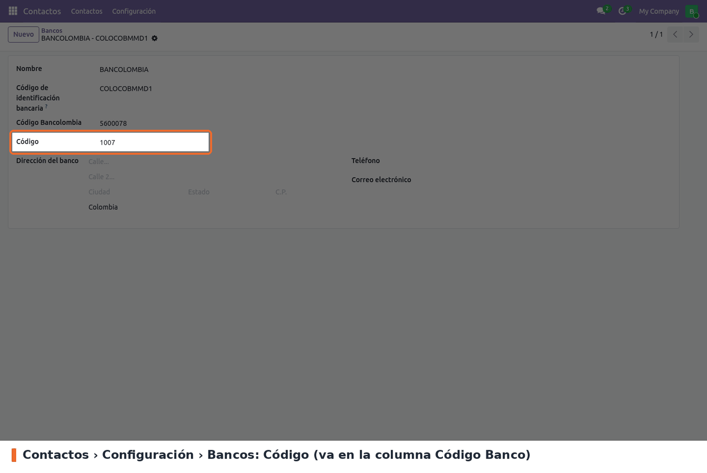
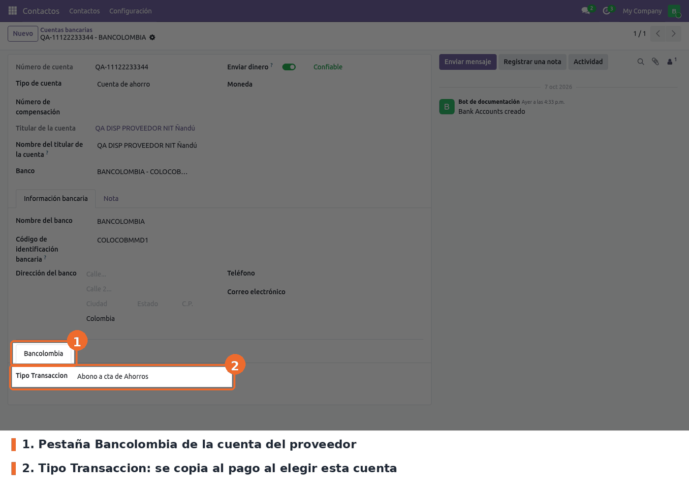
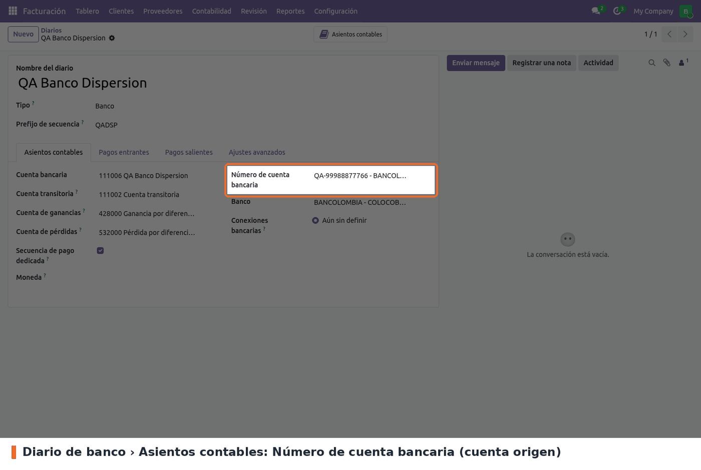
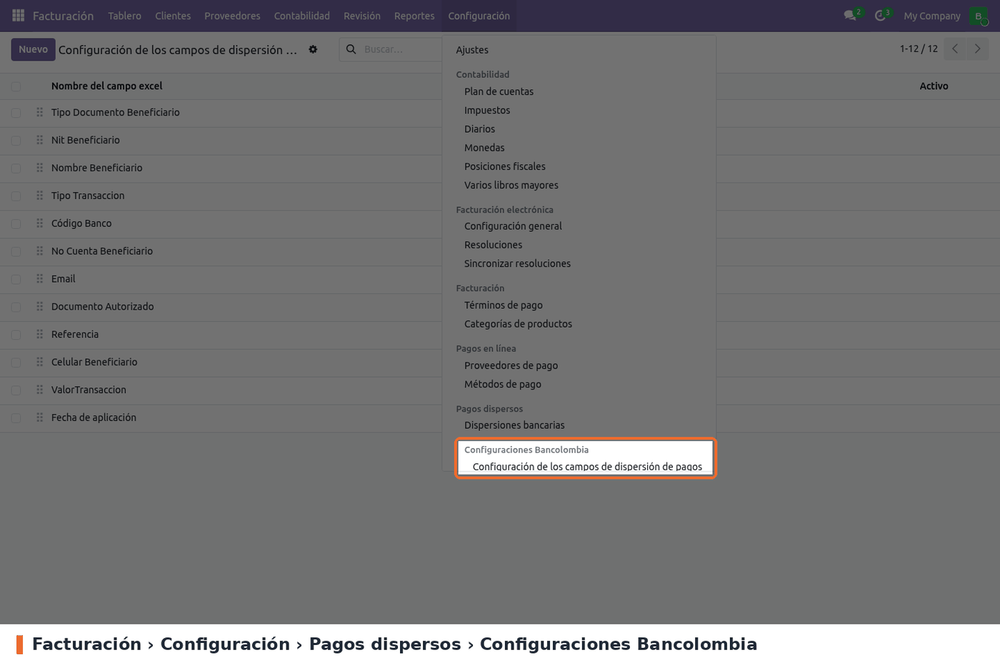
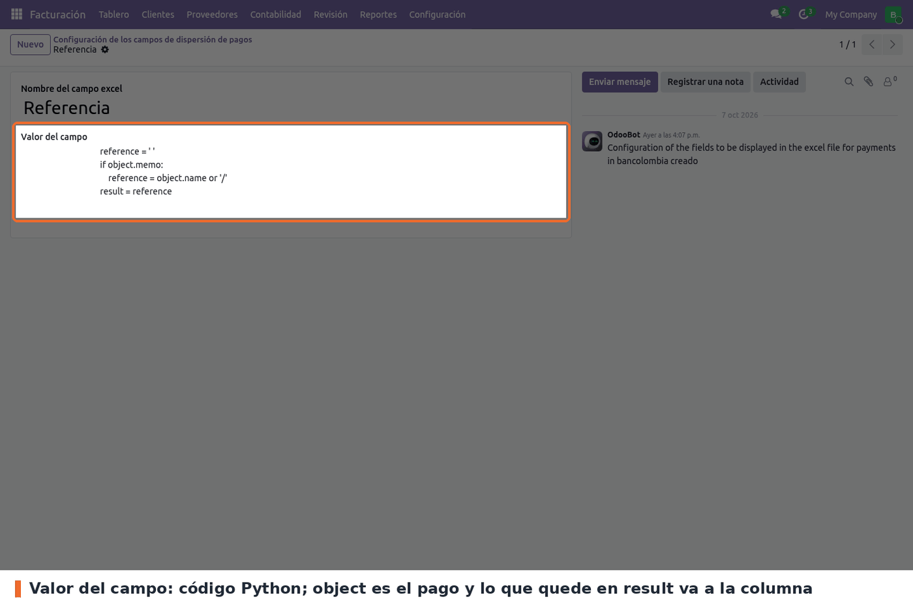

No hay ajustes que activar. Hay que dejar cargados cuatro datos.

**1. Código del banco.** *Contactos › Configuración › Cuentas bancarias › Bancos*, campo **Código**
(lo agrega `account_payment_dispersion`; los bancos colombianos vienen con él cargado). Es el valor
de la columna *Código Banco* del archivo, y sin él el pago no pasa la validación. El campo **Código
Bancolombia** que agrega este módulo viene cargado en 14 bancos, pero el archivo no lo usa.

**2. Tipo de transacción de la cuenta del proveedor (la configuración clave).** *Contactos ›
Configuración › Cuentas bancarias › Cuentas bancarias*, abrir la cuenta del proveedor, pestaña
**Bancolombia**, campo **Tipo Transaccion**. Normalmente *Abono a cta de Ahorros* (37) o *Abono cta
Corriente* (27). El banco de la cuenta tiene que tener **Código** (paso 1).

**3. Cuenta origen en el diario.** *Facturación › Configuración › Diarios*, abrir el diario de banco
desde el que se paga, pestaña *Asientos contables*, campo **Número de cuenta bancaria**. Sale en la
fila 2 del archivo (*NRO CUENTA A DEBITAR*) y su **Tipo de cuenta** da la letra de *TIPO DE CUENTA A
DEBITAR* (D corriente, S ahorros).

**4. Columnas del archivo (opcional).** Vienen 12 columnas listas. Se revisan en *Facturación ›
Configuración › Pagos dispersos › Configuraciones Bancolombia › Configuración de los campos de
dispersión de pagos*. El orden de la lista (se arrastra con el asa) es el orden de las columnas:
no lo cambies si no cambió el formato de la macro PAB.

Cada columna es código Python: `object` es el pago, y lo que quede en `result` va a la celda. Están
disponibles `env`, `date`, `datetime`, `timedelta` y `time`.

**Permisos.**

- Las dos acciones solo aparecen a quien tenga el grupo **Mostrar características de contabilidad
  completas** (`account.group_account_user`), igual que en 17. En Community ese grupo no lo trae ni
  *Contabilidad / Administrador*: hay que darlo aparte (en modo desarrollador, desde la ficha del
  usuario). Sin él, *Acciones* no muestra las dos opciones.
- Editar las columnas y ver el menú *Pagos dispersos* necesita *Contabilidad / Administrador*.
