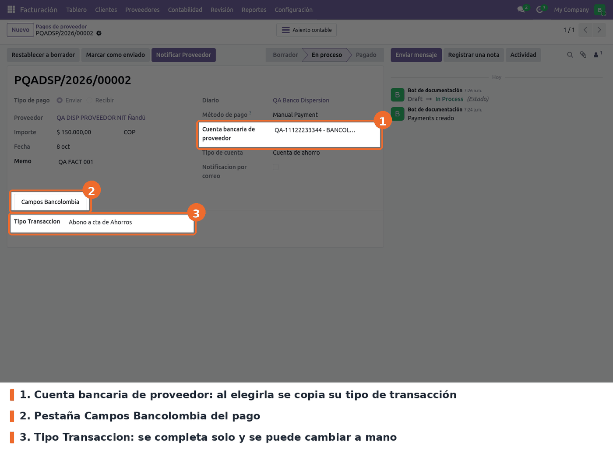
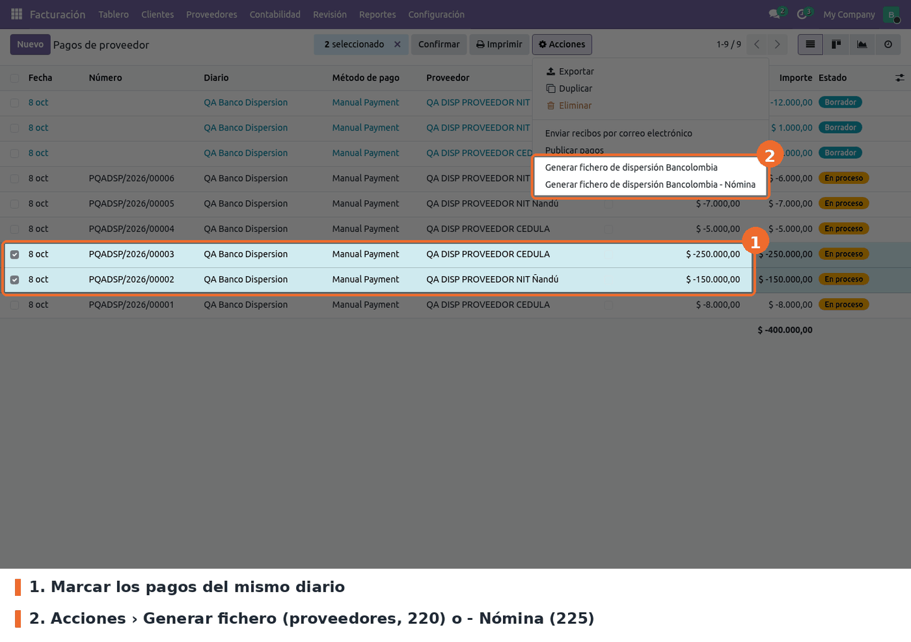
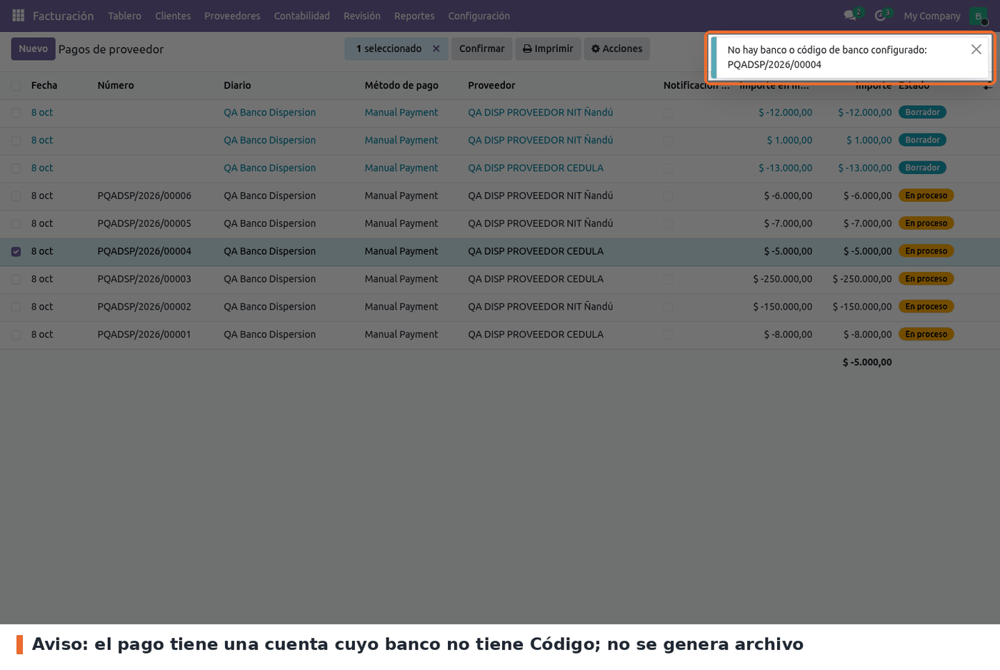
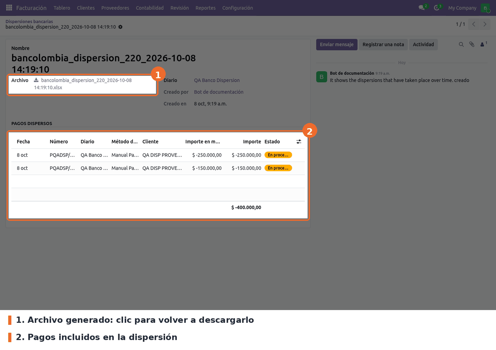

**1. Revisar el tipo de transacción en el pago.** En *Facturación › Proveedores › Pagos*, al elegir
la **Cuenta bancaria de proveedor**, la pestaña **Campos Bancolombia** se completa con el tipo de esa
cuenta. Se puede cambiar a mano (por ejemplo a *Pago en Efectivo*, que no lleva cuenta destino) y el
valor manual no se pisa al guardar ni al tocar otros campos; solo se recalcula si se cambia el
proveedor o la cuenta.

**2. Generar el archivo.** En la lista de pagos, marcar los pagos (todos del mismo diario) y en
*Acciones* elegir **Generar fichero de dispersión Bancolombia** (proveedores, 220) o **Generar
fichero de dispersión Bancolombia - Nómina** (225). El navegador descarga
`bancolombia_dispersion_<220|225>_<fecha hora>.xlsx`. Sirven pagos publicados y también en
borrador; un borrador sale con *Referencia* `/` porque todavía no tiene número.

**3. Si falta un dato, no se genera nada.** Odoo muestra un aviso fijo arriba a la derecha con el
pago que falla. Los avisos posibles:

- *Las dispersiones de pago deben ser para un solo diario y en este caso tiene los siguientes
  diarios: …*
- *El diario … no tiene configurada una cuenta de origen*
- *No hay tipo de transacción configurado: …*
- *Uno o más pagos no tienen cuenta de destino: …* (no aplica a los tipos 25, 36 y 40)
- *No hay banco o código de banco configurado: …* (no aplica a los tipos 25, 36 y 40)

Un pago en borrador aparece como *Borrador de pago (proveedor)*.

**4. Qué trae el archivo.** Ejemplo real generado en Odoo 19 con dos pagos de prueba:

- **Fila 1** (encabezado de la empresa): NIT PAGADOR, TIPO DE PAGO, APLICACIÓN, SECUENCIA DE ENVIÓ,
  NRO CUENTA A DEBITAR, TIPO DE CUENTA A DEBITAR, DESCRIPCIÓN DEL PAGO.
- **Fila 2**: NIT de la compañía sin los dos últimos caracteres (dígito de verificación), `220` o
  `225`, `I`, `A1`, número de la cuenta origen del diario, `D` (corriente) o `S` (ahorros), y la
  descripción vacía para completarla en la macro.
- **Fila 3**: vacía.
- **Fila 4**: los nombres de las 12 columnas, en el orden de la configuración: Tipo Documento
  Beneficiario, Nit Beneficiario, Nombre Beneficiario, Tipo Transaccion, Código Banco, No Cuenta
  Beneficiario, Email, Documento Autorizado, Referencia, Celular Beneficiario, ValorTransaccion,
  Fecha de aplicación.
- **Fila 5 en adelante**, un pago por fila. Por ejemplo, con las fórmulas que trae el módulo:
  3 · 800197268 · QA DISP PROVEEDOR NIT NANDÚ · 37 · 1007 · QA-11122233344 · qa.nit@example.com ·
  ` ` · ` ` · ` ` · 150000 · 20261008.

De dónde sale cada columna: tipo de documento del proveedor (1 cédula, 2 cédula de extranjería, 3
NIT, 4 tarjeta de identidad, 5 pasaporte); su número de identificación **sin el dígito de
verificación** (la parte antes del guion; si el número no tiene guion la celda sale en blanco);
nombre en mayúsculas con Ñ cambiada por N (las tildes quedan; si pasa de 30 caracteres se corta,
ver *Limitaciones*); tipo de transacción del pago; **Código** del banco de la cuenta destino;
número de esa cuenta; correo del contacto; importe; fecha del pago en `AAAAMMDD`.
*Documento Autorizado*, *Referencia* y *Celular Beneficiario* salen siempre en blanco, igual que
en producción: sus fórmulas calculan el valor (memo, número del pago, teléfono) y la última línea
lo reemplaza por `' '`. Para enviarlos, basta con borrar esa línea en la configuración de la
columna.

**5. Historial.** Cada archivo queda en *Facturación › Proveedores › Dispersiones bancarias*, con el
diario, quién lo generó y los pagos incluidos. Desde ahí se vuelve a descargar.

