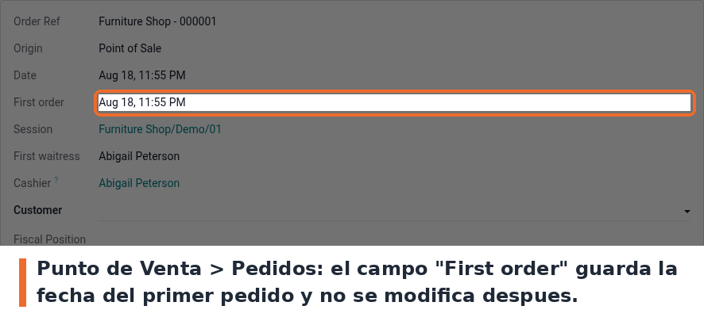

Entra a *Punto de Venta › Pedidos* y abri cualquier pedido. El campo **First order** esta justo
debajo de *Date*.

- El campo es de solo lectura: se calcula, no se escribe a mano.
- Solo se llena si estaba vacio, asi que un pedido ya registrado nunca pierde su valor original.
- El modulo trae un `pre_init_hook` que migra los identificadores externos del nombre viejo del
  modulo (`firstTimeOrder`) al actual. Es idempotente.
