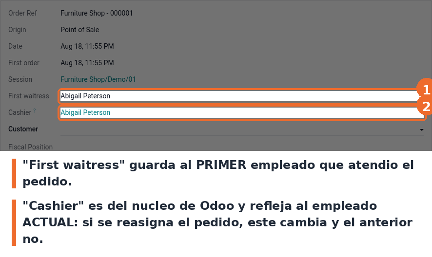

Entra a *Punto de Venta › Pedidos* y abri cualquier pedido. El campo **First waitress** esta entre
*Session* y *Cashier*, para poder comparar los dos de un vistazo.

- El campo es de solo lectura: se calcula, no se escribe a mano.
- Un pedido sin empleado asignado deja el campo vacio hasta que se le asigne uno.
