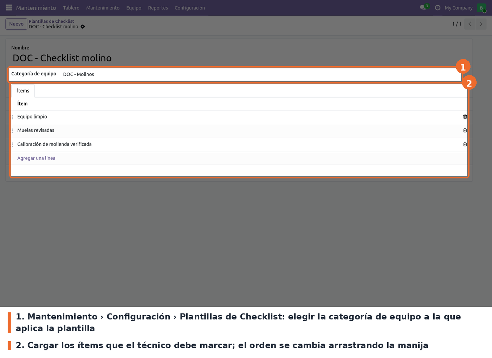

## Plantillas de checklist

Ir a *Mantenimiento › Configuración › Plantillas de Checklist* y crear una plantilla por categoría
de equipo. Las categorías se administran en *Mantenimiento › Configuración › Categorías del
equipo*.

- **Nombre**. Obligatorio. Solo sirve para identificar la plantilla.
- **Categoría de equipo**. Opcional en el formulario, pero una plantilla sin categoría nunca se
  aplica: la solicitud busca la plantilla por la categoría de su equipo.
- **Ítems**. Opcional. Cada ítem tiene un texto obligatorio; el orden se ajusta arrastrando la
  manija de la izquierda y es el mismo en que aparecen en la solicitud.

A tener en cuenta:

- El menú solo lo ven los usuarios del grupo **Responsable de los equipos** (`maintenance.group_equipment_manager`).
- Si hay varias plantillas para la misma categoría, se usa **solo la primera** que encuentra Odoo.
  Conviene mantener una plantilla por categoría.
- Cambiar una plantilla no modifica las solicitudes que ya tienen su checklist cargado.

## Checklist obligatorio para cerrar

El control que impide cerrar una solicitud con ítems pendientes se gobierna con el parámetro del
sistema `maintenance_management.enforce_checklist`, en *Ajustes › Técnico › Parámetros del
sistema* (requiere el modo de desarrollador).

- Valor por defecto: `True` (activo). Con `1`, `true` o `yes` (sin importar mayúsculas) el control
  está activo; con cualquier otro valor, por ejemplo `False`, queda desactivado.
- El parámetro se crea una sola vez al instalar: actualizar el módulo no pisa el valor que se haya
  cambiado.

## Datos del equipo

No hay más ajustes. La tienda (*Almacén/Tienda*) y el cliente se indican en cada equipo, en la
pestaña *Ficha técnica* (ver *Uso*). El código de la tienda que entra en el número de serie es el
**Nombre corto** del almacén en *Inventario › Configuración › Almacenes*.
