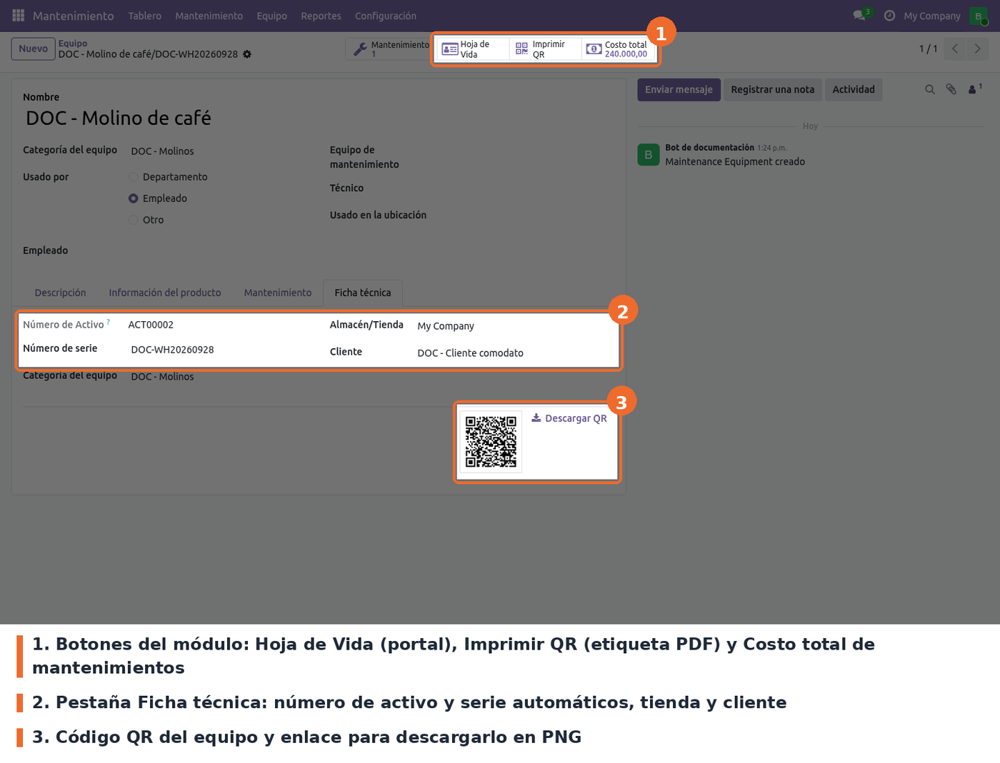
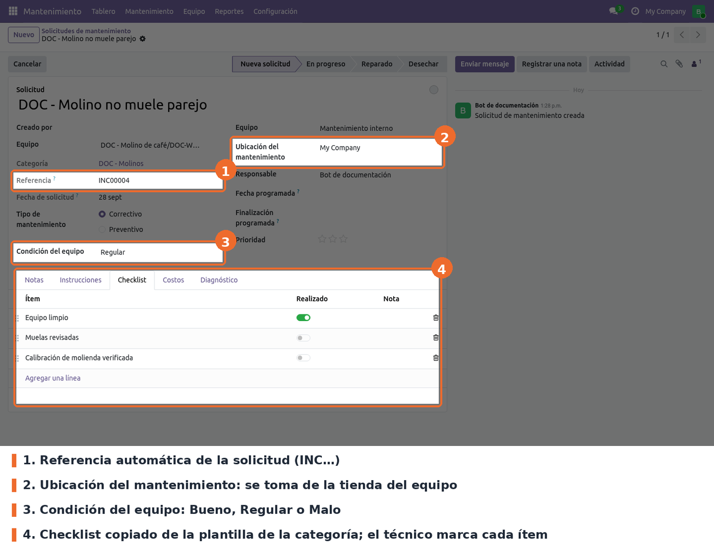
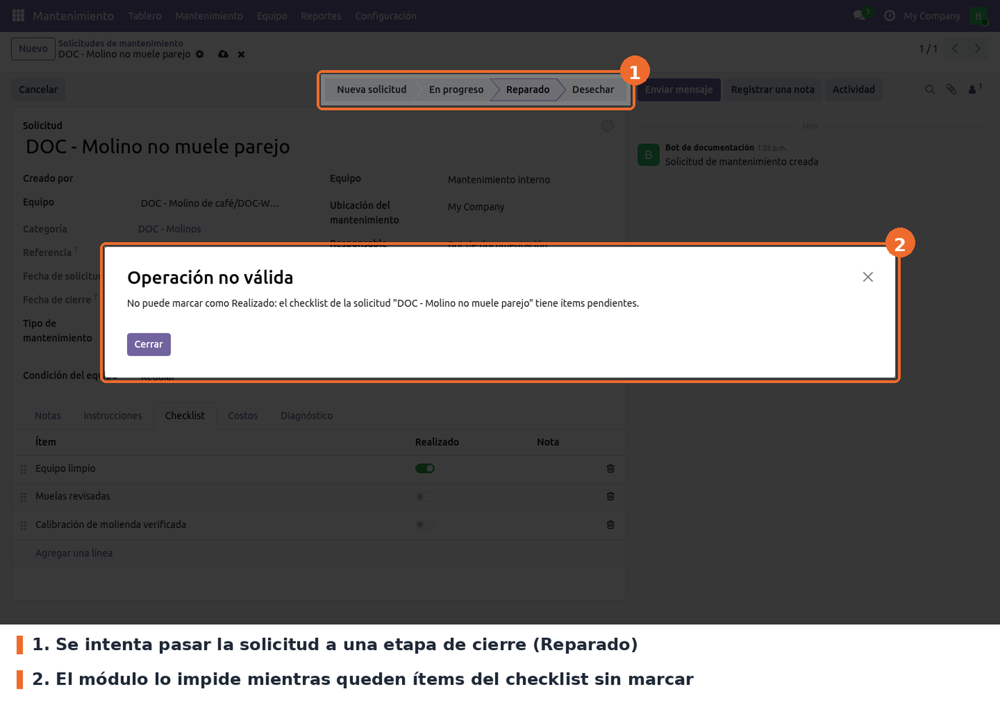
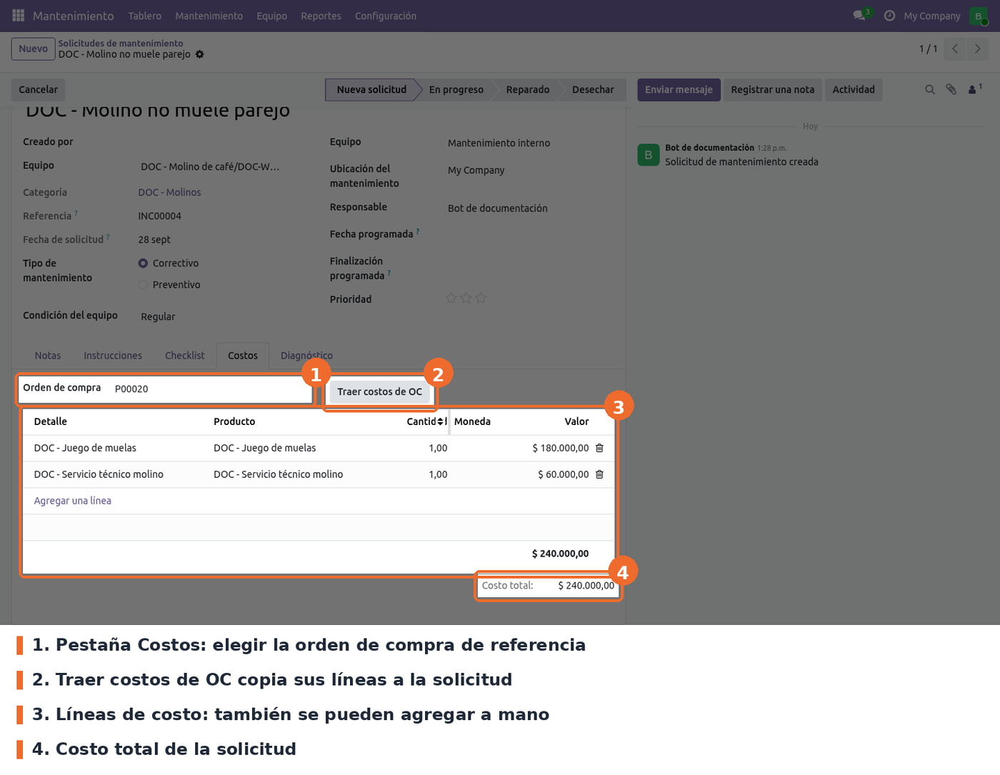
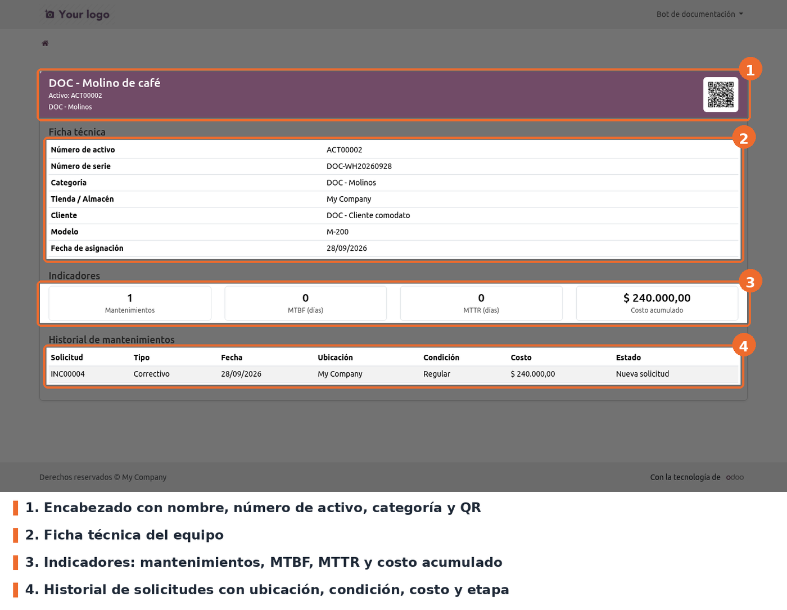

## Registrar un equipo

En *Mantenimiento › Equipo* crear el equipo con su nombre y categoría. En la pestaña
**Ficha técnica** indicar la tienda (*Almacén/Tienda*) y, si aplica, el cliente. Al guardar, el
módulo asigna:

- el **Número de Activo** siguiente de la secuencia `ACT`;
- el **Número de serie**, si se dejó vacío: las tres primeras letras de las dos primeras palabras
  del nombre (en mayúsculas, sin tildes y omitiendo artículos y preposiciones como *de*, *la*,
  *para*), más el código de la tienda y la fecha de registro `AAAAMMDD`. Por ejemplo, *Nevera de
  cocina* en la tienda `ZNG2` registrada el 8 de mayo de 2025 queda `NEVCOCZNG220250508`;
- el token de portal que usa el código QR.

Desde la ficha del equipo:

- **Hoja de Vida** abre la página del equipo en el portal.
- **Imprimir QR** genera la etiqueta PDF con el nombre, el número de activo, la serie, la categoría
  y el QR. La misma etiqueta sale de *Imprimir › Etiqueta QR del Equipo*, también para varios
  equipos seleccionados en la lista.
- **Costo total** muestra la suma de los costos de todas las solicitudes del equipo y, al
  pulsarlo, las lista.
- **Descargar QR**, debajo de la imagen, baja el QR como PNG (`QR_<número de activo>.png`).

En la búsqueda de equipos se puede filtrar por número de activo, tienda y cliente, y agrupar por
*Tienda* o *Cliente*.

## Atender una solicitud

Crear la solicitud en *Mantenimiento › Mantenimiento › Solicitudes de mantenimiento* y elegir el
equipo. En el formulario se cargan solos la **Ubicación del mantenimiento** (la tienda del equipo)
y el **Checklist** de la plantilla de su categoría. Al guardar se asigna la **Referencia** `INC`.

El técnico registra la **Condición del equipo** (Bueno, Regular o Malo), marca los ítems del
checklist a medida que los hace (con una nota opcional por ítem) y describe lo realizado en la
pestaña **Diagnóstico**.

Mientras quede algún ítem sin marcar, la solicitud no puede pasar a una etapa marcada como
*Solicitud lista* (en las etapas estándar, *Reparado* y *Desechar*). Odoo muestra el aviso y no guarda el
cambio de etapa.

## Registrar los costos

En la pestaña **Costos** se agregan las líneas de costo a mano (detalle, producto, cantidad y
valor) o se traen de una compra: elegir la **Orden de compra** y pulsar **Traer costos de OC**.
Cada línea de la orden se copia con su descripción, producto, cantidad y subtotal sin impuestos.
El **Costo total** de la solicitud se suma solo y alimenta el costo acumulado del equipo.

Para imprimir la solicitud usar *Imprimir › Orden de Mantenimiento*: incluye equipo, fechas,
técnico, condición, checklist, costos y observaciones.

## Hoja de vida en el portal

Al escanear el QR (o pulsar *Hoja de Vida*) se abre la página del equipo. La puede ver cualquier
persona que tenga el QR, sin iniciar sesión, porque el enlace incluye el token de acceso del
equipo. Un usuario interno con permiso sobre el equipo la ve también sin el token.

## Casos especiales

- **Equipo sin tienda**: el serial se arma sin código de tienda, y la solicitud queda sin ubicación
  hasta que se elija una.
- **Cambiar el equipo de una solicitud**: la ubicación y el checklist solo se cargan si están
  vacíos. Si ya había un checklist, no se reemplaza por el de la nueva categoría.
- **Mantenimiento preventivo recurrente**: la solicitud siguiente que crea Odoo al cerrar la actual
  recibe una referencia nueva, pero **llega sin checklist y sin costos**, por lo que el bloqueo no
  la afecta.
- **Traer costos de OC dos veces**: cada pulsación vuelve a copiar todas las líneas; hay que borrar
  las duplicadas a mano.

## Solución de problemas

- **"No puede marcar como Realizado: el checklist de la solicitud … tiene ítems pendientes."**
  Marcar los ítems que faltan en la pestaña *Checklist* y volver a cambiar la etapa. Después del
  aviso el formulario queda mostrando la etapa nueva sin guardar: descartar los cambios (ícono ✖
  junto al nombre) antes de seguir editando, o completar el checklist y guardar.
- **La solicitud no trae checklist.** El equipo no tiene categoría, o su categoría no tiene
  plantilla. El checklist se carga solo al elegir el equipo en el formulario; las solicitudes
  creadas por importación o por código no lo reciben.
- **Al escanear el QR se pide iniciar sesión.** El equipo no tenía token de portal cuando se
  imprimió o descargó el QR (pasa con equipos anteriores a la instalación). Ejecutar *Acción ›
  Asignar Nº de activo, QR y serial* sobre el equipo y volver a imprimir la etiqueta.
- **El QR abre una dirección que no carga desde el celular.** La URL del QR se arma con el
  parámetro `web.base.url`; debe ser la dirección pública del servidor. Si el servidor atiende
  varias bases sin filtro de base de datos (`dbfilter`), el enlace responde *404* a quien no tiene
  sesión.
- **El número de serie salió con caracteres raros**, por ejemplo `DOC-…`: los signos sueltos del
  nombre (un guion entre espacios) cuentan como palabra. Corregir la serie a mano; el módulo solo
  la calcula si está vacía.
