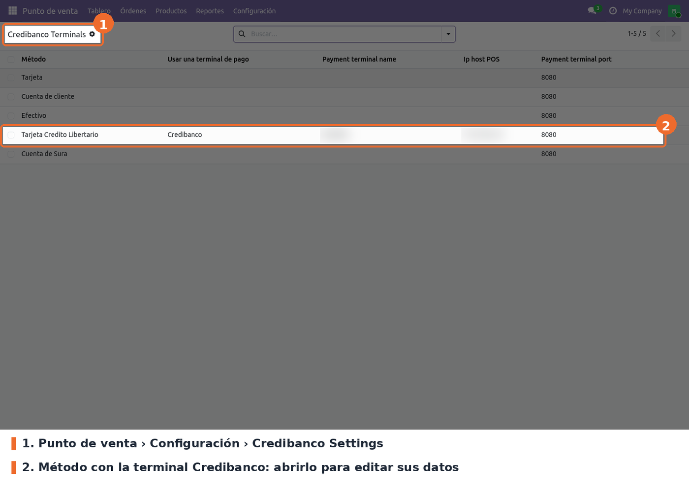
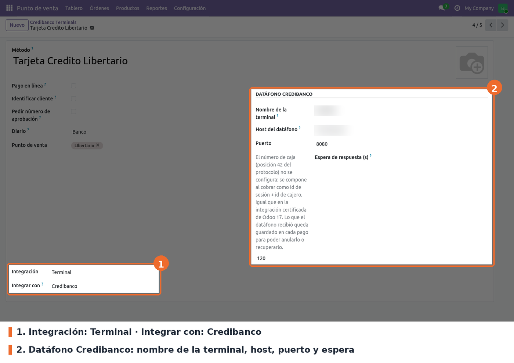

Ir a *Punto de venta › Configuración › Credibanco Settings* (solo lo ven los responsables del POS).
La lista muestra **todos** los métodos de pago con su terminal, nombre, host y puerto; no permite
crear ni borrar. Abrir el método que va a cobrar con el datáfono.

En el formulario del método de pago (es el mismo de *Configuración › Métodos de pago*):

- **Integración** = *Terminal* y luego **Integrar con** = *Credibanco*. Obligatorios. *Integrar
  con* solo aparece con la integración en *Terminal* y un diario que no sea de efectivo. Al elegir
  Credibanco aparece el bloque **Datáfono Credibanco**.
- **Nombre de la terminal** (`pos_payment_terminal_name`). Obligatorio, sin valor por defecto. Es
  el prefijo que lleva cada trama y debe coincidir con el nombre que el puente asocia a la IP del
  datáfono en `tcpIp.ini` (por ejemplo `dataf001`).
- **Host del datáfono** (`pos_ip_host`). Obligatorio, sin valor por defecto. Pese al nombre, es la
  IP o el nombre del **equipo donde corre el puente**, tal como lo ve el navegador de la caja: el
  navegador se conecta directo a `ws://<host>:<puerto>/ws` (o `wss://` si el POS se abre por https).
- **Puerto** (`pos_websocket_port`). Obligatorio; `8080` por defecto, que es el puerto del puente.
- **Espera de respuesta (s)** (`credibanco_timeout`). Opcional; `100` por defecto en métodos
  nuevos. Pasado ese tiempo sin respuesta, la venta queda pendiente de recuperar. Debe ser mayor
  que los 90 s que espera el propio puente (`LONG_TIMEOUT` en `tef.ini`), para que el primero en
  rendirse sea el datáfono y el cajero vea su error.
- **Diario**: uno de banco. Un método de efectivo no puede ser terminal Credibanco.
- **Punto de venta**: agregar el método a los puntos de venta que lo usan.

Lo que **no** se configura:

- **Número de caja** (posición 42 de la trama). Se compone al cobrar como *id de la sesión* + *id
  del cajero*, sin separador, igual que en la integración certificada de Odoo 17. Si supera los 10
  caracteres del protocolo, el cobro se rechaza con un mensaje; nunca se recorta.
- **Números de transacción** (posición 53). Salen de una secuencia por método de pago
  (`pos_api_credibanco.trx.<id>`) que se crea sola al primer cobro. El POS reserva bloques de 25
  para poder seguir cobrando si pierde el servidor.
- **Impuestos**. El servidor clasifica los impuestos de venta por el nombre de su **grupo**: los que
  empiezan por `IVA` van a la posición 41 y los que empiezan por `INC` (el "IAC" del datáfono) a la
  82. Las retenciones y los impuestos negativos no viajan. Si el pedido tiene impuestos pero
  ninguno es IVA ni INC, el cobro se rechaza con el nombre de los grupos encontrados.
- **Propina**. Se toma del producto de propina del punto de venta (*Ajustes › Propinas*).

Los cambios se ven en el POS después de volver a entrar a la sesión.
