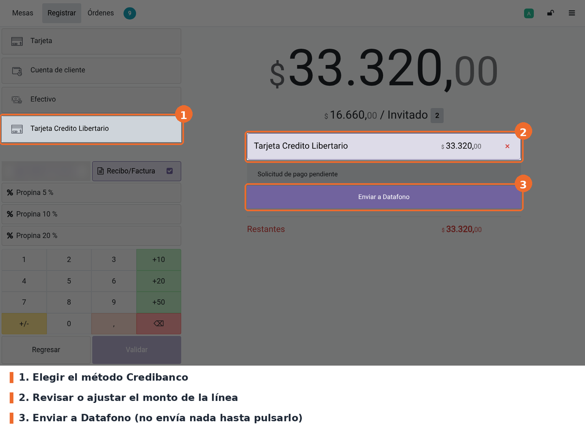
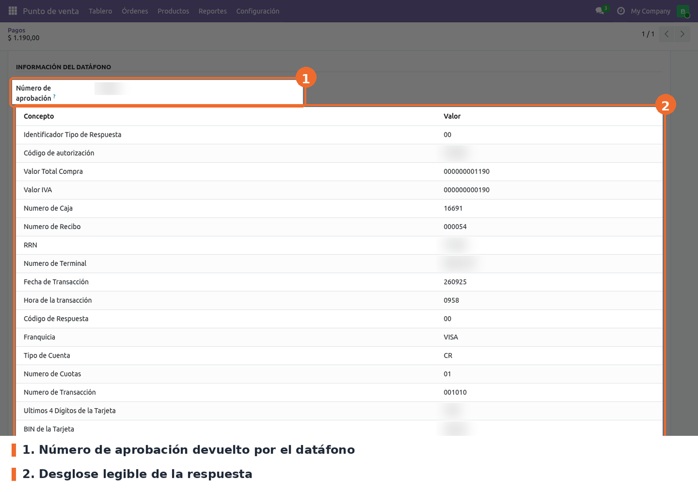

## Cobro con el datáfono

En la pantalla de pago, tocar el método Credibanco. Se crea una línea por el saldo pendiente con el
estado *Solicitud de pago pendiente*. **Agregar la línea no envía nada**: el monto se puede ajustar
con el teclado (pago parcial) antes de enviar.

Al pulsar **Enviar a Datafono**:

- El POS calcula los valores y abre **Valores de la transacción** con TOTAL, IVA, IAC y PROPINA.
  *Cancelar* no envía nada; *Continuar* envía la venta al datáfono.
- El cliente pasa la tarjeta y aprueba en el datáfono. Mientras tanto la línea muestra *Solicitud
  enviada*.
- Si el datáfono aprueba, la línea queda pagada con el **monto que cobró el terminal** (valor total
  más la propina que devuelve en la posición 80), el número de aprobación y el identificador de la
  transacción. En el recibo sale *Aprob.:* seguido del número de aprobación. Si con eso el pedido queda pagado y el punto de
  venta tiene activo *Validar órdenes de forma automática* (opción estándar de *Ajustes*, activa por defecto), el
  pedido se valida solo.
- Si el datáfono rechaza, se muestra el motivo según su código (02 rechazada, 05 problema de
  comunicación, 06 error de trama, 09 a 12 errores de formato, 13 tiempo agotado, 99 puerto
  ocupado). La línea queda en *Transacción cancelada* y se puede volver a enviar.

**Propina**: si el pedido tiene propina (producto de propina del POS) y la línea cubre el pedido
entero, el TOTAL se envía sin la propina y la propina viaja aparte en la posición 81.

## Venta sin respuesta y recuperación

Si el datáfono no contesta dentro de la espera configurada, se corta la conexión o responde con el
código 03 (sin respuesta final), la venta **puede haber quedado aprobada** en el terminal. Por eso:

- El POS guarda en la línea la venta enviada. Sin respuesta, avisa *Sin respuesta del datáfono*;
  con el código 03 abre directamente el diálogo **Recuperar** (en el datáfono: TECLA 3 y luego
  TECLA 9). *Más tarde* deja la venta pendiente.
- El botón de la línea cambia a **Recuperar venta**: pulsarlo consulta la venta pendiente, **nunca
  envía una venta nueva**.
- Si la página se recarga, al volver a la pantalla de pago se ofrece recuperar la venta pendiente.
- No se puede **validar** el pedido mientras haya una venta pendiente.
- Borrar esa línea pide confirmar que en el datáfono se verificó que la venta **no** fue aprobada.
- Después de tres intentos sin respuesta final, el POS pide consultar el datáfono y avisar a un
  responsable antes de cobrar de nuevo.

El botón estándar *Forzar terminación* sigue visible en algunos estados, pero con Credibanco no marca el
pago: muestra *No se puede forzar el pago* y pide usar la recuperación.

## Cancelar una venta en curso

Quitar la línea (×) mientras la venta está enviada manda al datáfono una **anulación** con los
datos de esa venta. Si el datáfono no la confirma, la línea sigue pendiente y el aviso pide usar
*Recuperar* antes de continuar.

## Anular un pago aprobado

Mientras el pedido sigue en la pantalla de pago, una línea Credibanco aprobada muestra el botón
estándar **Revertir**. Con Credibanco no deja la línea en cero: si el datáfono aprueba la anulación,
se agrega una **línea negativa** por el mismo monto (con propina incluida) y la línea original
queda como estaba, ya sin botón de revertir. El pedido vuelve a quedar con saldo pendiente: hay que
cobrarlo de otra forma o cancelarlo.

La línea de anulación **no se puede borrar**: ya existe una devolución en el datáfono y borrarla
dejaría la venta pagada en Odoo.

## Información del pago en el backend

En *Punto de venta › Órdenes › Pagos*, la ficha de un pago Credibanco muestra el **número de
aprobación** y el desglose de la respuesta del datáfono. Un responsable del POS puede agregar un
concepto a mano con **Agregar información**.

## Solución de problemas

- **"Sin respuesta del datáfono" en todos los cobros.** El navegador no llega al puente. Revisar
  que el contenedor `websocket-api-credibanco` esté corriendo en la caja y que *Host del datáfono* y
  *Puerto* apunten a ese equipo. Si el POS se abre por **https**, el navegador usa `wss://` y el
  puente no tiene TLS: la conexión falla siempre (ver *Limitaciones*).
- **"Error en la trama" o "Campo no corresponde".** La respuesta no se pudo leer o un valor no
  cumple el formato del datáfono. Revisar que el *Nombre de la terminal* coincida con `tcpIp.ini` y
  avisar a IT.
- **"El número de caja excede el protocolo".** La sesión y el cajero forman un número de más de 10
  caracteres. No se puede cobrar con el datáfono en esa sesión; avisar a IT.
- **"Impuestos no reconocidos".** Algún producto tiene impuestos de un grupo que no empieza por
  `IVA` ni `INC`. Corregir el grupo del impuesto en contabilidad.
- **"Sin números de transacción disponibles".** Se agotó el bloque reservado y no hay conexión con
  el servidor. Esperar a recuperar la conexión; no se repiten números.
- **"Falta el cajero"** o **"Sesión no disponible".** Iniciar sesión con un empleado o recargar el
  POS.
- **El método no aparece en el POS o no abre el datáfono.** Verificar que el método esté asignado
  al punto de venta, con *Integrar con = Credibanco*, y volver a entrar a la sesión.
