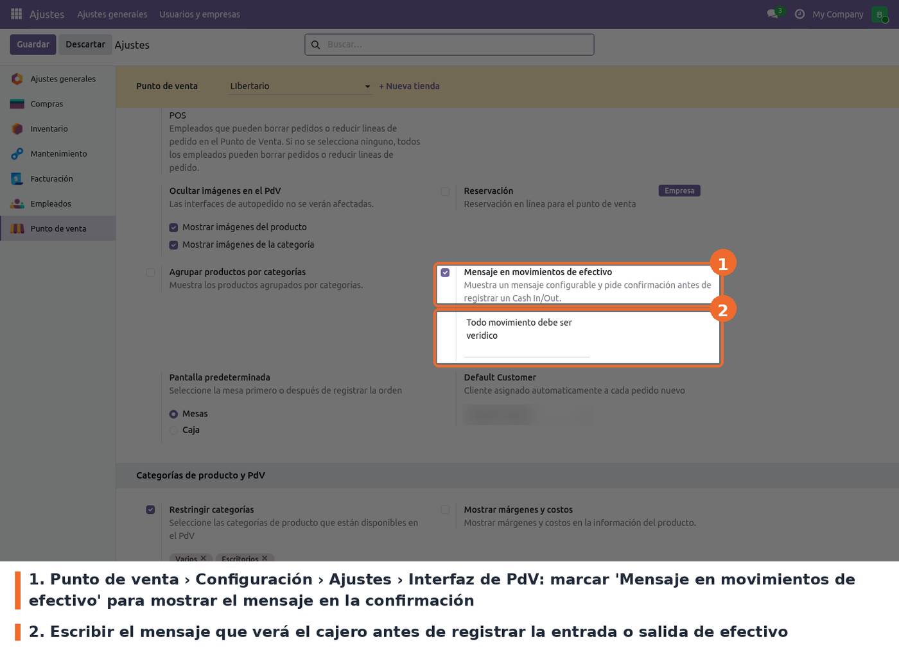

Ir a *Punto de venta › Configuración › Ajustes*, elegir el punto de venta en la parte superior y
buscar el bloque **Interfaz de PdV**. Allí está la opción **Mensaje en movimientos de efectivo**.

- **Casilla** (campo `cash_in_out_message_enabled` de `pos.config`). Opcional; desmarcada por
  defecto. Al marcarla aparece el cuadro de texto del mensaje.
- **Cuadro de texto** (campo `cash_in_out_message` de `pos.config`). Opcional; vacío por defecto.
  Texto libre, sin formato, que se muestra dentro del diálogo de confirmación.

A tener en cuenta:

- **La confirmación no depende de esta opción.** El diálogo de confirmación aparece siempre que el
  módulo está instalado; la casilla solo decide si se muestra el mensaje. Así funcionaba también en
  Odoo 17.
- La configuración es **por punto de venta**. Hay que repetirla en cada tienda.
- Desmarcar la casilla oculta el mensaje pero **no borra el texto**: al volver a marcarla, el
  mensaje anterior sigue ahí.
- Los cambios se ven en el POS después de volver a entrar a la sesión desde el backend.
- El límite de movimientos por sesión y el aviso de último movimiento se configuran en
  `pos_closing_validation` (*Máximo de movimientos de efectivo*), no en este módulo.
