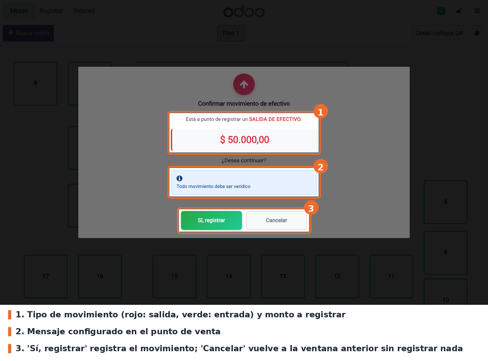

## Flujo

En el POS, abrir el menú (☰) y elegir **Entrada/salida de efectivo**. Elegir el tipo de
movimiento, escribir el monto y el motivo, y pulsar **Confirmar**. Antes de registrar nada aparece
el diálogo de confirmación, que muestra:

- el tipo de movimiento, en verde si es entrada y en rojo si es salida;
- el monto con el formato de la moneda del POS;
- el aviso de **último movimiento permitido**, si este movimiento agota el límite de la sesión;
- el mensaje configurado, si la opción está habilitada y el texto no está vacío.

**Sí, registrar** registra el movimiento por el flujo normal de Odoo. **Cancelar** cierra el
diálogo y vuelve a la ventana anterior con el monto ya escrito, para corregirlo.

## Casos especiales

- **Monto vacío o cero**: no se pide confirmación. El POS muestra su aviso estándar de movimiento
  ignorado.
- **Límite de movimientos alcanzado**: `pos_closing_validation` bloquea el movimiento y el diálogo
  no llega a abrirse.
- **Último movimiento permitido**: el aviso va dentro del diálogo de confirmación, y el aviso
  aparte que muestra `pos_closing_validation` se omite para no preguntar dos veces.
- **Sin conexión**: el POS no puede consultar cuántos movimientos lleva la sesión, así que el
  diálogo no muestra el aviso de último movimiento. El control del límite en ese caso es de
  `pos_closing_validation`.

## Solución de problemas

- **No aparece la opción *Entrada/salida de efectivo* en el menú del POS.** Es una condición de
  Odoo, no de este módulo: el punto de venta debe tener activo el control de efectivo y el usuario
  debe tener permiso para mover caja.
- **El diálogo de confirmación no aparece.** Verificar que el módulo esté instalado y volver a
  entrar a la sesión del POS desde el backend. Si el monto está vacío o es cero, el diálogo no se
  muestra (ver *Casos especiales*).
- **El diálogo aparece, pero sin el mensaje.** Revisar que la casilla esté marcada, que el texto no
  esté vacío y que se haya vuelto a entrar al POS después de guardar.
