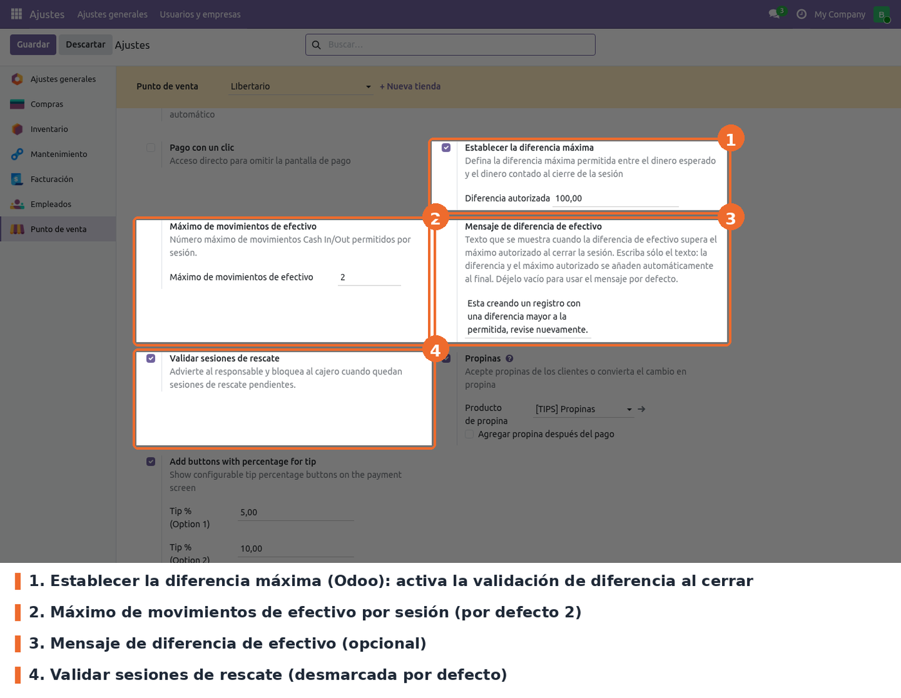

Ir a *Punto de venta › Configuración › Ajustes*, elegir el punto de venta en la parte superior y
buscar el bloque **Pagos**. Las opciones del módulo están junto a *Establecer la diferencia
máxima*, que es de Odoo.

- **Establecer la diferencia máxima** y **Diferencia autorizada** (campos de Odoo
  `set_maximum_difference` y `amount_authorized_diff`). Opcional; desmarcada por defecto. Es el
  interruptor de la validación de diferencia al cerrar: si está desmarcada, el módulo no compara el
  efectivo contado con el esperado.
- **Máximo de movimientos de efectivo** (`maximum_cash_in_out_moves` de `pos.config`).
  Obligatorio; 2 por defecto. Número de entradas/salidas de efectivo permitidas por sesión. Debe
  ser mayor que cero: el valor 0 o negativo se rechaza al guardar.
- **Mensaje de diferencia de efectivo** (`cash_difference_exceeded_message`). Opcional; vacío por
  defecto. Texto del aviso que bloquea el cierre por diferencia. Solo se escribe el texto: la
  diferencia y el máximo autorizado se agregan solos al final. Vacío, se usa el mensaje por defecto
  del módulo.
- **Validar sesiones de rescate** (`enable_rescue_session_validation`). Opcional; desmarcada por
  defecto. Impide abrir una sesión nueva mientras haya sesiones de rescate sin cerrar, y bloquea al
  cajero (advierte al responsable) al cerrar si hay rescates pendientes con datos.

A tener en cuenta:

- La configuración es **por punto de venta**. Hay que repetirla en cada tienda.
- El límite se lee del servidor cada vez que se abre la ventana de entrada/salida de efectivo, así
  que un cambio en el límite rige desde el siguiente movimiento, sin volver a entrar al POS.
- **No bajar el límite con sesiones abiertas.** Si una sesión ya tiene más movimientos que el nuevo
  límite, el cajero no podrá cerrarla (ver *Solución de problemas*).
- La diferencia de efectivo se valida para todos los roles, incluidos los responsables.
- Quién es "responsable" se decide por el grupo de administrador del Punto de Venta
  (`point_of_sale.group_pos_manager`) del **usuario de Odoo** con el que se abrió el POS. El
  empleado elegido con PIN en `pos_hr` no cambia ese rol.
