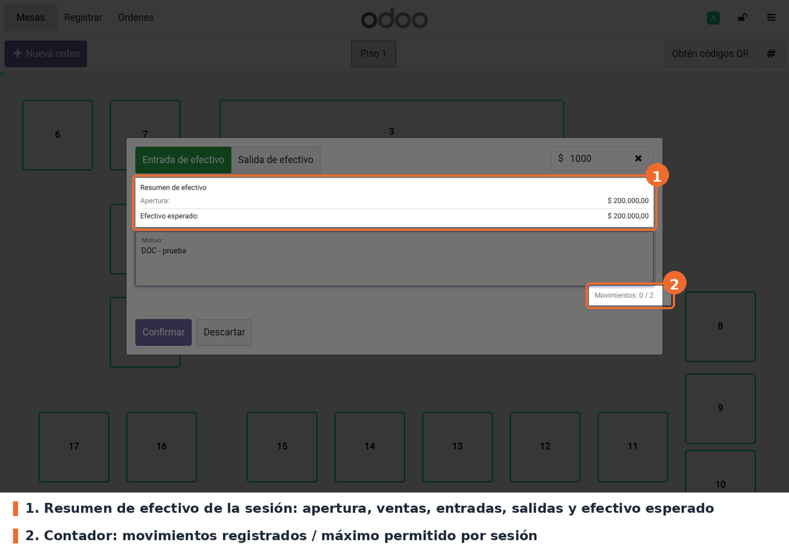
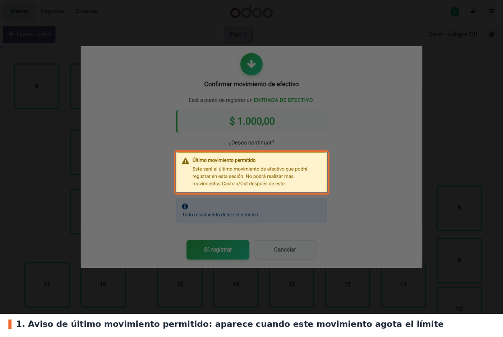
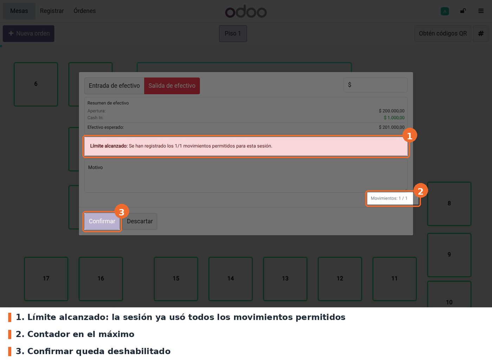

## Entradas y salidas de efectivo

En el POS, abrir el menú (☰) y elegir **Entrada/salida de efectivo**. Antes de abrir la ventana,
el POS consulta el estado de la sesión en el servidor. La ventana muestra, además de los campos de
Odoo, un **resumen de efectivo** (apertura, ventas en efectivo, entradas, salidas y efectivo
esperado) y el **contador** de movimientos de la sesión frente al máximo configurado.

Si el movimiento que se va a registrar es el último permitido, se pide una confirmación explícita.
Con `pos_cash_in_out_message` instalado, el aviso aparece dentro de su diálogo de confirmación
(captura); sin ese módulo, aparece un diálogo propio, *Último movimiento de efectivo*, con el
conteo y los botones *Confirmar* y *Cancelar*.

Cuando la sesión ya usó todos los movimientos, la ventana muestra **Límite alcanzado** y el botón
*Confirmar* queda deshabilitado. Si el aviso se saltara (por ejemplo, con una llamada directa al
servidor), el servidor rechaza el movimiento con *Se alcanzó el límite de movimientos de efectivo*.

## Cierre de caja

Al elegir **Cerrar caja registradora**, el POS consulta primero el estado de la sesión. Si el
usuario no puede cerrar, aparece *No se puede cerrar la sesión* con los motivos, y la ventana de
cierre de Odoo no llega a abrirse. Si puede, se abre la ventana de cierre estándar. Al confirmar,
el servidor valida de nuevo y, si algo falla, muestra el aviso con estos botones:

- **Diferencia superada** (el efectivo contado se aparta del esperado más que la diferencia
  autorizada): *Revisar órdenes*, que lleva a la lista de órdenes, o *Cancelar*, que deja el
  efectivo contado en 0 para volver a contar. Aplica a todos los roles.
- **Sesiones de rescate pendientes**: *Revisar órdenes* o *Cancelar*.
- **Movimientos por encima del límite** u **órdenes pagadas sin pagos**: un único botón,
  *Entendido*.

Ningún aviso del módulo cancela órdenes. El botón de Odoo que cancela las órdenes abiertas se
mantiene solo para los avisos propios de Odoo (por ejemplo, órdenes en borrador).

## Casos especiales

- **Responsable del Punto de Venta**: las revisiones de consistencia (movimientos por encima del
  límite, órdenes pagadas sin pagos, rescates pendientes) no lo bloquean. Si cierra con alguna
  activa, queda una nota *Validación de caja superada por un responsable* en el historial de la
  sesión. La diferencia autorizada sí lo bloquea.
- **Quién ve el aviso de diferencia**: la ventana de cierre de Odoo ya compara el conteo con la
  diferencia autorizada. A un usuario que no es responsable, Odoo le muestra su propio aviso y no
  lo deja continuar; a un responsable le ofrece seguir de todos modos. En ese caso el servidor
  aplica la regla del módulo y el cierre se bloquea igual.
- **Sin conexión**: la ventana avisa que no puede verificar el límite y pide confirmar *Registrar
  de todos modos*. El movimiento queda en la cola del POS y el servidor aplica el límite al
  sincronizar. Si el servidor responde con un error que no es de conexión, la ventana se bloquea.
- **Reintentos**: cada ventana genera un identificador único para su movimiento. Si el POS reenvía
  el mismo movimiento (respuesta perdida o cola sin conexión), el servidor lo reconoce y no lo
  registra dos veces.
- **Dos terminales a la vez**: el movimiento de efectivo espera hasta 2 segundos a que la otra
  terminal libere la sesión, y el cierre hasta 10 segundos. Si se agota la espera, el aviso trae el
  conteo actual de movimientos para comprobarlo antes de reintentar.
- **Sesión de rescate**: no admite movimientos de efectivo ni se cierra desde el POS; se cierra
  desde el backend.
- **Eliminar un movimiento**: el servidor solo lo permite a un responsable del Punto de Venta.

## Solución de problemas

- **"Se alcanzó el límite de movimientos de efectivo"**: la sesión no admite más movimientos. Para
  un caso excepcional, un responsable puede subir el límite en Ajustes; rige desde el siguiente
  movimiento.
- **"Existe una inconsistencia en los movimientos de efectivo"**: la sesión tiene más movimientos
  que el límite, normalmente porque el límite se bajó con la sesión abierta o por movimientos
  sincronizados después de un corte. Un responsable puede cerrar la sesión; queda registrado en el
  historial.
- **"La diferencia de efectivo supera la diferencia máxima autorizada"** (o el mensaje
  configurado): volver a contar con *Cancelar*, o revisar si falta registrar una orden. Si la
  diferencia es real, la regla no se salta con un rol: hay que corregir el conteo o ajustar la
  diferencia autorizada.
- **"Hay N órdenes pagadas sin pagos registrados"**: una orden pagada con total distinto de cero
  no tiene líneas de pago. Revisarla antes de cerrar o pedir a un responsable que cierre.
- **"No se pudo registrar el movimiento... Otro terminal está utilizando la caja"**: otra terminal
  está cerrando o moviendo caja. Comprobar el conteo que trae el mensaje antes de repetir el
  movimiento.
- **"El Punto de Venta no está sincronizado con la sesión actual"** o **"Sesión no disponible"**:
  el navegador tiene una sesión cerrada o de rescate. Pulsar *Actualizar la página*.
- **"No puede abrir una nueva sesión porque existe(n) sesión(es) de rescate pendiente(s)"**: abrir
  el tablero del punto de venta, entrar al enlace de sesiones de rescate pendientes y cerrarlas.
- **"Solo un responsable del Punto de Venta puede eliminar un movimiento de efectivo"**: registrar
  el movimiento contrario y avisar a un responsable.
