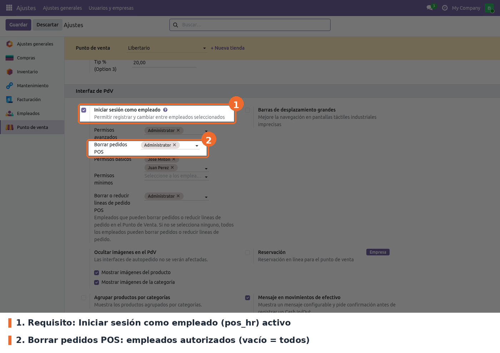

Ir a *Punto de venta › Configuración › Ajustes*, elegir el punto de venta en la parte superior y
buscar el bloque **Interfaz de PdV**.

- **Iniciar sesión como empleado** (campo estándar de `pos_hr`). Requisito. El campo del módulo
  solo aparece con esta casilla marcada y guardada, y el control usa el empleado que inició sesión
  en la caja.
- **Borrar pedidos POS** (campo `able_del_employee_ids` de `pos.config`). Opcional; vacío por
  defecto. Lista de empleados de la compañía que pueden eliminar órdenes. Vacío significa que
  **todos** pueden (el campo muestra "Todos los empleados").

A tener en cuenta:

- La configuración es **por punto de venta**. Hay que repetirla en cada tienda.
- Los cambios se ven en el POS después de volver a entrar a la sesión desde el backend.
- La fila **Borrar o reducir lineas de pedido POS** que aparece más abajo pertenece a otro módulo
  (`pos_restrict_del_ordered_order_line`) y no tiene efecto sobre esta regla.
- Los empleados con **Permisos mínimos** de `pos_hr` ya no ven el ícono ni el botón *Cancelar
  orden*, aunque estén en esta lista. Esa restricción es de Odoo.
