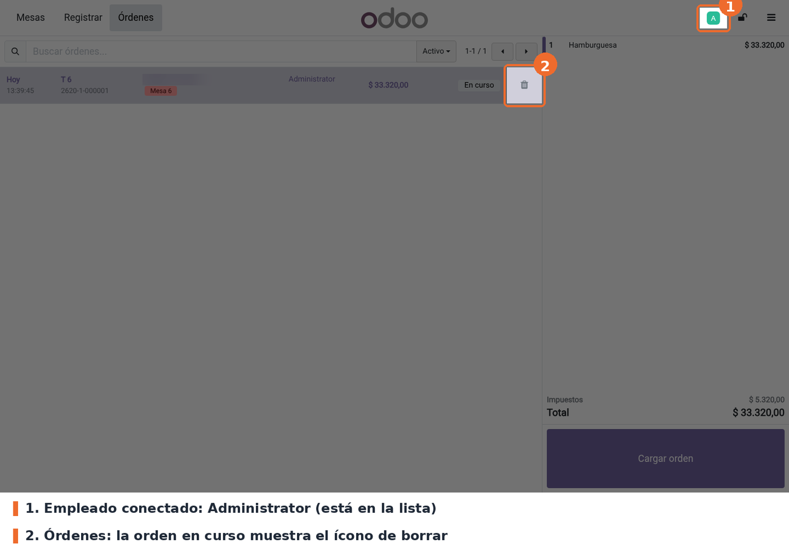
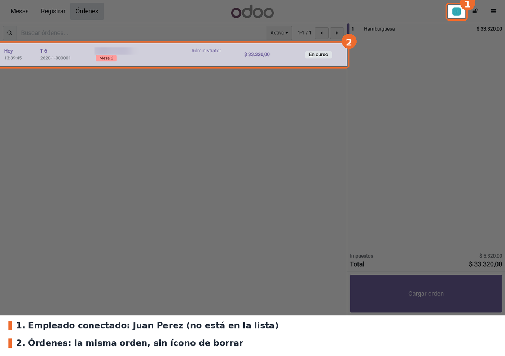
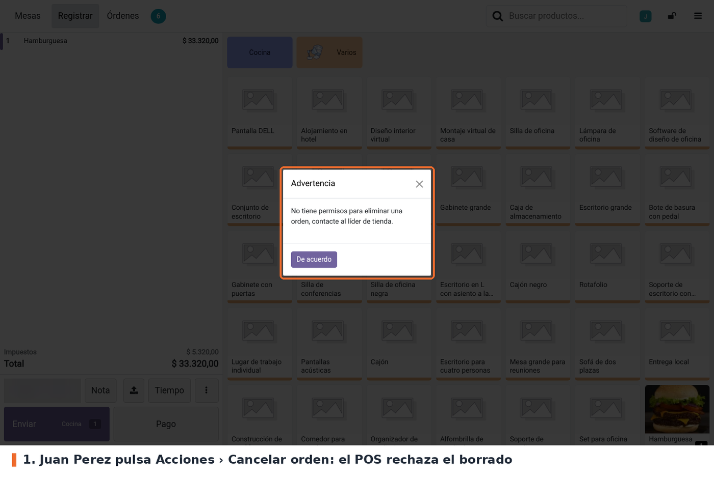

## Empleado autorizado

Con un empleado de la lista en la caja, la pantalla **Órdenes** muestra el ícono de borrar en las
órdenes en curso. Al pulsarlo, Odoo pide la confirmación habitual ("... ¿Está seguro de que desea
eliminar esta orden?") y, si se acepta, la orden desaparece del POS. Si la orden ya estaba
sincronizada, en el backend queda en estado **Cancelado**.

## Empleado no autorizado

Con un empleado que no está en la lista, la misma orden aparece **sin el ícono de borrar**.

Si ese empleado intenta eliminar la orden desde la pantalla de productos (**⋮ › Cancelar orden**),
el POS muestra el aviso *Advertencia* y la orden no se toca.

## Casos especiales

- **Lista vacía**: todos los empleados pueden eliminar órdenes.
- **Cambio de empleado**: la regla se evalúa con el empleado que tiene la caja en ese momento. Al
  bloquear la caja y entrar con otro PIN, el ícono aparece o desaparece según el nuevo empleado.
- **Orden vacía**: el empleado no autorizado tampoco puede eliminarla con *Cancelar orden*; el aviso
  sale igual.
- **Transferir o fusionar mesas, Liberar la mesa y cierre de sesión**: Odoo elimina órdenes en esos
  flujos sin pasar por la regla del módulo (ver *Limitaciones conocidas*).

## Solución de problemas

- **No aparece el campo Borrar pedidos POS en Ajustes.** Marcar *Iniciar sesión como empleado*,
  guardar y volver a la página: el campo está dentro de ese bloque.
- **Un empleado no autorizado sigue viendo el ícono.** Verificar que la lista esté guardada en el
  punto de venta correcto y volver a entrar al POS desde el backend. Revisar también qué empleado
  tiene la caja (avatar arriba a la derecha).
- **Nadie ve el ícono de borrar.** Odoo lo oculta además en órdenes pagadas, con un pago
  electrónico ya aprobado, en la orden vacía por defecto y para empleados con permisos mínimos.
  Esas condiciones aplican también con la lista vacía.
- **El aviso sale para todos, incluso con la lista cargada.** Comprobar que *Iniciar sesión como
  empleado* esté activo: sin él, el POS usa el usuario y no el empleado, y el control no encuentra
  coincidencias (ver *Limitaciones conocidas*).
