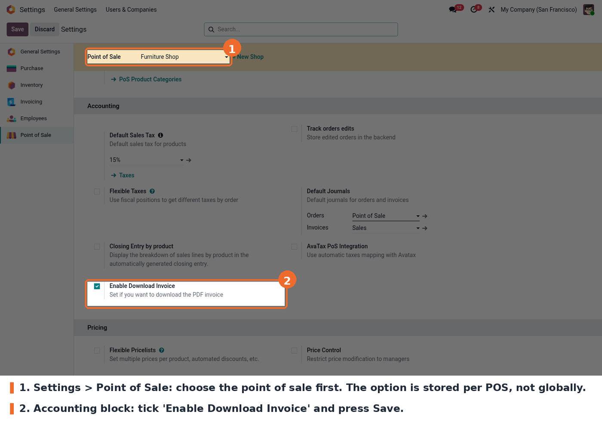
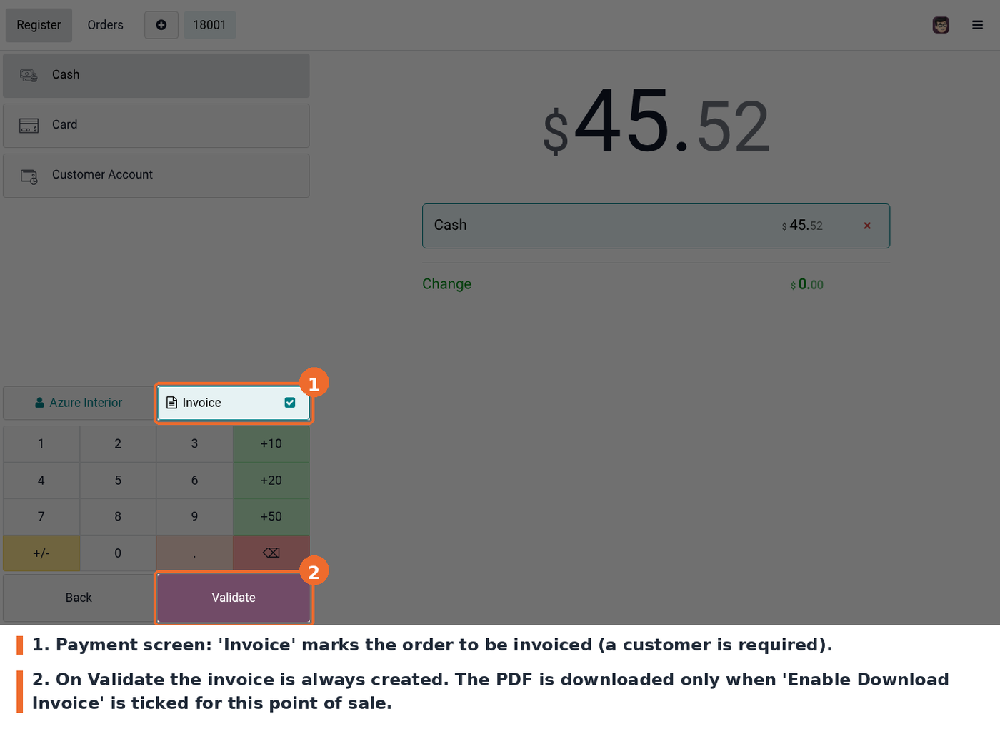

Nothing changes for the cashier. Take an order, press **Payment**, choose a
customer, leave the **Invoice** button active and validate. The invoice is
created either way; the PDF download is what the setting controls. The same
applies to the quick payment flow.

The checkbox lives in the **Accounting** block of the Point of Sale settings:

And this is the payment screen with the **Invoice** button active, right before
validating the order:

The setting only controls the **download**. The invoice itself is always created
for orders marked as Invoice, and stays available in Accounting and in the
customer portal.
