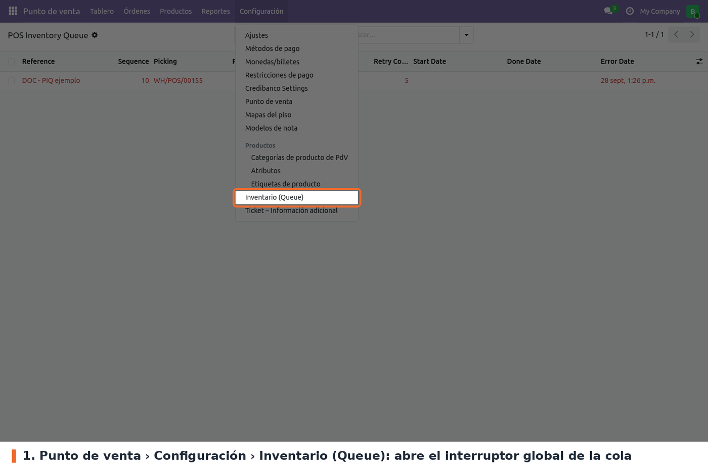
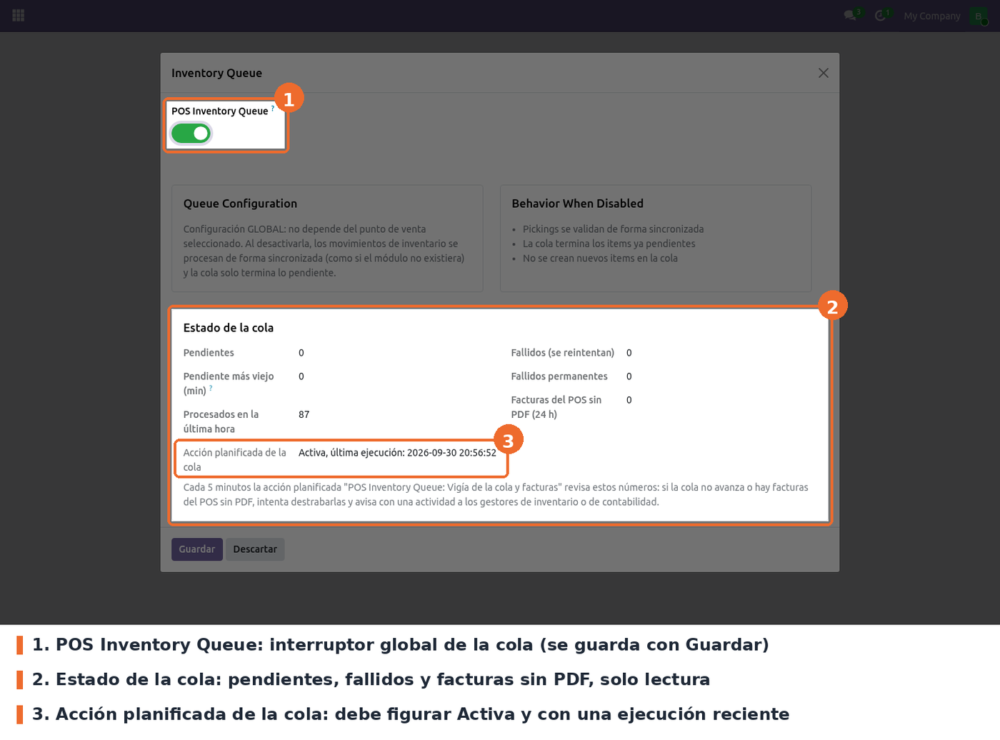

Ir a *Punto de venta › Configuración › Inventario (Queue)*. Se abre una ventana con el interruptor
de la cola y, abajo, el **estado de la cola** en vivo.

- **POS Inventory Queue** (parámetro del sistema `pos_inventory_queue.enabled`). Opcional;
  **activado** por defecto, y si el parámetro no existe el código también lo toma como activado.
  Activado, las ventas crean el picking y lo encolan. Desactivado, cada venta valida su picking en
  el momento, como Odoo estándar, y no se crean ítems nuevos. Los ítems que ya estaban en la cola
  se siguen procesando igual: el procesador drena siempre, esté o no activado.
- El valor se guarda con **Guardar**. *Descartar* cierra la ventana sin cambios.
- **Estado de la cola** (solo lectura, se calcula al abrir la ventana): pendientes, minutos que lleva
  esperando el pendiente más viejo, procesados en la última hora, fallidos, fallidos permanentes,
  facturas del POS de las últimas 24 h sin PDF y si la acción planificada de la cola está activa y
  cuándo corrió por última vez. Ver *Vigía* en *Uso*.

A tener en cuenta:

- **Es global.** No depende del punto de venta ni de la compañía: afecta a todas las cajas.
- **Solo un administrador puede cambiarlo.** Según `security/ir.model.access.csv`, el grupo
  *Administración / Ajustes* tiene todos los permisos sobre esta ventana; el *Administrador* del
  Punto de venta solo puede leerla.
- **Condición previa: inventario en tiempo real.** La cola solo interviene cuando la orden genera
  su picking en el momento. Eso depende del ajuste estándar *Gestión de inventario* de la compañía
  (en *Punto de venta › Configuración › Ajustes*, bloque *Inventario*, visible solo en modo
  desarrollador), que en Odoo 19 viene en *En tiempo real*. Con *Al cierre de
  la sesión* la cola no actúa, salvo en los casos que el core fuerza en tiempo real: contabilidad
  anglosajona con la orden facturada, o devolución de una orden de envío posterior.
- **Acciones planificadas** (*Ajustes › Técnico › Acciones planificadas*, en modo desarrollador):
  *POS Inventory Queue: Process pending items* corre **cada 1 minuto** y es la red de seguridad del
  drenaje; *POS Inventory Queue: Cleanup done items* corre **cada 7 días** y borra los ítems `done`
  con más de 30 días; *POS Inventory Queue: Vigía de la cola y facturas* corre **cada 5 minutos**
  (ver *Vigía* en *Uso*). No hay que tocarlas; si se desactiva la primera, la cola no avanza y el
  vigía avisa.
- **Umbral del vigía** (parámetro del sistema `pos_inventory_queue.stall_alert_minutes`, opcional,
  **15** minutos por defecto): cuántos minutos puede esperar un ítem o una factura antes de que el
  vigía actúe.
