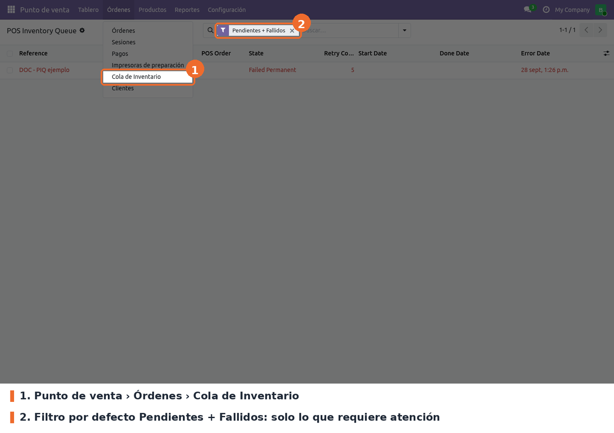
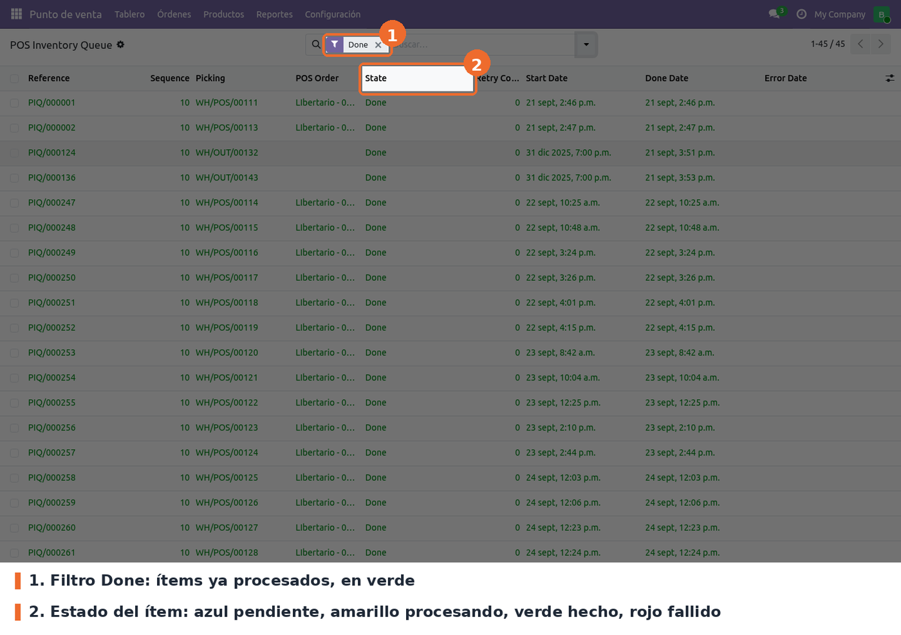
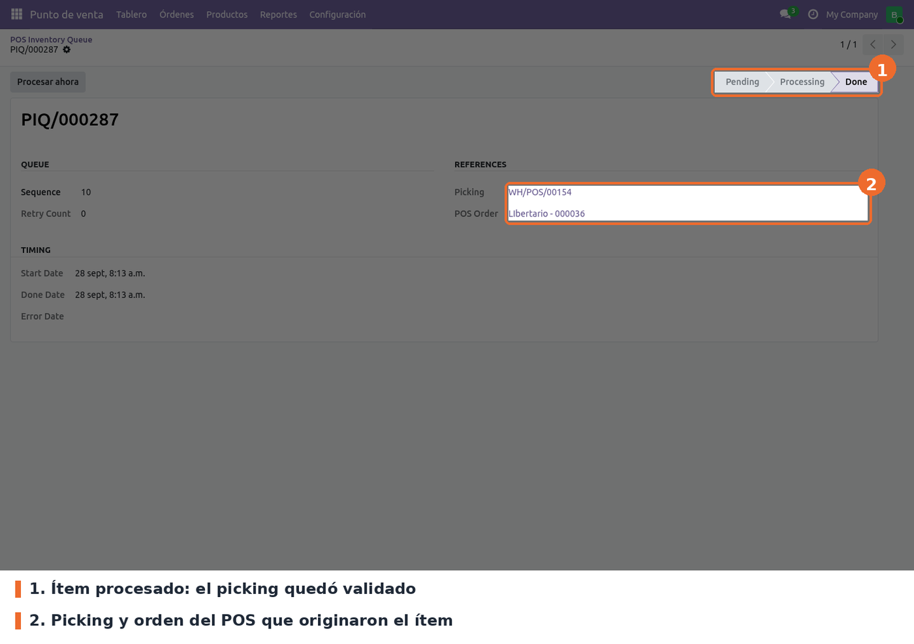
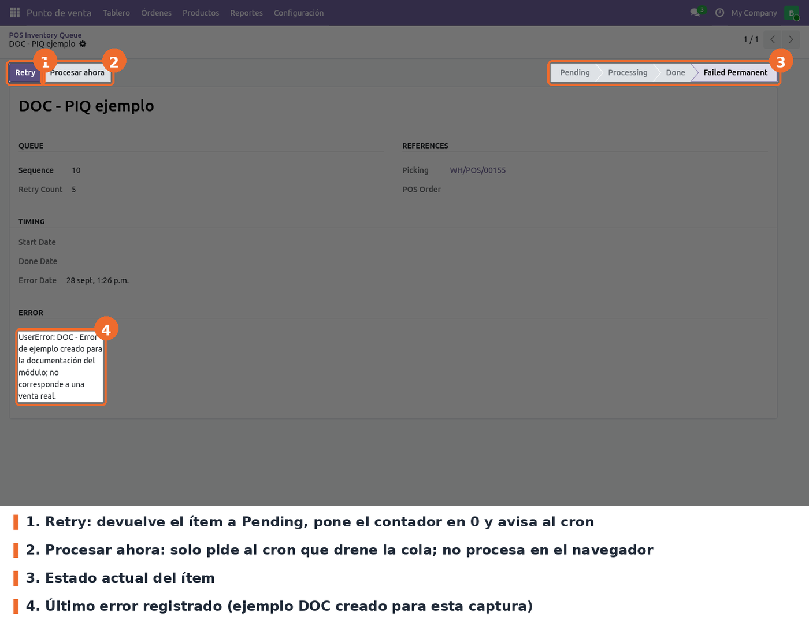

## Flujo

El cajero no hace nada distinto: vende y cobra como siempre. Lo que cambia ocurre en el servidor:

- Al registrar la orden, el módulo crea el picking **sin validarlo** y un ítem de cola en estado
  *Pending* con referencia `PIQ/000NNN`. Si la venta tiene productos a entregar y devueltos, crea
  un picking y un ítem para cada parte.
- En la misma transacción pide al worker de cron que drene la cola. Si ese aviso se pierde, la
  acción planificada de cada minuto lo retoma.
- El worker toma los ítems de a uno, primero los *Pending*, valida el picking y marca el ítem
  *Done*. Cuando la cola se vacía, termina.

Para ver la cola, ir a *Punto de venta › Órdenes › Cola de Inventario*. Abre con el filtro
**Pendientes + Fallidos**, que muestra solo lo que necesita atención; si la lista está vacía, no hay
nada atrasado.

Quitando el filtro, o eligiendo *Done*, se ven los ítems procesados. El color de la fila indica el
estado.

## Estados

- **Pending** (azul): esperando turno.
- **Processing** (amarillo): un worker lo tomó. Si queda así más de 5 minutos, porque el worker
  murió o se cortó la conexión, la cola lo vuelve a tomar.
- **Done** (verde): picking validado. Se borra automáticamente a los 30 días.
- **Failed** (rojo): la validación dio un error de lógica, por ejemplo un producto con lote o serie
  sin asignar. Se reintenta solo, esperando 2, 4, 8 y 16 minutos entre intentos; *Next Retry*
  indica cuándo.
- **Failed Permanent** (rojo): falló en 5 ciclos seguidos. Ya no se reintenta solo.

## Qué hacer con un ítem fallido

Abrir el ítem desde la lista. La sección *Error* muestra la excepción y la traza, y *Retry Count*
cuántos ciclos lleva. Corregir la causa en el picking o en el producto y pulsar **Retry**.

- **Retry** (solo *Administrador* del Punto de venta, visible en *Failed* y *Failed Permanent*):
  vuelve el ítem a *Pending*, borra el error, pone el contador en 0 y avisa al cron.
- **Procesar ahora** (solo *Administrador* del Punto de venta): no procesa nada en el navegador.
  Pide al cron que drene la cola y muestra el aviso "Procesamiento solicitado".

## Casos especiales

- **Contención con otra caja.** Si el intento choca con otro proceso sobre el mismo stock (error
  de serialización o `lock_not_available`), se reintenta hasta 5 veces con esperas cortas, de hasta
  0,8 segundos. Si sigue chocando, el ítem vuelve a *Pending* sin sumar ciclos de fallo, y queda
  el detalle en *Error Message*.
- **Picking ya validado.** Si al tomar el ítem el picking ya está *Hecho*, lo marca *Done* sin
  volver a validar, para no descontar stock dos veces.
- **Líneas sin stock.** Servicios y cantidades en cero no generan picking ni ítem.
- **Devolución total de una orden cuyo picking aún no se validó.** Se cancela el picking original y
  no se crea ninguno nuevo. En una devolución parcial se reducen las cantidades del picking
  pendiente.
- **Cola apagada con ítems pendientes.** Los pendientes se terminan de procesar; las ventas nuevas
  se validan en el momento.
- **Cierre de sesión.** Antes de cerrar, Odoo procesa en línea los ítems de esa sesión que no estén
  *Done* ni *Failed Permanent*. Si después queda alguno sin *Done*, el cierre se detiene con el
  mensaje "No se puede cerrar la sesión … quedan N movimiento(s) de inventario sin procesar en la
  cola" y la lista de referencias.
- **Fallo permanente.** El log registra una línea con el prefijo `POS Queue: PERMANENT`. El código
  intenta además crear una actividad para los gestores de inventario, pero en Odoo 19 esa alerta
  no se crea (ver *Limitaciones conocidas*).

## Solución de problemas

- **La sesión no cierra por movimientos sin procesar.** Filtrar la cola por la orden o el picking
  que indica el mensaje. Si el ítem está en *Failed* o *Failed Permanent*, corregir la causa y
  pulsar *Retry*. Si el picking ya está *Hecho* pero el ítem no, también *Retry*: la cola lo marca
  *Done* sin revalidar. Si el ítem acaba de procesarse durante el propio intento de cierre, volver
  a intentar el cierre (ver *Limitaciones conocidas*). El mensaje menciona *Punto de Venta ›
  Configuración › Cola de Inventario*, pero la cola está en *Órdenes*.
- **Ítems en *Pending* que no avanzan.** Revisar que la acción planificada *POS Inventory Queue:
  Process pending items* esté activa y que el servidor tenga workers de cron. En el log, cada
  pasada deja una línea `POS Queue: summary reason=... elapsed=... done=N contention=N failed=N permanent=N`.
- **Ítem en *Processing* por mucho tiempo.** Pasados 5 minutos la cola lo vuelve a tomar sola. Si
  no ocurre, es el mismo caso del punto anterior: el cron no está corriendo.
- **El stock de una venta tarda en reflejarse.** Es lo esperado: el descuento ocurre cuando el
  worker procesa el ítem, normalmente en segundos. Para ver el stock en el momento, apagar la cola.
- **Qué dice el error.** *Error Message* guarda el tipo de excepción, el código SQLSTATE si lo hay
  y la traza, recortados a 4000 caracteres.
