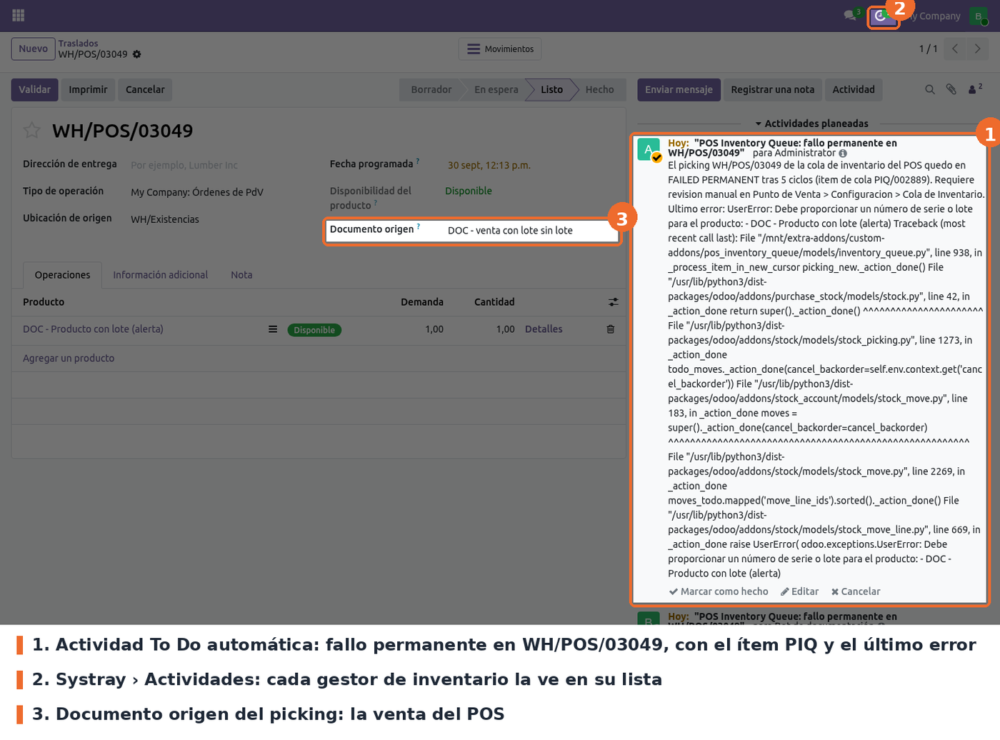
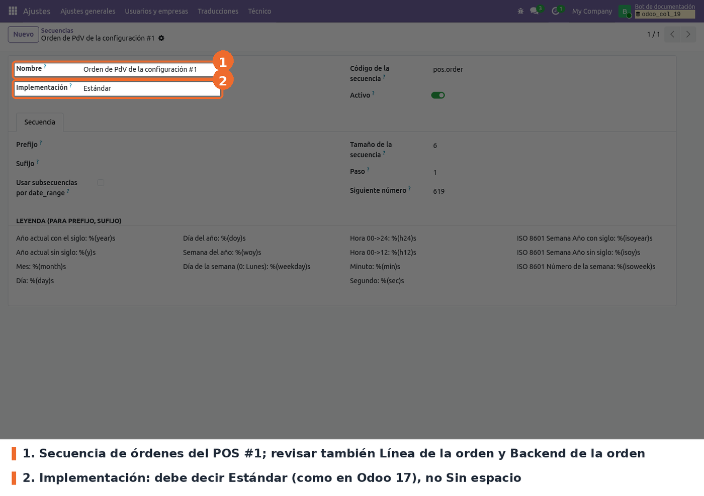

## Flujo

El cajero no hace nada distinto: vende y cobra como siempre. Lo que cambia ocurre en el servidor:

- Al registrar la orden, el módulo crea el picking **en borrador**, sin reservar stock ni validarlo,
  y un ítem de cola en estado *Pending* con referencia `PIQ/000NNN` que guarda las líneas de la
  venta. Así la venta no toca el stock y no compite con las otras cajas. Si la venta tiene
  productos a entregar y devueltos, crea un picking y un ítem para cada parte.
- En la misma transacción pide al worker de cron que drene la cola. Si ese aviso se pierde, la
  acción planificada de cada minuto lo retoma.
- El worker toma los ítems de a uno, primero los *Pending*. Confirma el picking, reserva el stock,
  asigna cantidades, lotes y series desde las líneas de la venta, lo valida y marca el ítem *Done*.
  Cuando la cola se vacía, termina. En *Inventario* el picking se ve unos segundos en *Borrador*
  hasta que la cola lo procesa.

Para ver la cola, ir a *Punto de venta › Órdenes › Cola de Inventario*. Abre con el filtro
**Pendientes + Fallidos**, que muestra solo lo que necesita atención; si la lista está vacía, no hay
nada atrasado.

Quitando el filtro, o eligiendo *Done*, se ven los ítems procesados. El color de la fila indica el
estado.

## Estados

- **Pending** (azul): esperando turno.
- **Processing** (amarillo): un worker lo tomó. Si queda así más de 5 minutos, porque el worker
  murió o se cortó la conexión, la cola lo vuelve a tomar.
- **Done** (verde): picking validado. Se borra automáticamente a los 30 días.
- **Failed** (rojo): la validación dio un error de lógica, por ejemplo un producto con lote o serie
  sin asignar. Se reintenta solo, esperando 2, 4, 8 y 16 minutos entre intentos; *Next Retry*
  indica cuándo.
- **Failed Permanent** (rojo): falló en 5 ciclos seguidos. Ya no se reintenta solo.

## Qué hacer con un ítem fallido

Abrir el ítem desde la lista. La sección *Error* muestra la excepción y la traza, y *Retry Count*
cuántos ciclos lleva. Corregir la causa en el picking o en el producto y pulsar **Retry**.

- **Retry** (solo *Administrador* del Punto de venta, visible en *Failed* y *Failed Permanent*):
  vuelve el ítem a *Pending*, borra el error, pone el contador en 0 y avisa al cron.
- **Procesar ahora** (solo *Administrador* del Punto de venta): no procesa nada en el navegador.
  Pide al cron que drene la cola y muestra el aviso "Procesamiento solicitado".

## Casos especiales

- **Errores de inventario.** Un problema de lote, serie o unidad de medida ya no hace fallar la
  venta en el POS: la venta entra y el error aparece en la cola (*Failed*, con reintentos y, si
  persiste, la alerta a los gestores de inventario).
- **PDF de la factura.** Las ventas facturadas se confirman sin generar el PDF dentro; el PDF se
  genera justo después, antes de que el POS reciba la respuesta, así que el POS ve la factura con su
  PDF igual que antes. Mientras tanto el número de factura queda libre para las otras ventas del
  mismo diario. Si la generación falla, la factura queda publicada y la completa la acción
  planificada de Odoo *Send invoices automatically* (debe estar activa). Para volver a generar el
  PDF dentro de la venta: parámetro de sistema `pos_inventory_queue.invoice_pdf_after_commit` en
  `False`.
- **Volver a reservar en la venta.** El parámetro de sistema `pos_inventory_queue.defer_reservation`
  (por defecto `True`) activa la reserva en la cola. En `False` la venta vuelve a confirmar y
  reservar el picking como antes y la cola solo lo valida; aplica a las ventas nuevas, y los
  pickings en borrador que ya estén en cola se completan igual.

- **Contención con otra caja.** Si el intento choca con otro proceso sobre el mismo stock (error
  de serialización o `lock_not_available`), se reintenta hasta 5 veces con esperas cortas, de hasta
  0,8 segundos. Si sigue chocando, el ítem vuelve a *Pending* sin sumar ciclos de fallo, y queda
  el detalle en *Error Message*.
- **Picking ya validado.** Si al tomar el ítem el picking ya está *Hecho*, lo marca *Done* sin
  volver a validar, para no descontar stock dos veces, y le recalcula el costo de la orden.
- **Costo y margen de la orden.** El costo de los productos con método FIFO o AVCO sale de los
  movimientos del picking, así que se calcula recién cuando la cola lo valida (si no, quedaría en 0
  y el margen de la orden, mal). Los productos de costo estándar no se tocan: su costo sale de la
  tarifa del producto y es el mismo validando la cola o no.
- **Líneas sin stock.** Servicios y cantidades en cero no generan picking ni ítem.
- **Devolución total de una orden cuyo picking aún no se validó.** Se cancela el picking original y
  no se crea ninguno nuevo. En una devolución parcial se reducen las cantidades del picking
  pendiente.
- **Cola apagada con ítems pendientes.** Los pendientes se terminan de procesar; las ventas nuevas
  se validan en el momento.
- **Cierre de sesión.** Antes de cerrar, Odoo procesa en línea todos los ítems de esa sesión que
  no estén *Done*, incluidos los fallidos: si su causa ya se resolvió (por ejemplo, alguien validó
  el picking a mano), el cierre los marca *Done* solo. Si después queda alguno sin *Done*, el
  cierre se detiene con el mensaje "No se puede cerrar la sesión … quedan N movimiento(s) de
  inventario sin procesar en la cola" y la lista de referencias.
- **Fallo permanente.** El log registra una línea con el prefijo `POS Queue: PERMANENT`. Además,
  el sistema crea una actividad **To Do** para cada gestor de inventario de la compañía del
  picking, con el picking como referencia, visible en *Actividades* del systray. Se crea una sola
  vez por picking: los reintentos posteriores no la duplican. Para revisar la causa, abrir el
  picking o el ítem de la cola en *Punto de venta › Órdenes › Cola de Inventario*. La nota de la
  actividad dice *Punto de Venta › Configuración › Cola de Inventario*, pero la cola está en
  *Órdenes*.

  

- **Numeración de ventas del POS.** Las secuencias de órdenes, líneas y referencia backend de cada
  POS usan la implementación *Estándar*, como en Odoo 17, en lugar de *Sin espacio* (la que crea
  Odoo 19, que hace esperar a los cajeros de una misma tienda). Los POS nuevos nacen así y los
  existentes se convierten al actualizar el módulo, sin saltos en la numeración. Para verificarlo,
  en modo desarrollador: *Ajustes › Técnico › Secuencias*, buscar el nombre del POS y abrir *Orden
  de PdV…*, *Línea de la orden de PdV…* y *Backend de la orden de PdV…*: las tres deben decir
  *Estándar*. *Dispositivo de PdV…* queda en *Sin espacio*: no se usa al vender. No es numeración
  fiscal: la factura electrónica numera con su propio diario.

  

## Solución de problemas

- **La sesión no cierra por movimientos sin procesar.** Filtrar la cola por la orden o el picking
  que indica el mensaje. Si el ítem está en *Failed* o *Failed Permanent*, corregir la causa y
  pulsar *Retry* (o intentar cerrar de nuevo: el propio cierre reintenta los ítems fallidos). Si
  el picking ya está *Hecho* pero el ítem no, basta con volver a intentar el cierre: la cola lo
  marca *Done* sin revalidar, ni siquiera hace falta *Retry*. El mensaje menciona *Punto de Venta ›
  Configuración › Cola de Inventario*, pero la cola está en *Órdenes*.
- **Ítems en *Pending* que no avanzan.** Revisar que la acción planificada *POS Inventory Queue:
  Process pending items* esté activa y que el servidor tenga workers de cron. En el log, cada
  pasada deja una línea `POS Queue: summary reason=... elapsed=... done=N contention=N failed=N permanent=N`.
- **Ítem en *Processing* por mucho tiempo.** Pasados 5 minutos la cola lo vuelve a tomar sola. Si
  no ocurre, es el mismo caso del punto anterior: el cron no está corriendo.
- **El stock de una venta tarda en reflejarse.** Es lo esperado: el descuento ocurre cuando el
  worker procesa el ítem, normalmente en segundos. Para ver el stock en el momento, apagar la cola.
- **Qué dice el error.** *Error Message* guarda el tipo de excepción, el código SQLSTATE si lo hay
  y la traza, recortados a 4000 caracteres.
