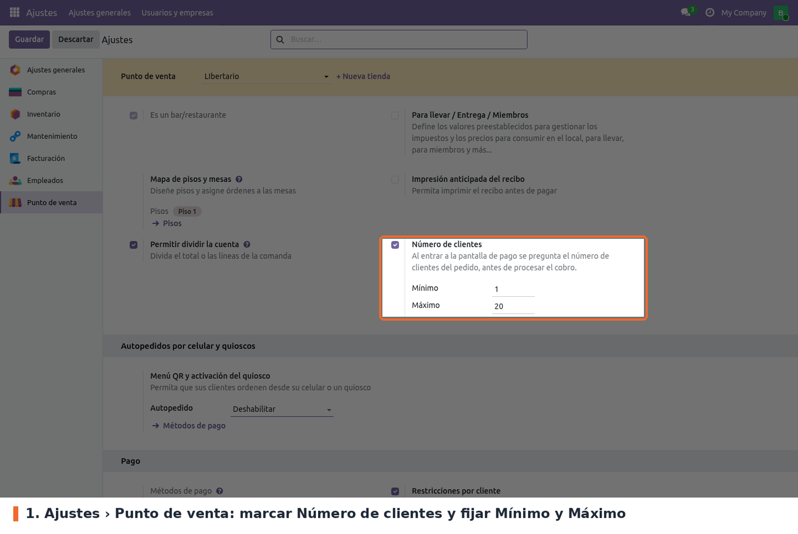

Ir a *Punto de venta › Configuración › Ajustes*, elegir el punto de venta en la parte superior y
buscar el bloque **Punto de venta** (el de *Es un bar/restaurante*). La opción **Número de clientes**
está junto a *Permitir dividir la cuenta*.

- **Número de clientes** (campo `enable_obligatory_ask_number_customers` de `pos.config`). Opcional;
  desmarcada por defecto. Activa la pregunta. Al marcarla aparecen los dos campos del rango.
- **Mínimo** (campo `number_customers_min`). Por defecto 1. No se acepta un valor menor que 1.
- **Máximo** (campo `number_customers_max`). Por defecto 20. No puede ser menor que el mínimo.

A tener en cuenta:

- La opción solo se ve si el punto de venta es un **bar/restaurante** y no está en modo quiosco.
- La configuración es **por punto de venta**. Hay que repetirla en cada tienda.
- Un rango inválido (mínimo menor que 1 o máximo menor que el mínimo) no se puede guardar: Odoo
  muestra un error al pulsar *Guardar*.
- Los cambios se ven en el POS después de volver a entrar a la sesión desde el backend.
