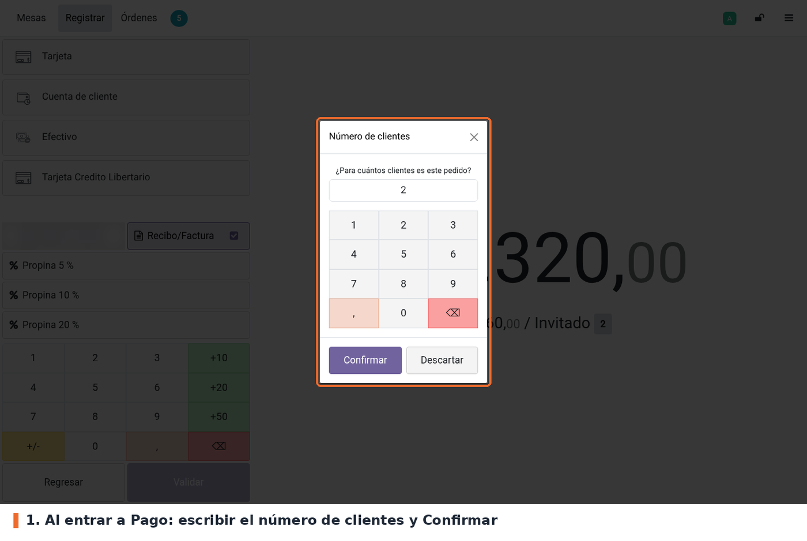
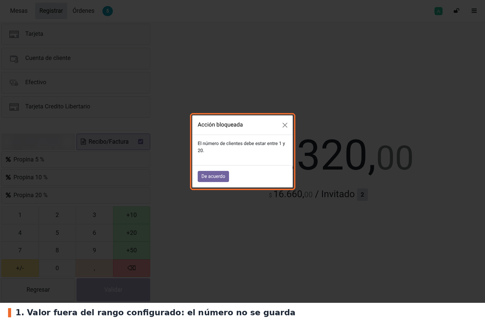
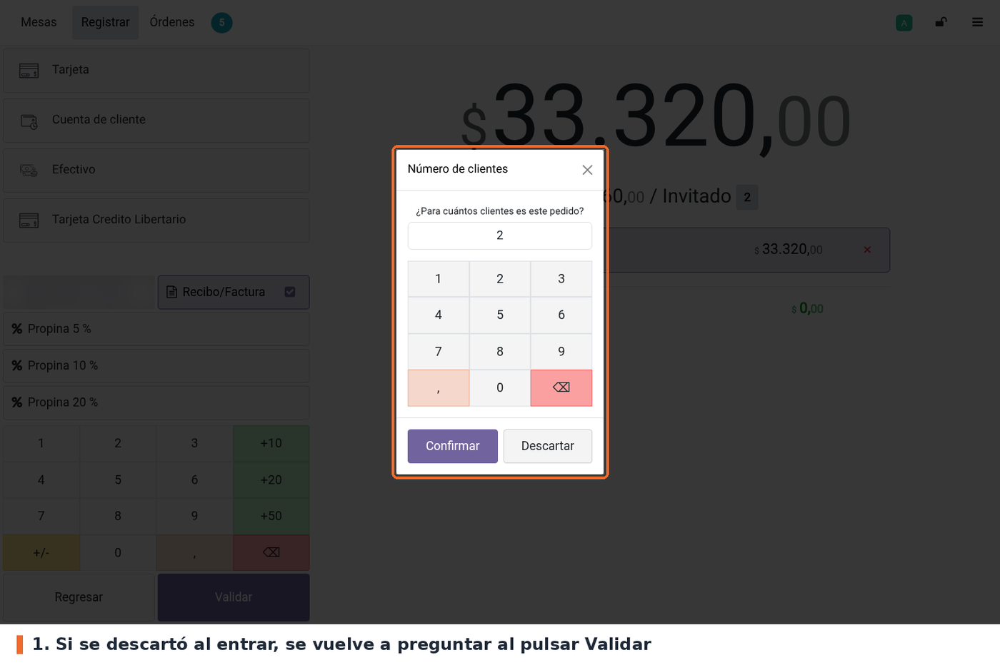
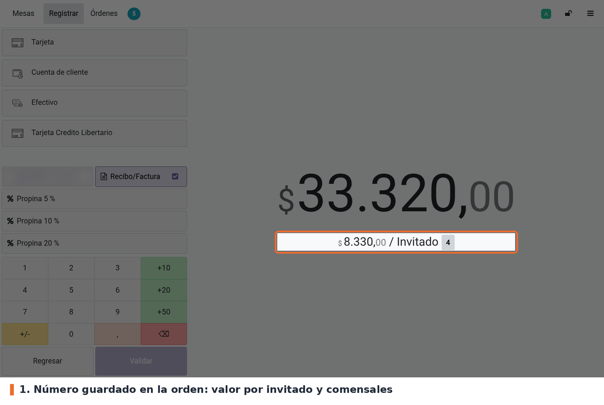

## Flujo

En el POS, abrir la mesa, agregar los productos y pulsar **Pago**. Si la orden tiene productos sin
enviar a cocina, Odoo pregunta primero si se quiere enviar (es un aviso de `pos_restaurant`, no de
este módulo). Al llegar a la pantalla de pago aparece la ventana **Número de clientes**. El valor
inicial es el que ya tenía la orden; en una mesa nueva, los asientos de la mesa. Escribir el número
y pulsar **Confirmar**.

Si el número está fuera del rango configurado, aparece el aviso **Acción bloqueada** con el rango
permitido. El número no se guarda y se vuelve a preguntar al pulsar *Validar*.

Si el cajero pulsa **Descartar** o cierra la ventana al entrar, puede seguir registrando los pagos.
Pero al pulsar **Validar** se le vuelve a preguntar, y si descarta otra vez, la orden no se valida y
queda en la pantalla de pago.

Una vez respondida, la pregunta no se repite en esa orden, aunque el cajero vuelva a productos y
entre de nuevo a pago. El número queda en la orden: la pantalla de pago muestra el valor por
invitado y en el recibo sale *Mesa N, Comensales: X*.

## Casos especiales

- **Cambiar el número después de responder**: la acción *Comensales* de la pantalla de productos y
  el número junto al valor por invitado de la pantalla de pago (ambos de `pos_restaurant`) permiten
  corregirlo. Esos botones no aplican el rango de este módulo.
- **Una sola persona**: la pantalla de pago de Odoo solo muestra el valor por invitado cuando hay
  más de un comensal. Con 1, el número se guarda igual, pero esa línea no aparece.
- **Pago en un clic**: si el punto de venta valida desde la pantalla de productos sin pasar por la
  de pago, la pregunta sale al validar.
- **Recarga del navegador**: la marca de "ya preguntado" vive solo en memoria. Si se recarga el POS
  antes de validar, se vuelve a preguntar.

## Solución de problemas

- **No aparece la opción en Ajustes.** El punto de venta debe tener marcado *Es un bar/restaurante*
  y no estar en modo quiosco.
- **No sale la pregunta en el POS.** Verificar que la casilla esté marcada en el punto de venta
  correcto y volver a entrar a la sesión desde el backend.
- **No deja guardar Ajustes.** Revisar el rango: el mínimo debe ser al menos 1 y el máximo no puede
  ser menor que el mínimo.
- **Siempre dice "Acción bloqueada".** El número escrito está fuera del rango. Se puede borrar el
  valor inicial con la tecla ⌫ de la ventana antes de escribir el nuevo.
