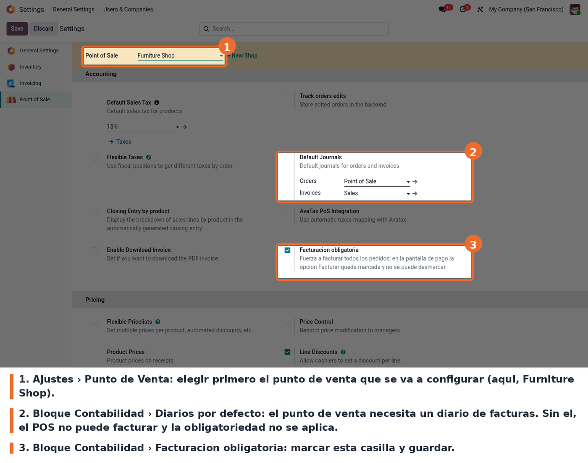
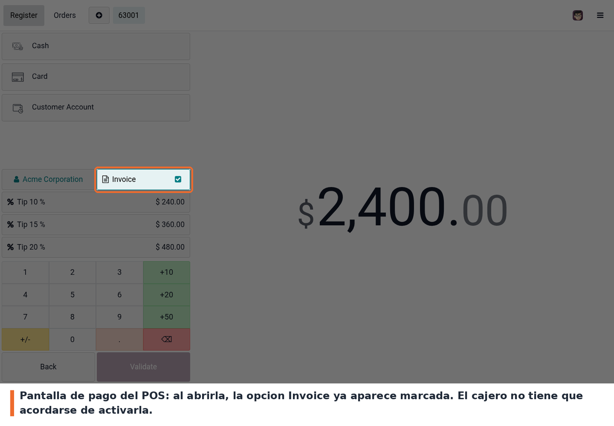
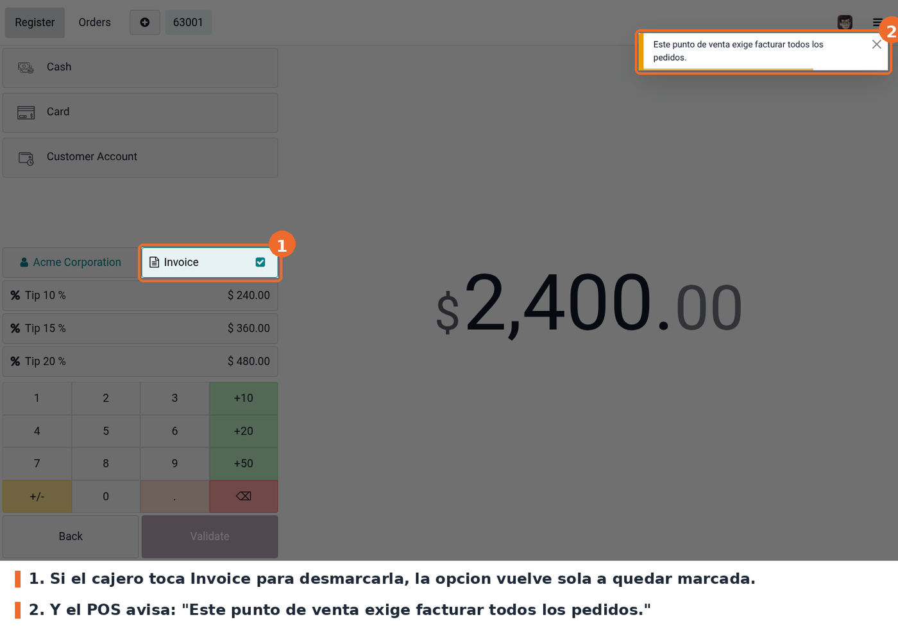

La casilla esta en los ajustes del punto de venta:

Con el interruptor activo, cualquier pedido de ese punto de venta llega a la
pantalla de pago con **Invoice** ya marcado:

Si el cajero intenta desmarcarla, la opcion se restablece sola y el POS lo
avisa con el mensaje *"Este punto de venta exige facturar todos los pedidos."*:

Los pedidos ya finalizados no se tocan: el modulo solo actua sobre el pedido en
curso.
