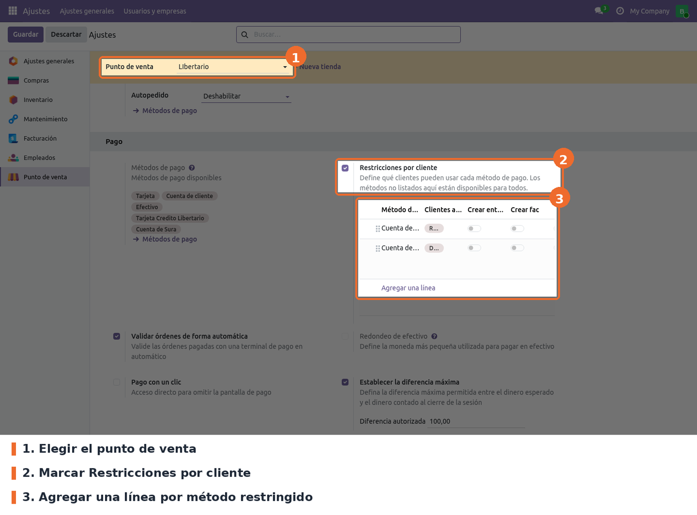
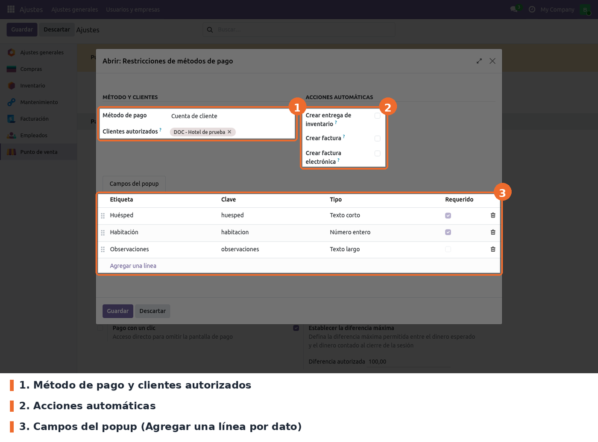

## Activar las restricciones en el punto de venta

Ir a *Punto de venta › Configuración › Ajustes*, elegir el punto de venta en la parte superior y
buscar, en el bloque **Pago**, la opción **Restricciones por cliente**.

- **Restricciones por cliente** (campo `payment_restrict_enabled` de `pos.config`). Opcional;
  desmarcada por defecto. Es el interruptor general: con la casilla desmarcada el POS no filtra
  métodos ni decide la factura, y la lista queda oculta (pero no se borra).
- **Lista de restricciones**: una línea por método de pago restringido. *Agregar una línea* abre el
  formulario de la restricción. El método tiene que estar entre los métodos de pago del punto de
  venta para que aparezca en el POS.

La configuración es **por punto de venta**. Se puede cambiar con la sesión abierta, pero el POS la
lee al cargar: los cambios se ven después de volver a entrar al POS.

Las mismas restricciones, de todos los puntos de venta, se consultan también en *Punto de venta ›
Configuración › Restricciones de pago*. Ahí cada línea indica su punto de venta.

## Crear una restricción

- **Método de pago**. Obligatorio. El método que queda reservado. No se puede borrar un método de
  pago que tenga restricciones. Para un convenio a crédito conviene un método de tipo *Cuenta de
  cliente*, que no registra entrada de dinero.
- **Clientes autorizados**. Opcional, vacío por defecto. Si queda vacío, el método **no lo ve
  nadie** en ese punto de venta.
- **Crear entrega de inventario**. Opcional; desmarcada por defecto. Si el inventario se actualiza
  al cierre de la sesión, las órdenes de estos clientes generan igual su entrega en el momento de la
  venta, sin importar con qué método se paguen. Si ya se actualiza en tiempo real, no cambia nada.
- **Crear factura**. Opcional; desmarcada por defecto. Decide si las órdenes de estos clientes se
  facturan en el POS. Desmarcada, la orden queda *Pagada* sin factura aunque el POS exija factura, y
  se factura después con la factura agrupada. Marcada, se factura siempre.
- **Crear factura electrónica**. Opcional; desmarcada por defecto. **Hoy no tiene efecto** con
  Jorels 19 (ver *Limitaciones conocidas*).
- **Campos del popup**. Opcional. Cada línea es un dato que el cajero escribe al elegir el método:
  *Etiqueta* (obligatoria, es el texto que ve el cajero), *Tipo* (*Texto corto* por defecto, *Texto
  largo* o *Número entero*) y *Requerido* (desmarcado por defecto). La *Clave* se calcula sola a
  partir de la etiqueta, sin tildes ni espacios (*Habitación* → `habitacion`). Sin campos, no hay
  popup.

A tener en cuenta:

- Un cliente puede estar en varias restricciones del mismo punto de venta: en ese caso ve todos sus
  métodos autorizados.
- El popup sale para cualquier método que tenga campos, **aunque la casilla general esté
  desmarcada**.
- Si las etiquetas son *Huésped* y *Habitación*, sus valores se copian además a los campos
  `hotel_guest` y `hotel_room` de la orden (también sirven las claves `huesped`, `guest`,
  `nombre_huesped`, `room` y `numero_habitacion`).
