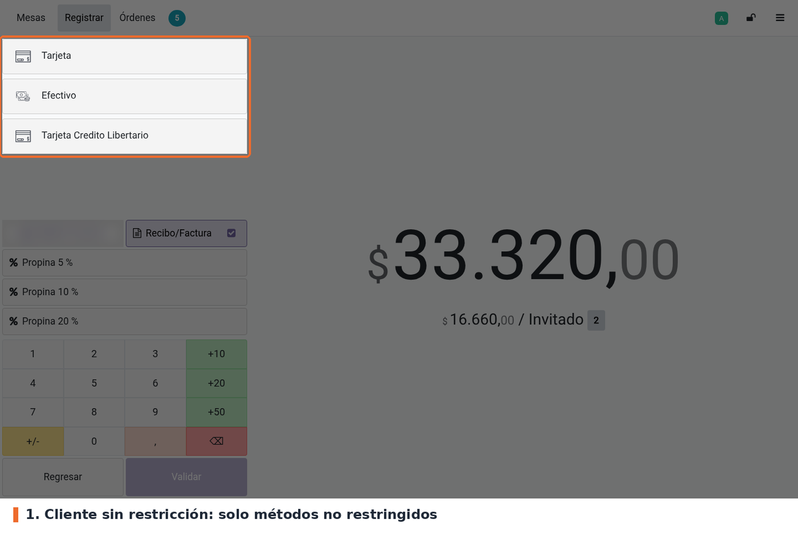
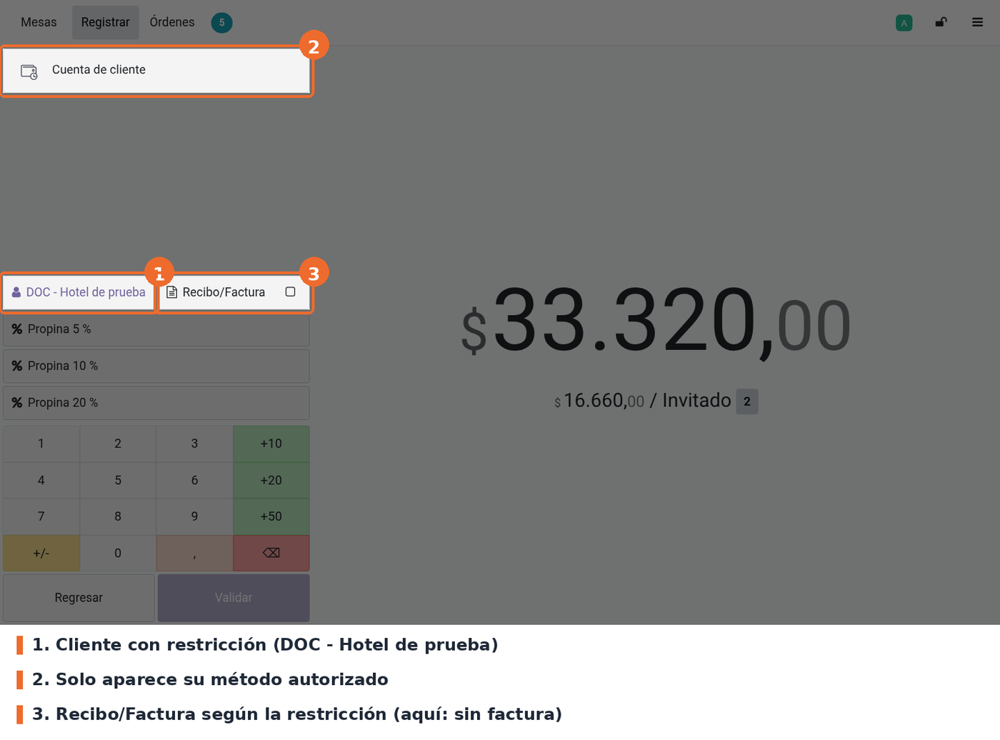
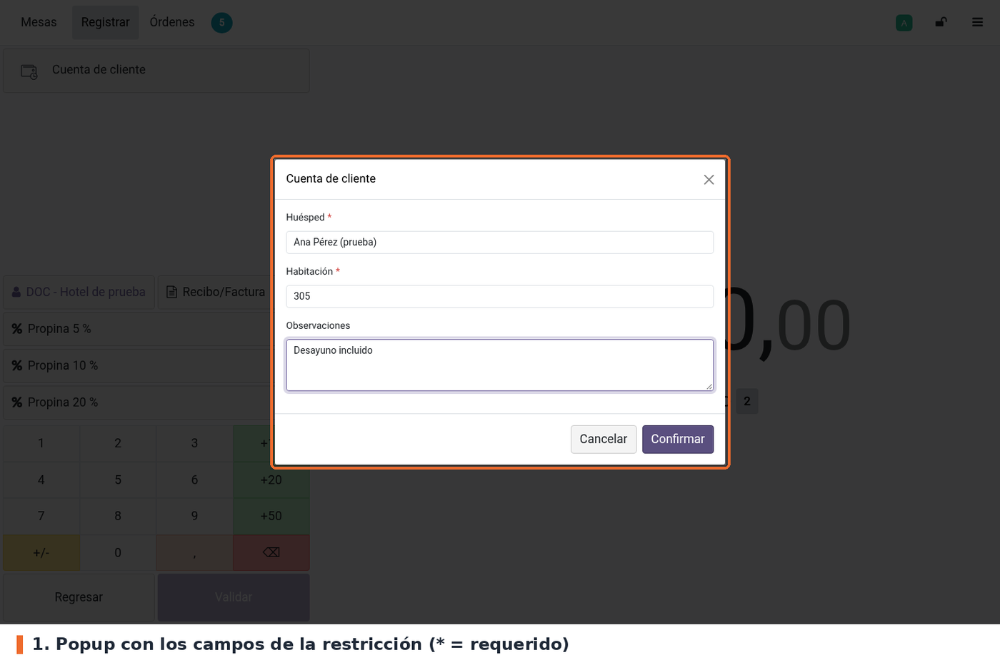
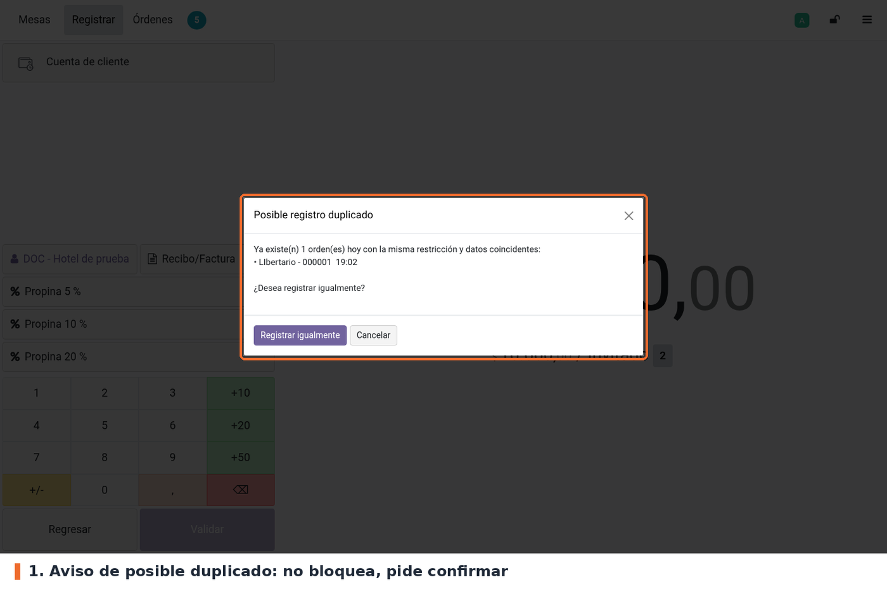
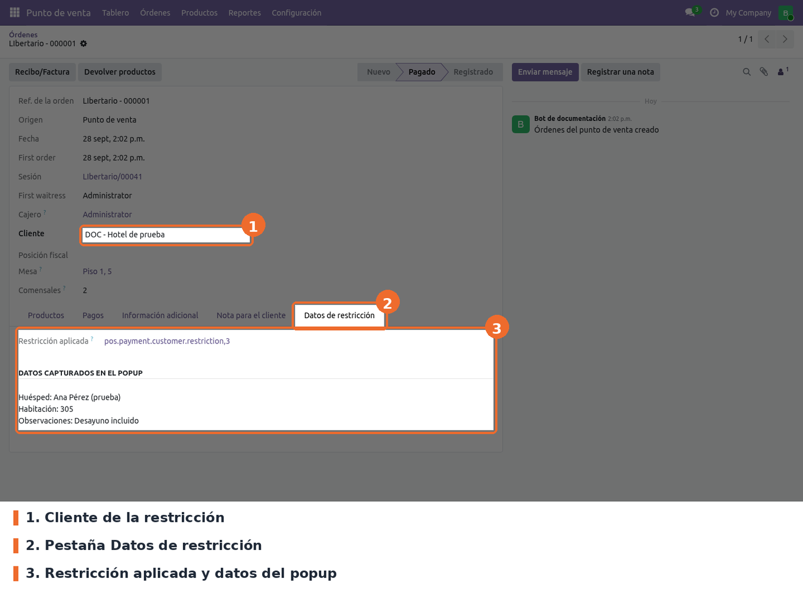
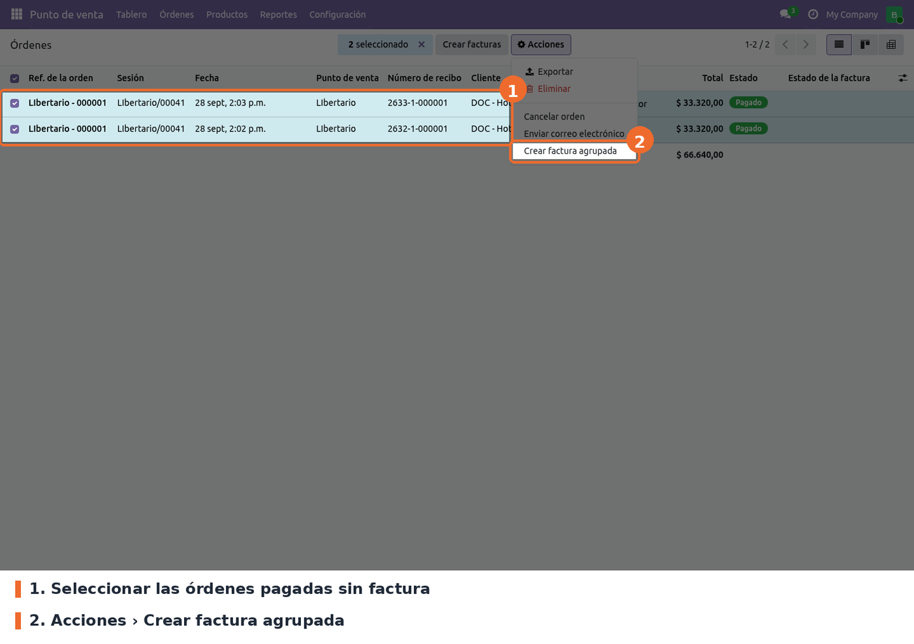
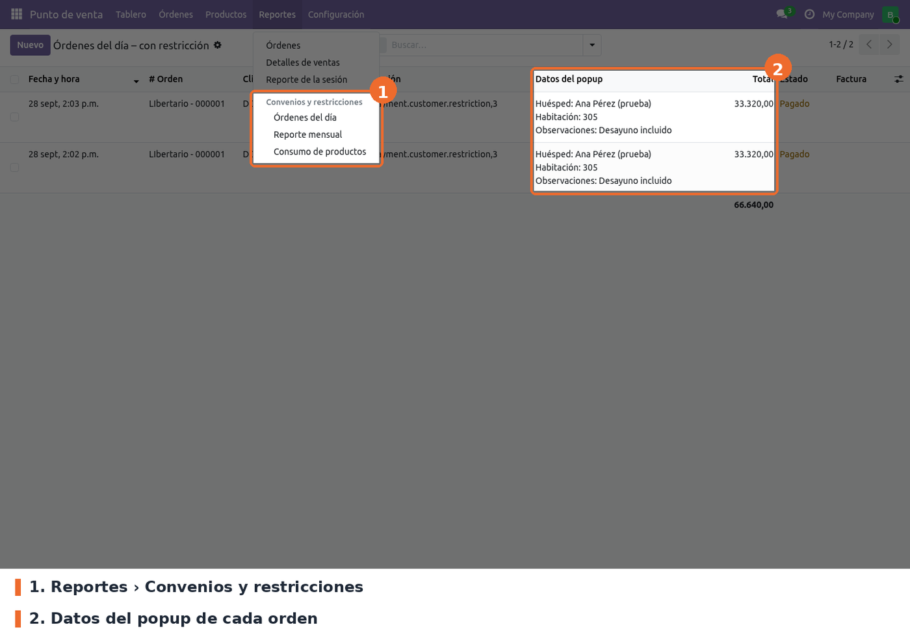

## Métodos de pago según el cliente

En la pantalla de pago, la lista de métodos se recalcula cada vez que cambia el cliente. Con un
cliente sin restricción, o sin cliente, los métodos restringidos no aparecen:

Al elegir un cliente autorizado quedan solo sus métodos, y la casilla **Recibo/Factura** toma el
valor de *Crear factura* de la restricción:

## Popup de datos adicionales

Si el método tiene campos configurados, al pulsarlo aparece el popup. Los campos marcados con * son
obligatorios: *Confirmar* no avanza mientras estén vacíos. *Cancelar*, la X o la tecla Esc cierran
el popup sin agregar el pago.

Al confirmar, el POS busca órdenes de **hoy** con la misma restricción y algún valor igual (sin
distinguir mayúsculas). Si encuentra alguna, muestra el aviso con el número y la hora de cada
orden. **Registrar igualmente** sigue con el pago; **Cancelar** lo descarta. El aviso no bloquea:
puede haber dos huéspedes en la misma habitación.

Los datos quedan guardados en la orden, en la pestaña **Datos de restricción** del formulario de la
orden en el backend:

## Factura según la restricción

Al sincronizar la orden, el servidor vuelve a aplicar *Crear factura* de la restricción del
cliente, aunque otro módulo del POS haya vuelto a marcar *Recibo/Factura* (por ejemplo la
facturación obligatoria). Si el cliente está en varias restricciones, manda la del método con que
se pagó. Hay dos excepciones: una orden que ya tiene factura no se toca, y la devolución de una
orden facturada sigue facturada (lleva nota crédito).

Esto solo ocurre si el punto de venta tiene activa la casilla *Restricciones por cliente*. Los
clientes sin restricción conservan lo que envió el POS.

## Factura agrupada

En *Punto de venta › Órdenes › Órdenes*, seleccionar las órdenes y usar **Acciones › Crear factura
agrupada** (no el botón *Crear facturas* del estándar).

- Solo toma órdenes en estado *Pagado*, sin factura y con cliente. Las demás se ignoran; si no queda
  ninguna, muestra un error.
- Crea **una factura por cliente**, con las líneas de todas sus órdenes, y la publica. La
  referencia y el origen de la factura listan los números de las órdenes.
- Usa el **diario de facturas del punto de venta** de la primera orden del grupo.
- Concilia los pagos de las órdenes con la factura, como el estándar. Las órdenes pasan a
  *Registrado* con la factura enlazada, y ya no se pueden volver a agrupar.
- Al terminar abre la lista de facturas creadas.

Si la factura sale electrónica depende de Jorels 19 y del diario (ver *Limitaciones conocidas*).
Verificar en STG.

## Informes de convenios

El menú *Punto de venta › Reportes › Convenios y restricciones* (solo administradores del POS)
tiene tres informes de órdenes con restricción:

- **Órdenes del día**: lista con fecha, cliente, restricción, datos del popup, total, estado y
  factura. Se puede agrupar por restricción, cliente, fecha, mes o estado.
- **Reporte mensual**: la misma lista, agrupada por día.
- **Consumo de productos**: las líneas de esas órdenes, agrupadas por producto.

Hoy *Reporte mensual* y *Consumo de productos* dan error al abrirse (ver *Limitaciones conocidas*).

## Solución de problemas

- **El cliente ve todos los métodos, o un método restringido no desaparece.** Revisar que la
  casilla *Restricciones por cliente* esté marcada en ese punto de venta y volver a entrar al POS:
  los cambios de configuración no llegan a una sesión ya cargada.
- **Un método no aparece para nadie.** Su restricción tiene la lista de clientes vacía.
- **El popup no aparece.** La restricción de ese método no tiene campos, o el POS no se recargó
  después de agregarlos.
- **La orden se facturó y debía quedar para la factura agrupada.** Revisar que *Crear factura* esté
  desmarcada en la restricción, que el cliente de la orden sea el autorizado y que la casilla general
  esté activa.
- **"No hay órdenes válidas para facturar".** Las órdenes seleccionadas ya tienen factura, no están
  pagadas o no tienen cliente.
- **Al abrir *Reporte mensual* o *Consumo de productos* sale "Ocurrió un error".** Es la limitación
  de los filtros de fecha. Usar *Órdenes del día*, quitar el filtro *Hoy* y agrupar por mes.
