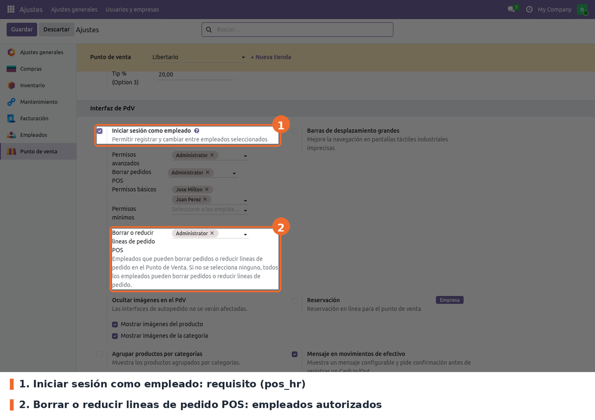

Ir a *Punto de venta › Configuración › Ajustes*, elegir el punto de venta en la parte superior y
buscar el bloque **Interfaz de PdV**.

- **Iniciar sesión como empleado** (campo estándar de `pos_hr`). Requisito. El campo del módulo
  solo aparece con esta casilla marcada y guardada, y el control usa el empleado que inició sesión
  en la caja.
- **Borrar o reducir lineas de pedido POS** (campo `able_del_pol_employee_ids` de `pos.config`).
  Opcional; vacío por defecto. Lista de empleados de la compañía que pueden reducir o borrar líneas
  ya enviadas a cocina. Vacío significa que **todos** pueden.

A tener en cuenta:

- La configuración es **por punto de venta**. Hay que repetirla en cada tienda.
- Los cambios se ven en el POS después de volver a entrar a la sesión desde el backend.
- El texto de ayuda de la fila dice "borrar pedidos", pero este módulo **no controla la eliminación
  de órdenes completas**. Eso lo hace la fila **Borrar pedidos POS**, del módulo `pos_del_order`.
- En el backend, la columna opcional **Ordered Quantities** de las líneas de la orden (*Punto de
  venta › Órdenes*) muestra la cantidad ordenada guardada. Es de solo lectura.
