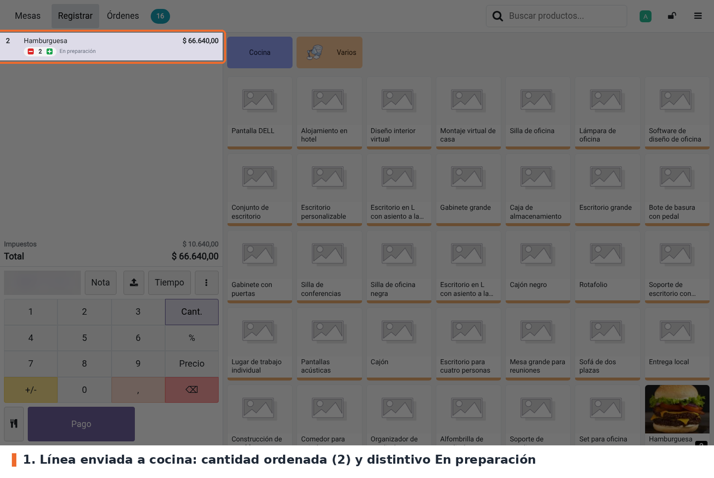
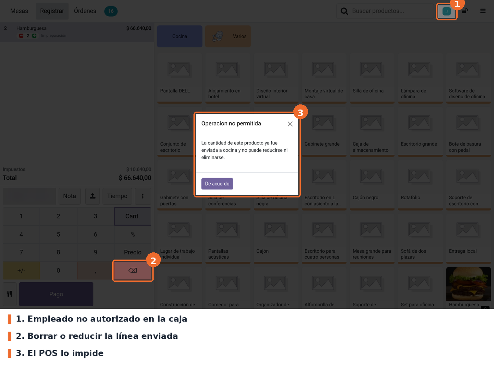
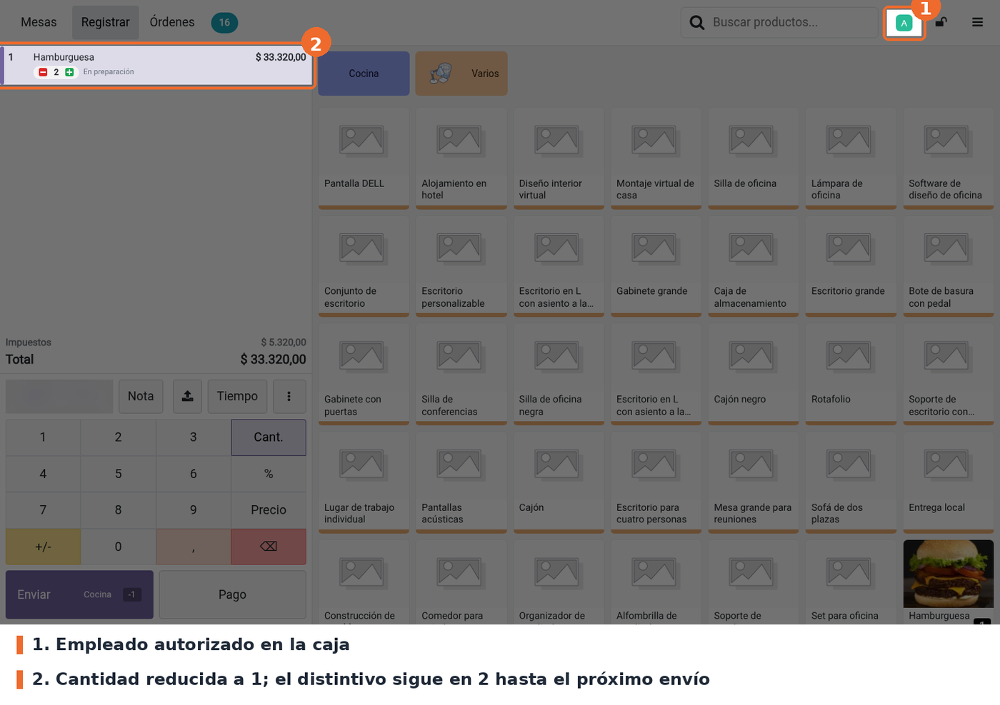

## Enviar a cocina

Al pulsar **Enviar** (o **Pago**, ver *Casos especiales*), el POS guarda la cantidad actual de cada
línea como **cantidad ordenada**. Al volver a la mesa, cada línea muestra esa cantidad entre los
botones de restar y sumar, con el distintivo *En preparación*.

## Empleado no autorizado

Con un empleado que no está en la lista, cualquier intento de dejar la línea por debajo de la
cantidad ordenada muestra el aviso *Operacion no permitida* y la línea no cambia. Aplica a la tecla
⌫ del teclado numérico, a escribir una cantidad menor con el teclado y al botón de restar del
distintivo.

Sumar unidades está permitido. Las unidades agregadas después del envío, mientras no se vuelva a
enviar, se pueden quitar hasta llegar otra vez a la cantidad ordenada.

## Empleado autorizado

Con un empleado de la lista, la línea se reduce o se borra como en el POS estándar. Odoo registra la
diferencia como un cambio pendiente para cocina (el botón **Enviar** muestra *Cocina -1*).

El distintivo sigue mostrando la cantidad ordenada anterior hasta el próximo **Enviar**, que la
actualiza con la cantidad nueva.

## Casos especiales

- **Lista vacía**: todos los empleados pueden reducir y borrar líneas.
- **Cambio de empleado**: la regla se evalúa con el empleado que tiene la caja en ese momento. Al
  bloquear la caja y entrar con otro PIN, el mismo pedido queda permitido o bloqueado según el
  nuevo empleado.
- **Pago**: el botón **Pago** también marca todas las líneas como ordenadas, antes de que Odoo
  pregunte si se quiere enviar el pedido a preparación. Aunque se elija *Descartar* y no se envíe
  nada a cocina, al volver a la mesa las líneas aparecen *En preparación* y quedan protegidas.
- **Dividir cuenta**: al confirmar la división, las cantidades de las dos órdenes resultantes pasan
  a ser las cantidades ordenadas.
- **Combos**: si alguna línea del combo tiene cantidad ordenada, el empleado no autorizado no puede
  borrar el combo.
- **Transferir o fusionar mesas, Cancelar orden, Liberar la mesa**: no pasan por este control (ver
  *Limitaciones conocidas*).

## Solución de problemas

- **No aparece el campo en Ajustes.** Marcar *Iniciar sesión como empleado*, guardar y volver a la
  página: el campo está dentro de ese bloque.
- **La línea no muestra el distintivo *En preparación*.** Solo aparece después de **Enviar** o
  **Pago**, en las pantallas de productos y de pago, y nunca en líneas de recompensa. Si el módulo
  se acaba de instalar, volver a entrar al POS desde el backend.
- **Un empleado no autorizado puede reducir la línea.** Verificar que la lista esté guardada en el
  punto de venta correcto, volver a entrar al POS y revisar qué empleado tiene la caja (avatar arriba
  a la derecha). Si la reducción no baja de la cantidad ordenada, está permitida.
- **Un empleado no puede quitar un producto que nunca se envió a cocina.** Probablemente se pulsó
  **Pago** antes (ver *Casos especiales*). Lo puede quitar un empleado autorizado.
