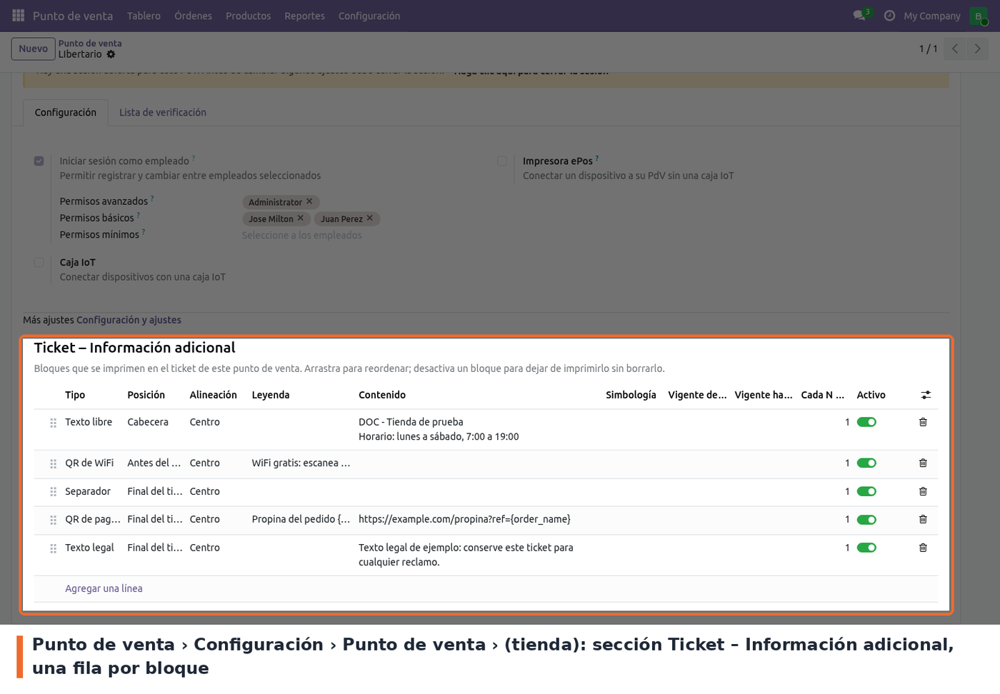
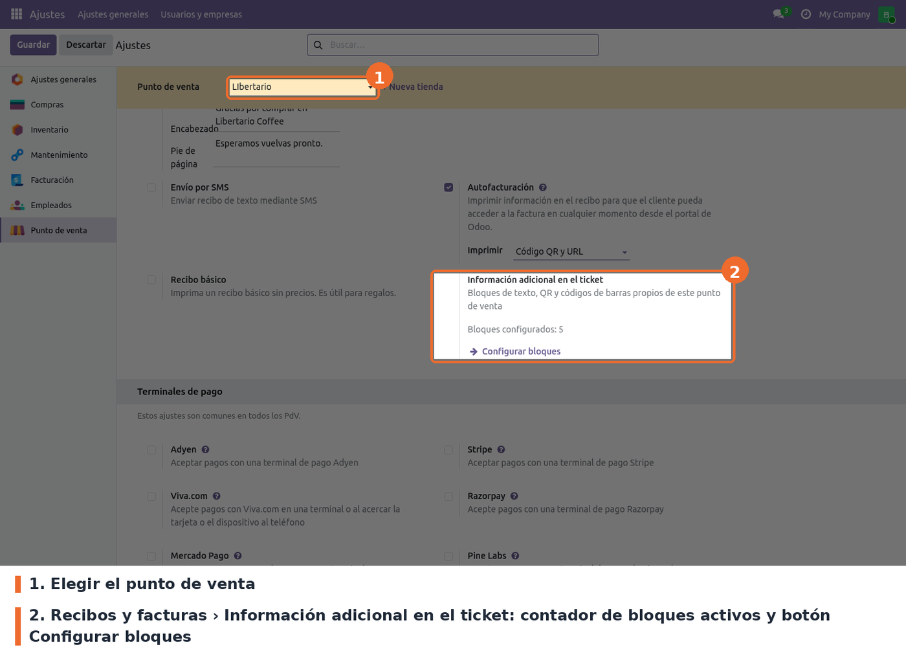
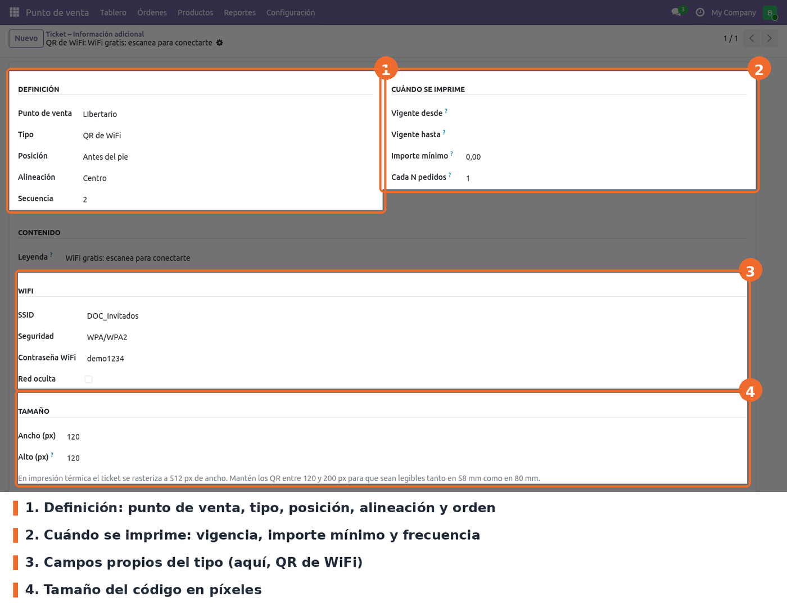

Los bloques se configuran por punto de venta. El acceso principal está en *Punto de venta ›
Configuración › Punto de venta*: al abrir una tienda, al final del formulario aparece la sección
**Ticket – Información adicional**, con una lista editable en línea. Cada fila es un bloque; se
reordenan arrastrando el ícono de la izquierda y se apagan con el interruptor **Activo**.

Hay dos accesos más al mismo modelo:

- *Punto de venta › Configuración › Ajustes*, bloque **Recibos y facturas**, opción **Información
  adicional en el ticket**: muestra cuántos bloques activos tiene la tienda elegida arriba y el
  botón **Configurar bloques**, que abre la lista de esa tienda.
- *Punto de venta › Configuración › Ticket – Información adicional*: lista de todas las tiendas,
  con filtros para agrupar por punto de venta, tipo o posición y para ver los archivados.

Todas las opciones requieren el grupo **Administrador del POS**. Si no hay ningún bloque, el ticket
se imprime igual que el estándar de Odoo.

## Campos de un bloque

Al abrir un bloque desde la lista global o desde *Configurar bloques* se ve el formulario completo.
Los grupos de campos cambian según el tipo elegido.

- **Punto de venta** (obligatorio): la tienda dueña del bloque. Si se elimina la tienda, se
  eliminan sus bloques.
- **Tipo** (obligatorio, por defecto *Texto libre*): define qué se imprime y qué campos se piden.
- **Posición** (obligatoria, por defecto *Antes del pie*): *Cabecera*, *Antes del pie* o *Final del
  ticket*.
- **Alineación** (obligatoria, por defecto *Centro*): izquierda, centro o derecha.
- **Secuencia** (por defecto 10): orden de impresión dentro de la misma posición.
- **Leyenda** (opcional): texto que se imprime encima del bloque. Admite marcadores.
- **Contenido**: obligatorio para texto libre, texto legal, QR de URL, QR de texto, código de
  barras, QR de reseña y QR de pago. Es el texto, la URL o el valor del código. Admite marcadores.
- **Imagen** (obligatoria para el tipo *Imagen*): se reduce a 512 px como máximo al guardar.
- **WhatsApp**: *Número* (obligatorio, formato internacional sin "+" ni espacios, por ejemplo
  573001234567) y *Mensaje* prellenado (opcional, admite marcadores).
- **WiFi**: *SSID* (obligatorio), *Seguridad* (por defecto WPA/WPA2), *Contraseña* y *Red oculta*.
- **Contacto (vCard)**: *Nombre* (obligatorio), organización, teléfono, correo, sitio web y
  dirección.
- **Simbología** (solo código de barras, por defecto Code 128) y **Mostrar valor** (imprime el
  valor legible bajo las barras).
- **Ancho / Alto (px)** (por defecto 150 × 150; al elegir *Código de barras* pasa a 300 × 60): entre
  1 y 1000 px. Para impresora térmica se recomiendan QR de 120 a 200 px.
- **Vigente desde / hasta** (opcionales): vacío significa sin límite.
- **Importe mínimo** (por defecto 0): el bloque solo sale si el total con impuestos del pedido es
  igual o mayor. 0 significa sin mínimo.
- **Cada N pedidos** (obligatorio, por defecto 1) y **Desplazamiento** (por defecto 0): con 1 sale en
  todos los pedidos; con 10, en los pedidos 10, 20, 30… de la sesión de caja. El desplazamiento
  corre el ciclo (con 10 y desplazamiento 5, sale en 5, 15, 25…) y debe estar entre 0 y N − 1.

Para el QR de reseña, el *Contenido* puede ser el Place ID de Google o una URL completa: si empieza
por `http` se usa tal cual; si no, se arma el enlace de reseña de Google con ese Place ID.

## Validaciones al guardar

- Cada tipo exige sus campos obligatorios (contenido, imagen, número, SSID o nombre de contacto).
- EAN-8 y EAN-13 deben tener la longitud y el dígito de control correctos, salvo que el valor lleve
  marcadores.
- *Vigente desde* no puede ser posterior a *Vigente hasta*.
- Ancho y alto deben ser mayores que 0 y no pasar de 1000 px.

## Marcadores

Disponibles en *Contenido*, *Leyenda* y *Mensaje de WhatsApp*: `{order_name}`, `{total}`, `{date}`,
`{cashier}`, `{table}`, `{partner_name}`, `{tracking_number}` y `{store_name}`. Un marcador que no
existe se imprime tal cual, para que el error se vea en el ticket.

A tener en cuenta:

- Los cambios se ven en el POS después de volver a entrar a la sesión o recargar la pestaña: los
  bloques se cargan al abrir el POS.
- Los bloques archivados no se cargan en el POS.
