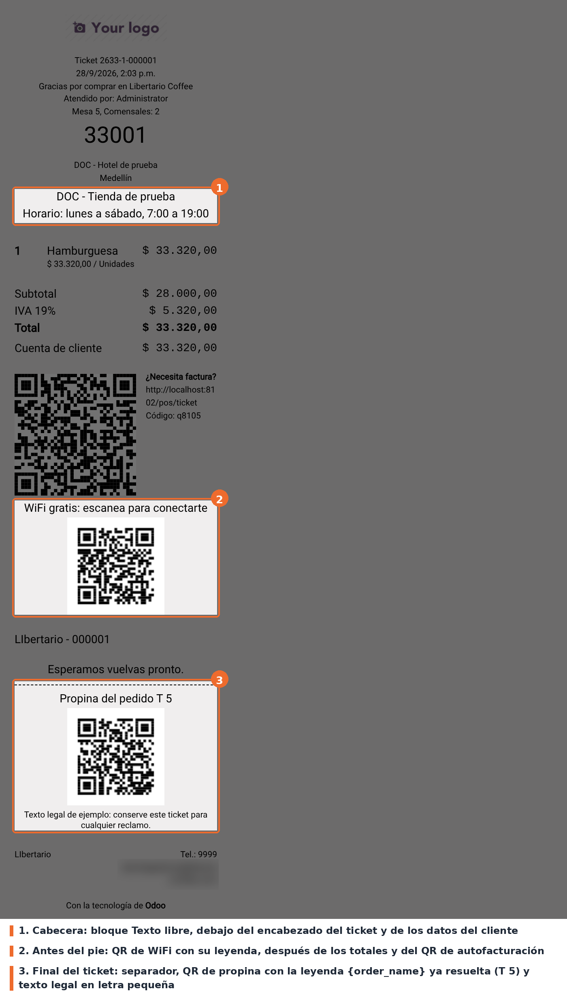

## Flujo

No hay ningún paso nuevo para el cajero. Al terminar un pedido, el ticket incluye los bloques
activos de la tienda que cumplen sus condiciones (vigencia, importe mínimo y frecuencia), cada uno
en su posición:

- **Cabecera**: justo debajo del encabezado estándar (datos del pedido, cajero y cliente).
- **Antes del pie**: después de los totales, los pagos y el QR de autofacturación de Odoo, antes del
  pie configurable de la tienda.
- **Final del ticket**: después del pie y de los comprobantes del datáfono.

Los mismos bloques salen en la pantalla de recibo, en la impresión, en la reimpresión desde
*Órdenes › Imprimir recibo* y en el recibo enviado por correo.

La captura es la vista de impresión de un ticket reimpreso desde *Órdenes*, con cinco bloques de
ejemplo: un texto libre en la cabecera, un QR de WiFi antes del pie y, al final, un separador, un
QR de propina cuya leyenda usa `{order_name}` y un texto legal.

## Casos especiales

- **Reimpresión**: la frecuencia se calcula con el número de pedido dentro de la sesión de caja,
  que se guarda con el pedido. Una reimpresión muestra los mismos bloques que el ticket original.
- **Sin conexión**: los códigos que no dependen del pedido se descargan al abrir la sesión y quedan
  en memoria. Los que llevan marcadores se generan al imprimir; si en ese momento no hay conexión,
  el bloque imprime la información en texto (SSID y clave del WiFi, la URL, el teléfono…).
- **Recibo básico** (el que Odoo imprime sin precios, para regalos): los bloques de la posición
  *Antes del pie* no salen, porque Odoo omite esa parte del ticket. Los de cabecera y final sí.
- **Restaurante**: con `pos_restaurant`, `{order_name}` se reemplaza por el nombre que Odoo le da
  al pedido en la mesa (por ejemplo "T 5"), no por la referencia del pedido. Para imprimir una
  referencia única conviene usar `{tracking_number}`.

## Solución de problemas

- **Un bloque no aparece en el ticket.** Revisar que esté activo, que la fecha de hoy esté dentro
  de la vigencia, que el total alcance el importe mínimo y que *Cada N pedidos* sea 1 (o que le
  toque a ese pedido). Después de cambiar algo, recargar el POS.
- **Un bloque con *Cada N pedidos* no sale nunca.** El conteo se reinicia en cada sesión de caja: si
  la tienda hace menos de N pedidos por turno, el bloque no llega a imprimirse. Bajar N.
- **Aparece `{algo}` literal en el ticket.** El marcador está mal escrito; ver la lista en
  *Configuración*.
- **Sale el texto en lugar del código.** El código no se pudo generar (sin conexión con el
  servidor). Al recuperar la conexión, la siguiente impresión vuelve a intentarlo.
- **Un bloque archivado no aparece en la lista de la tienda.** La lista del formulario de la tienda
  solo muestra los activos; para reactivarlo, usar el menú *Ticket – Información adicional* con el
  filtro *Archivado*.
