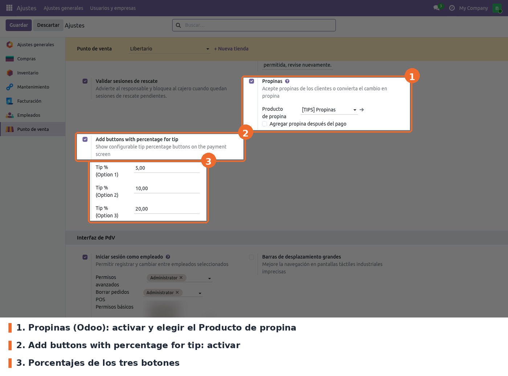

Ir a *Punto de venta › Configuración › Ajustes*, elegir el punto de venta en la parte superior y
buscar el bloque **Pago**. El ajuste del módulo está justo después del ajuste **Propinas** de Odoo.

- **Propinas** (Odoo, campo `iface_tipproduct`). Obligatorio. Sin él no se ve el ajuste del módulo.
  Al activarlo, Odoo propone el **Producto de propina** (`tip_product_id`); en esta base es
  *[TIPS] Propinas*. El módulo usa ese producto para la línea de propina.
- **Add buttons with percentage for tip** (campo `iface_tippercent` de `pos.config`). Obligatorio
  para que el módulo actúe; desmarcado por defecto. Al marcarlo aparecen los tres porcentajes.
- **Tip % (Option 1)**, **(Option 2)** y **(Option 3)** (campos `tip_percent1`, `tip_percent2` y
  `tip_percent3`). Opcionales; 0 por defecto. Cada porcentaje distinto de 0 es un botón en la
  pantalla de pago. Un porcentaje en 0 no muestra botón.

A tener en cuenta:

- **Con el módulo instalado, *Propinas* solo no alcanza.** El módulo reemplaza el botón estándar
  **Propina** de la pantalla de pago. Si *Propinas* está activado pero *Add buttons with percentage
  for tip* no, la pantalla de pago queda **sin ningún botón de propina**.
- Si la casilla está marcada y los tres porcentajes están en 0, se ve un único botón **Propina** que
  abre el teclado de Odoo, como el estándar.
- Al desmarcar *Propinas* en Ajustes, Odoo deja vacío el producto de propina y los botones del
  módulo desaparecen, aunque su casilla siga marcada.
- La configuración es **por punto de venta**. Hay que repetirla en cada tienda.
- Los cambios se ven en el POS después de volver a entrar a la sesión desde el backend.
- *Agregar propina después del pago* es otra función de Odoo (restaurante) y no interviene en este
  módulo.
