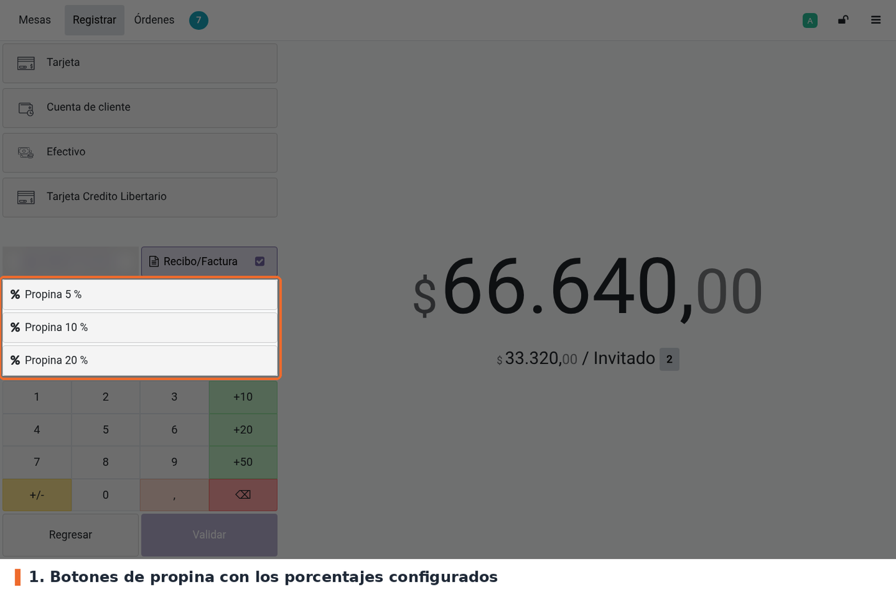
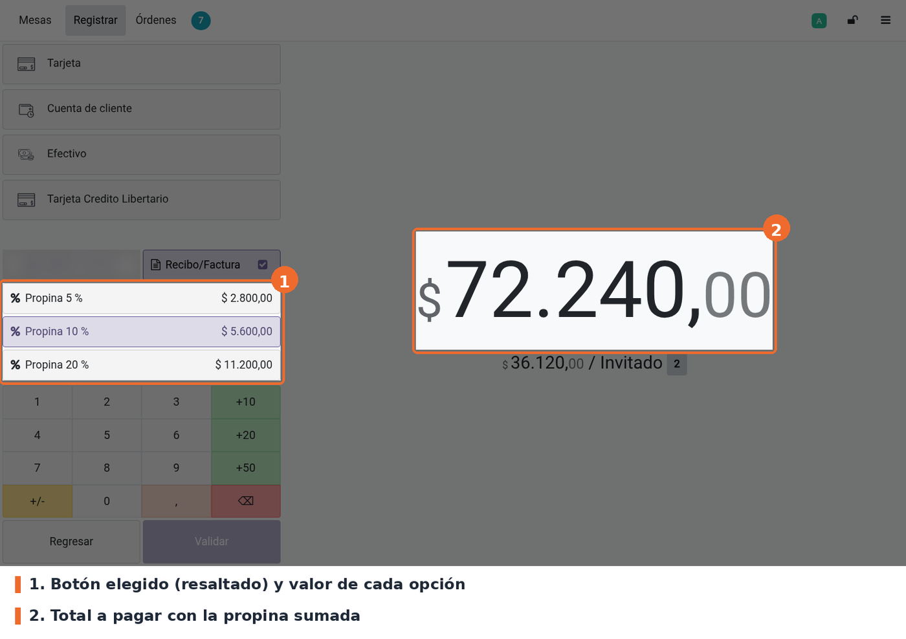
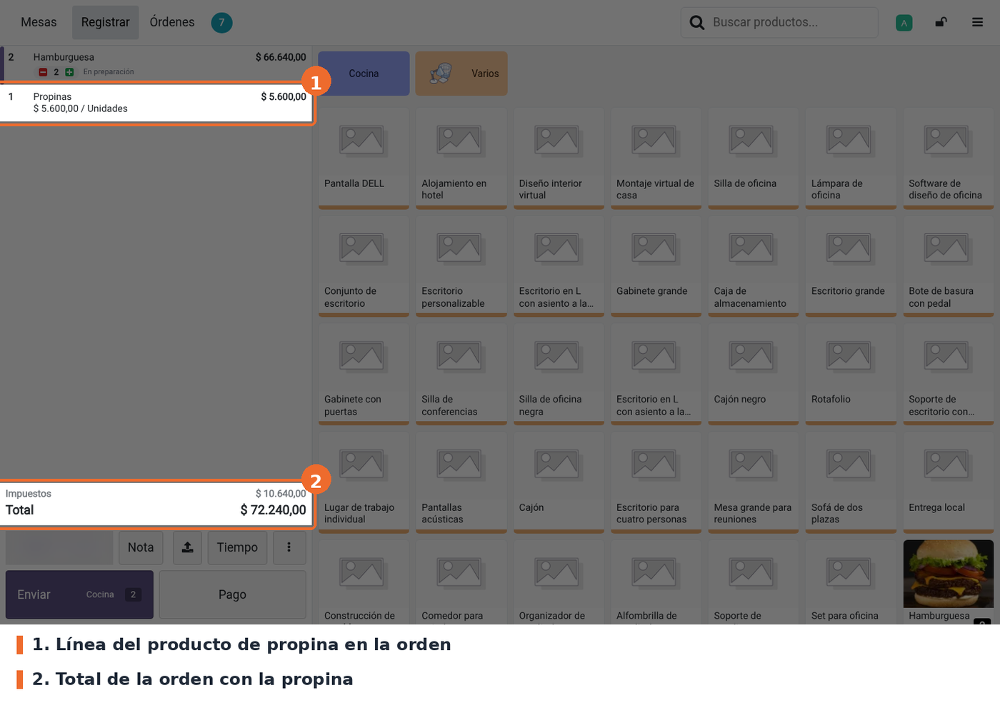
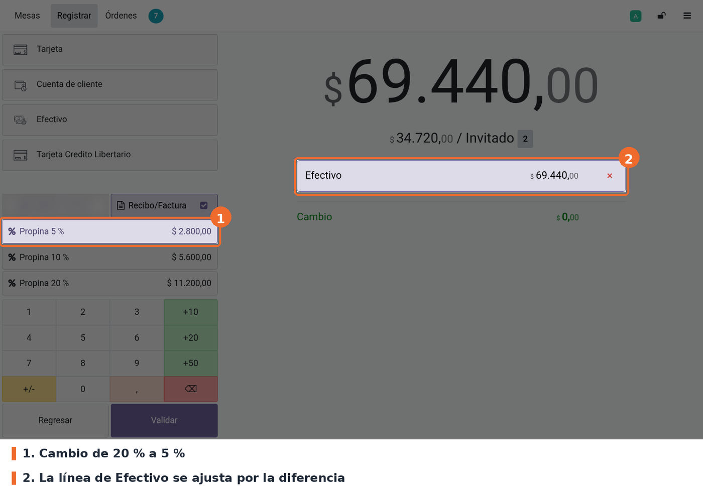

## Flujo

En el POS, cargar la orden y pulsar **Pago**. Debajo de los métodos de pago aparecen los botones
**Propina N %**, uno por cada porcentaje configurado.

Pulsar el porcentaje que pide el cliente. El POS agrega la propina a la orden y el total a pagar
sube en ese valor. El botón elegido queda resaltado y, desde ese momento, cada botón muestra cuánto
sería la propina con su porcentaje, para comparar antes de cambiar.

Después se elige el método de pago y se valida como siempre. La propina es una línea más de la
orden, con el producto de propina, y se ve al volver a la pantalla de productos con **Regresar**.

## Casos especiales

- **Cambiar de porcentaje.** Pulsar otro botón reemplaza la propina anterior; la orden conserva una
  sola línea de propina. En la prueba: 10 % ($ 5.600), luego 20 % ($ 11.200), luego 5 % ($ 2.800).
- **Pulsar dos veces el mismo botón** no suma nada: la propina se calcula sin la anterior y da el
  mismo valor.
- **Con una línea de pago ya cargada.** Si la línea seleccionada es de efectivo u otro método no
  electrónico, o un pago electrónico todavía pendiente, su monto se ajusta por la diferencia de
  propina. En la captura, la línea de efectivo tenía el total con 20 % ($ 77.840) y bajó a
  $ 69.440 al cambiar a 5 %. Un pago electrónico ya enviado no se toca.

- **Orden sin productos o porcentaje que da 0**: el botón no hace nada.
- **Quitar la propina.** El módulo no trae un botón para quitarla. Hay que borrar la línea del
  producto de propina en la pantalla de productos.
- **Propina con un valor libre.** Mientras haya algún porcentaje configurado, la pantalla de pago no
  ofrece el teclado de Odoo para escribir el valor: ese botón solo aparece con los tres porcentajes
  en 0.

## Solución de problemas

- **No aparece ningún botón de propina en Pago.** Revisar que *Propinas* esté activado con un
  producto de propina y que *Add buttons with percentage for tip* esté marcado (ver
  *Configuración*). Después, volver a entrar al POS desde el backend.
- **Falta uno de los botones.** Ese porcentaje está en 0.
- **La propina parece menor de lo esperado.** Se calcula sobre el subtotal **sin impuestos**, no
  sobre el total que ve el cliente.
- **Los botones no muestran el valor.** Es normal antes de aplicar la primera propina: los valores
  aparecen cuando la orden ya tiene propina.
