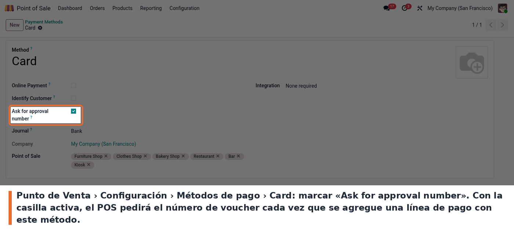
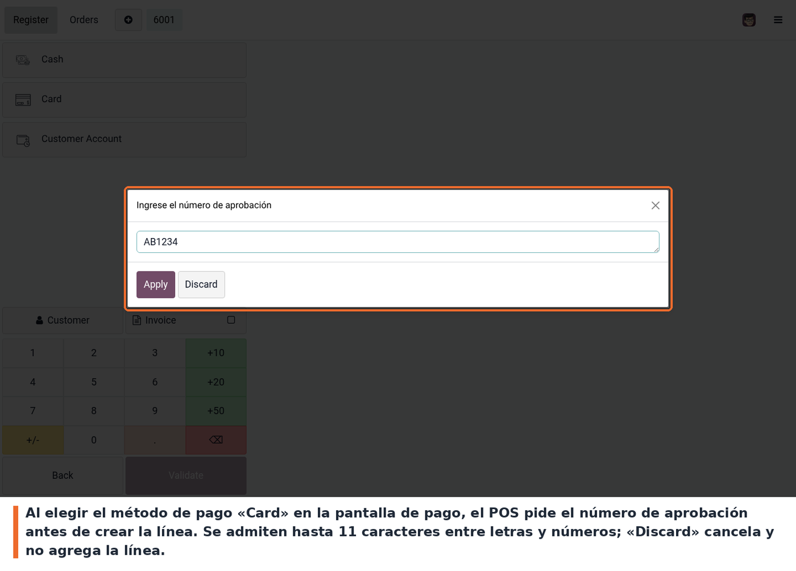
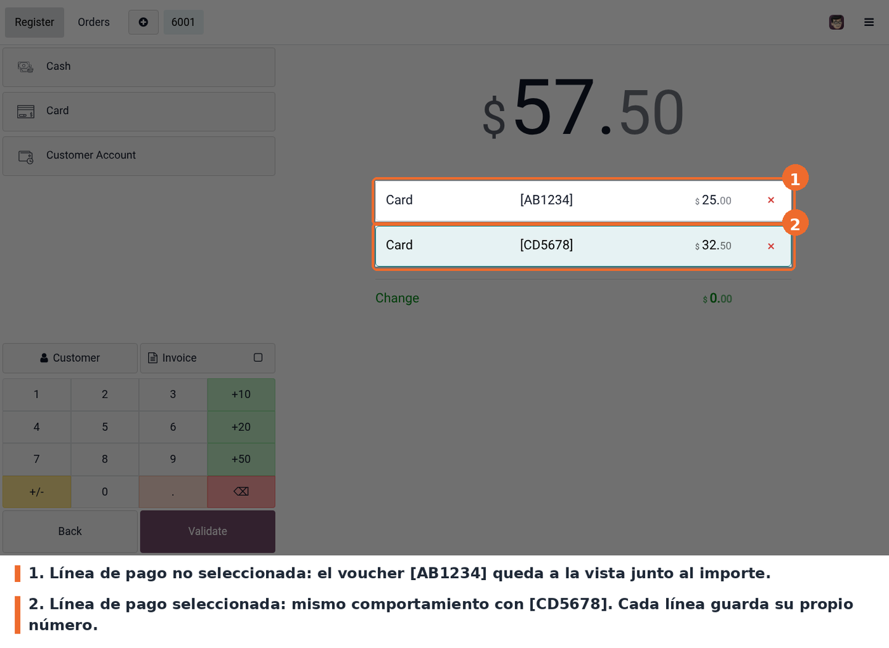
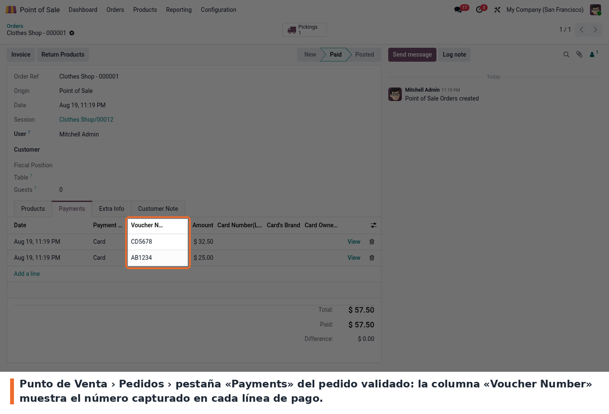

La casilla está en el formulario del método de pago:

En la pantalla de pago, al elegir el método configurado, el POS pide el número
de aprobación. Se escribe el voucher del datáfono y se confirma con **«Apply»**:

El número aparece entre corchetes junto al importe, tanto en la línea
seleccionada como en las demás. Un pedido puede tener varias líneas del mismo
método, cada una con su propio voucher:

Una vez validado el pedido, el número se consulta en *Punto de Venta >
Pedidos*, pestaña **«Payments»**, columna **«Voucher Number»**. El mismo campo
está en el formulario del pago del POS (*Punto de Venta > Pedidos > Pagos*) y
como columna opcional en la conciliación bancaria:

