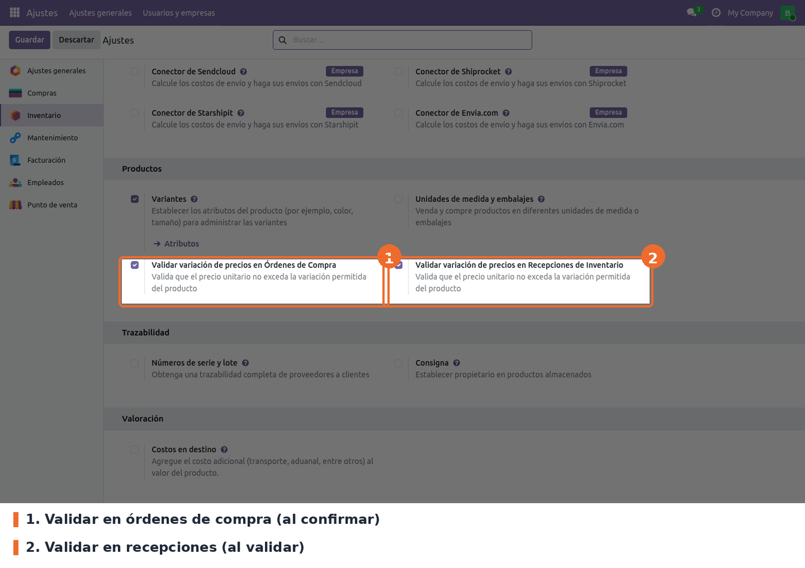
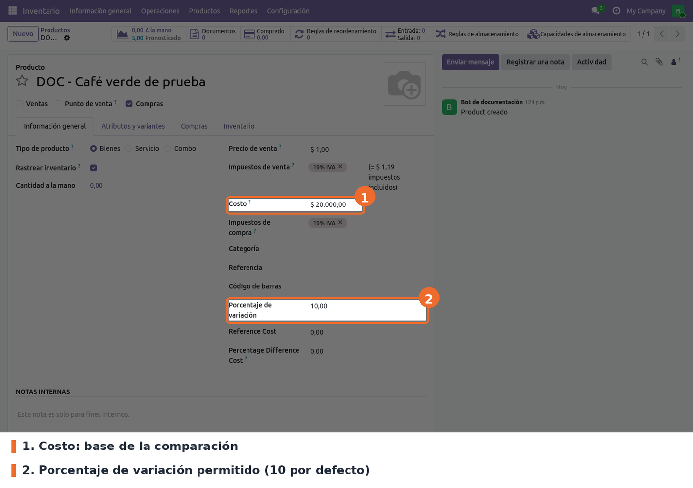

## Ajustes generales

Ir a *Inventario › Configuración › Ajustes* y bajar hasta el bloque **Productos**. Allí están las
dos opciones del módulo.

- **Validar variación de precios en Órdenes de Compra** (parámetro
  `purchase_price_validation.enable_purchase_validation`). Opcional; activada por defecto. Revisa
  los precios al confirmar la orden y al guardar cambios en sus líneas.
- **Validar variación de precios en Recepciones de Inventario** (parámetro
  `purchase_price_validation.enable_stock_validation`). Opcional; activada por defecto. Revisa los
  precios al validar operaciones de tipo *Recepción*.

Las opciones son globales para la base de datos, no por compañía ni por almacén.

**Desmarcar la casilla no desactiva la validación.** Al guardar desmarcada, Odoo borra el
parámetro, y tanto el módulo como la pantalla de ajustes interpretan un parámetro ausente como
"activado": la casilla vuelve a aparecer marcada. Para desactivarla de verdad, ver *Solución de
problemas*.

## Porcentaje por producto

En la ficha del producto (*Inventario › Productos › Productos*), pestaña *Información general*,
el campo **Porcentaje de variación** define cuánto puede alejarse el precio unitario del **Costo**
antes de disparar el aviso.

- **Porcentaje de variación** (campo `porcent_variation` de `product.template`). Opcional; vale
  **10** por defecto. Se escribe como número (10 = 10 %); en 0, cualquier diferencia con el costo
  dispara el aviso. La comparación es en ambos
  sentidos: un precio 10 % por encima o por debajo del costo cuenta igual.
- **Costo** es el campo estándar de Odoo. Es la base de la comparación, así que debe estar al día.

Los campos *Reference Cost* y *Percentage Difference Cost* que aparecen debajo son del módulo
`telegram_alerts`, no de este.

## Permisos

- **Administrador de inventario** (grupo `stock.group_stock_manager`): ve el aviso y puede
  confirmar la orden o la recepción con las diferencias.
- **Resto de usuarios**: ve el aviso y solo puede cerrarlo.
