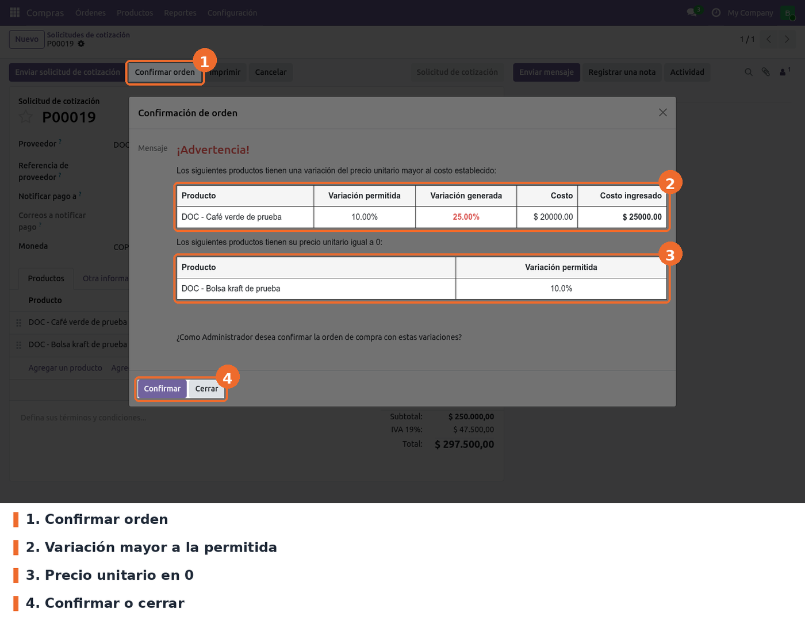
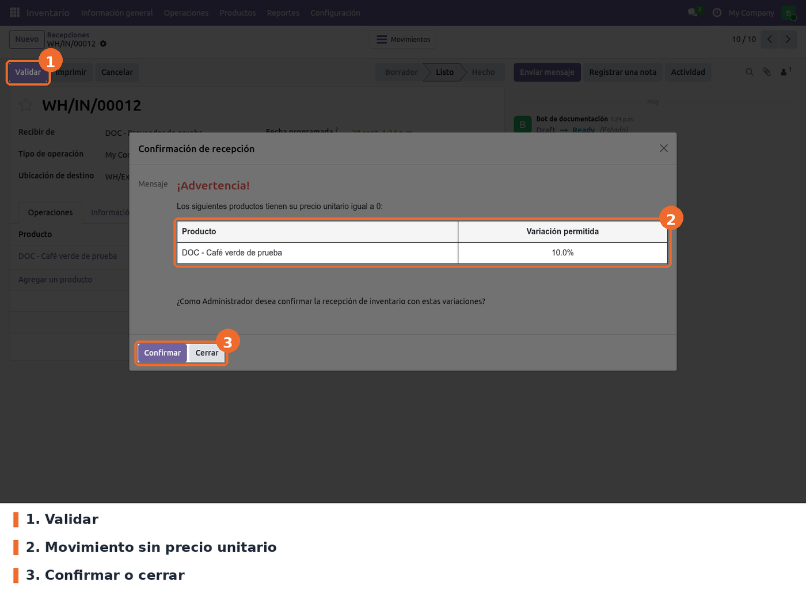

## Orden de compra

Crear la solicitud de cotización como siempre y pulsar **Confirmar orden**. Si todos los productos
están dentro de su porcentaje, la orden se confirma sin aviso. Si alguno se sale, o tiene precio 0,
se abre el asistente **Confirmación de orden** con una tabla por cada caso.

La variación se calcula como la diferencia entre el precio unitario y el costo, dividida por el
costo. En el ejemplo, el costo es 20.000 y el precio 25.000: la variación es del 25 %, por encima
del 10 % permitido.

- **Confirmar** (solo administradores de inventario) sigue con la confirmación estándar de Odoo.
- **Cerrar** deja la orden como estaba, en borrador, para corregir el precio.

Un usuario que no es administrador de inventario recibe en su lugar el asistente **Advertencia
orden con variación de costos**, con la misma tabla y solo el botón *Cerrar*.

Además, para esos usuarios, **guardar cambios en las líneas** de una orden ya creada también se
bloquea si alguna línea queda fuera de rango o en 0: Odoo muestra un error que termina en
"Comuniquese con el Administrador" y el cambio no se guarda.

## Recepción de inventario

En *Inventario › Operaciones › Recepciones*, abrir la recepción y pulsar **Validar**. Si algún
movimiento se sale del rango o no tiene precio, aparece el asistente **Confirmación de recepción**
(o **Advertencia recepción con variación de costos** para quien no es administrador), con los
mismos botones. Al confirmar, la validación sigue su curso normal, incluidos los avisos estándar de
Odoo como el de entrega parcial.

El precio que se revisa es el precio unitario del movimiento de inventario. En una recepción que
viene de una orden de compra, Odoo lo toma de la línea de la orden (ya convertido a la moneda de la
compañía y a la unidad del producto). Una recepción creada a mano no tiene precio, así que todos
sus productos salen en la tabla de **precio unitario igual a 0**, como en la captura.

## Casos especiales

- **Solo productos de tipo Bienes.** Los servicios y los combos no se revisan.
- **Producto con costo 0.** La variación se calcula contra el propio precio y da 100 %, así que el
  aviso sale siempre que el porcentaje permitido sea menor que 100.
- **Solo recepciones.** Las entregas y los traslados internos no se revisan.
- **Varias órdenes o recepciones a la vez.** El código asume un solo registro al abrir el
  asistente: confirmar o validar varios desde la lista, cuando alguno tiene diferencias, termina en
  un error de Odoo en vez del aviso. Hay que hacerlo de a uno.

## Solución de problemas

- **Desmarqué la opción en Ajustes y la validación sigue.** Es la limitación descrita en
  *Configuración*. Para desactivarla, activar el modo desarrollador, ir a *Ajustes › Técnico › Parámetros ›
  Parámetros del sistema*, abrir `purchase_price_validation.enable_purchase_validation` (compras) o
  `purchase_price_validation.enable_stock_validation` (recepciones) y cambiar el valor a `False`.
  Con ese valor la casilla de Ajustes también aparece desmarcada. Para volver a activarla, poner
  `True`.
- **No aparece el aviso.** Revisar que la opción esté activa, que el producto sea de tipo *Bienes*
  y que la diferencia supere de verdad el porcentaje del producto. En recepciones, que la operación
  sea de tipo *Recepción*.
- **Todas las recepciones manuales piden confirmación.** Es lo esperado: sus movimientos no tienen
  precio unitario. Las recepciones que salen de una orden de compra traen el precio de la orden.
- **El aviso sale en órdenes en otra moneda o con otra unidad de compra.** En la orden de compra se
  compara el precio tal como está en la línea (moneda de la orden, unidad de compra) contra el costo
  (moneda de la compañía, unidad del producto), sin convertir. En esos casos la variación que se
  muestra no es real.
- **"Comuniquese con el Administrador" al guardar la orden.** El usuario no es administrador de
  inventario y alguna línea está fuera de rango o en 0. Corregir el precio o pedir que un
  administrador guarde y confirme la orden.
