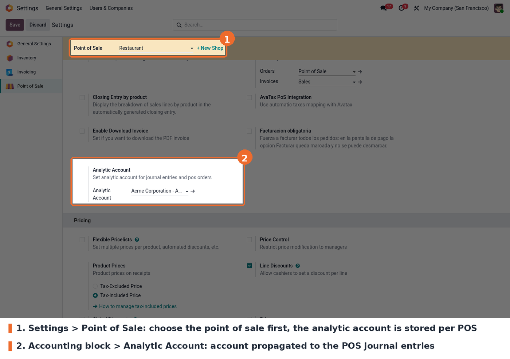
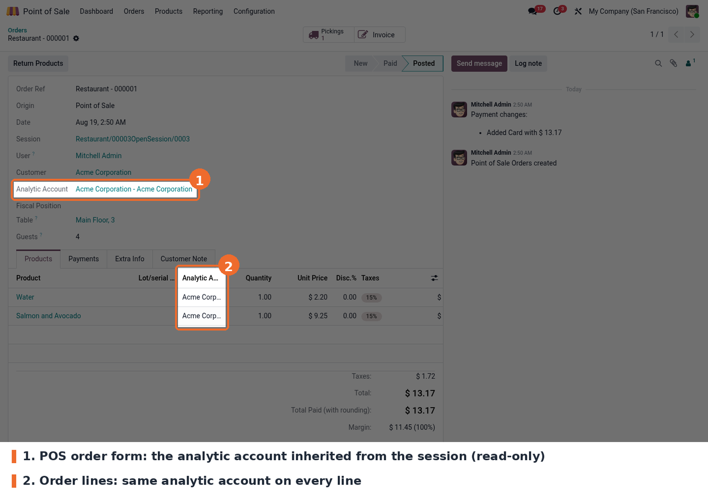
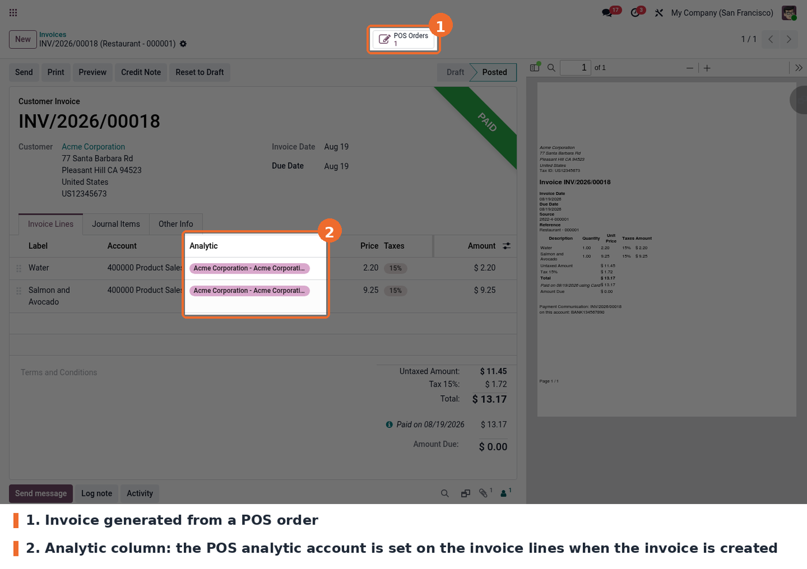
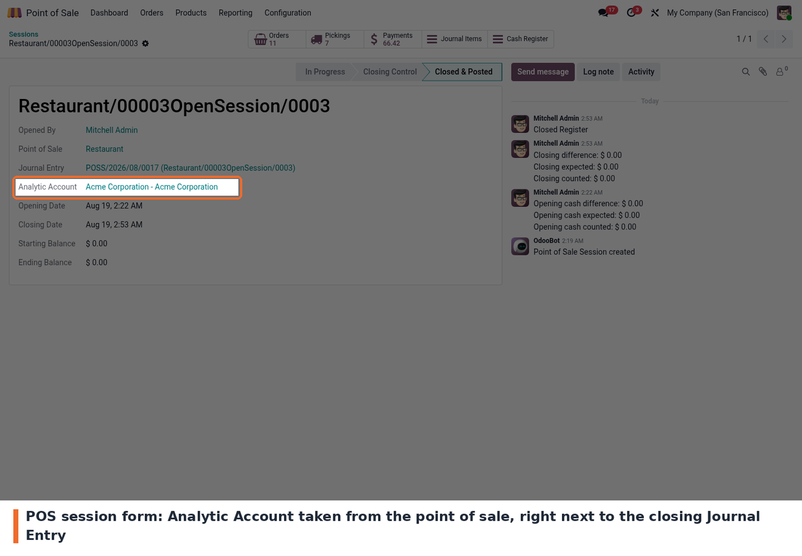
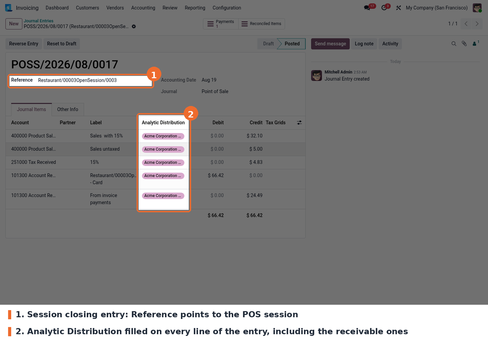

The account is picked in the Point of Sale settings, in the **Accounting** block.

**1. POS order.** Every order of a session inherits the analytic account of the point of sale.
The field is read-only: it follows the session, it is not typed order by order.

**2. Invoiced order.** When the customer asks for an invoice, the invoice lines are created
with the analytic distribution already set. There is no manual step at invoicing time.

**3. POS session.** The session shows the same analytic account next to the journal entry
created when the register is closed.

**4. Session closing entry.** This is the result: the closing journal entry of the session
carries the analytic distribution on its lines.

Journal entries are only visible to users with accounting access rights; the point of sale
cashier does not need them.
