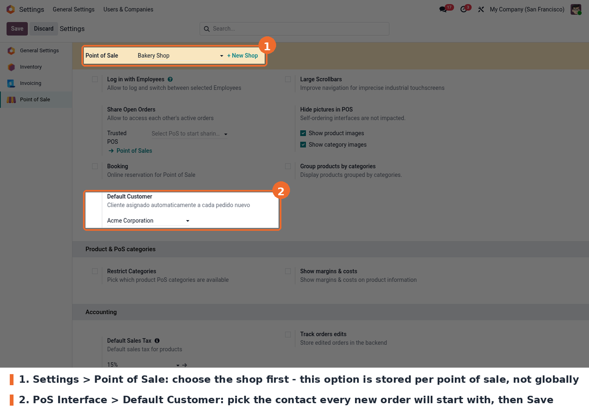
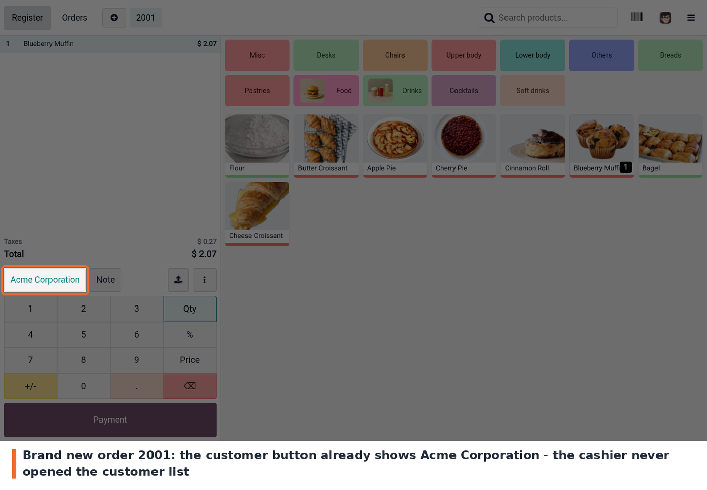
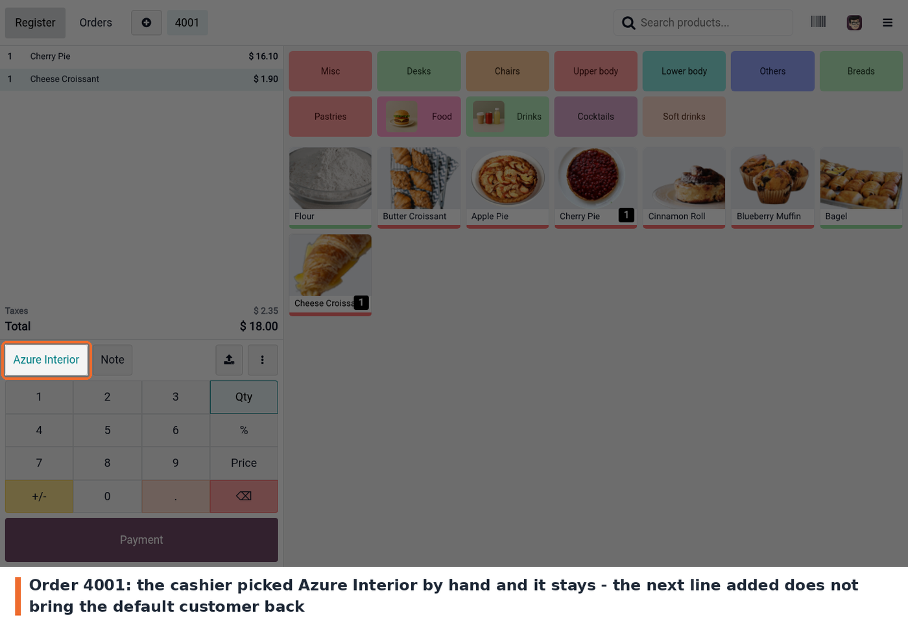

The customer is picked in the Point of Sale settings, in the *PoS Interface* block.

**A new order already has the customer.** Open the Point of Sale and start an order: the
customer button at the bottom of the ticket already shows the configured customer. Nobody
opened the customer list.

**The cashier can still change it.** Tapping the customer button opens the usual customer
list; once another customer is selected, that choice stays on the order — adding more lines
does not bring the default customer back.

