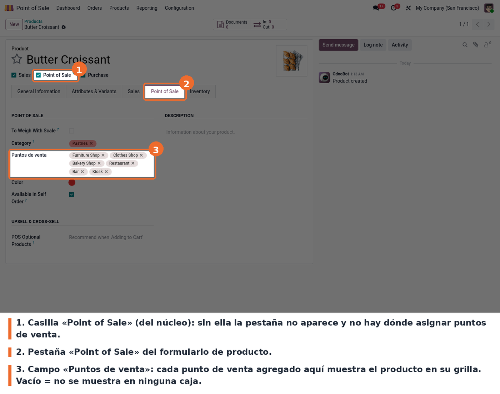
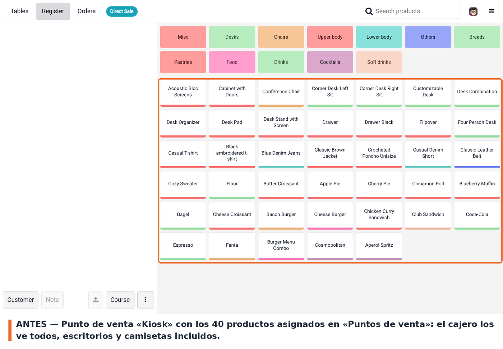
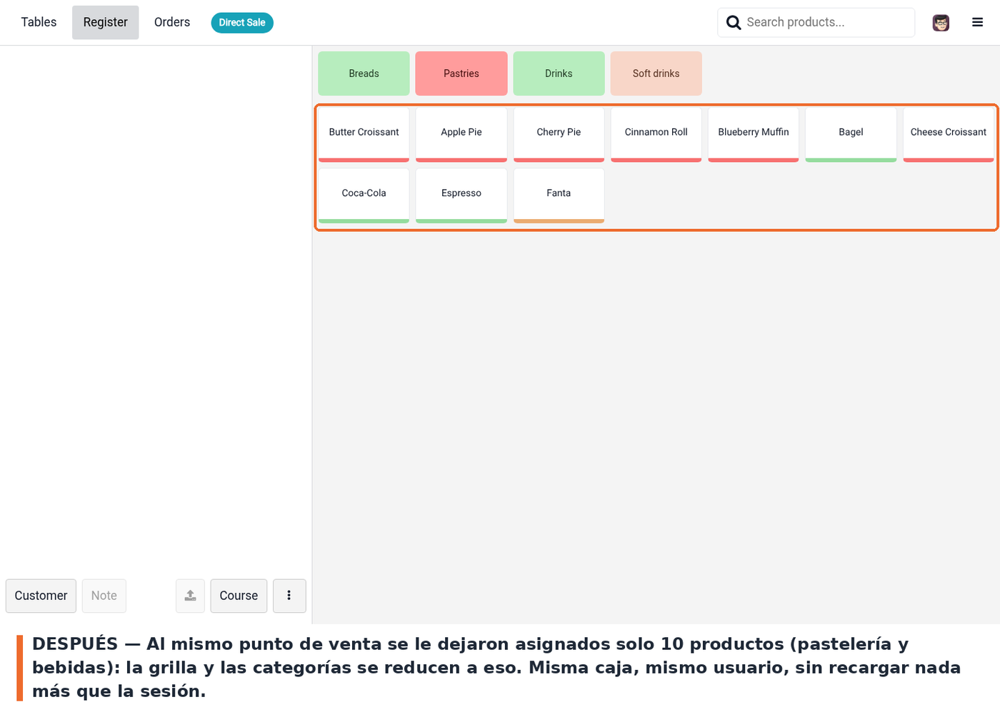

La asignación se hace en la ficha del producto, pestaña **Point of Sale**, campo **Puntos de
venta**.

El cajero no hace nada distinto: abre su caja y la grilla ya viene recortada. En el ejemplo,
el punto de venta **Kiosk** tenía asignados los 40 productos de la base de demostración
—muebles, ropa, panadería y bebidas, todo junto—.

Se le quitó el punto de venta **Kiosk** del campo **Puntos de venta** a todo lo que no fuera
pastelería ni bebidas, y se volvió a entrar a la misma caja. Quedan diez productos, y las
categorías vacías también desaparecen de la barra superior.

