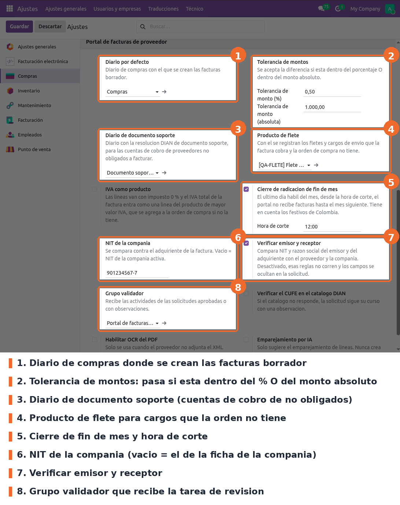
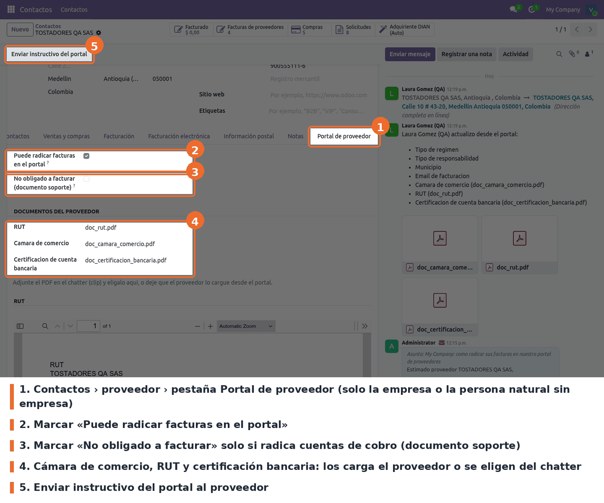
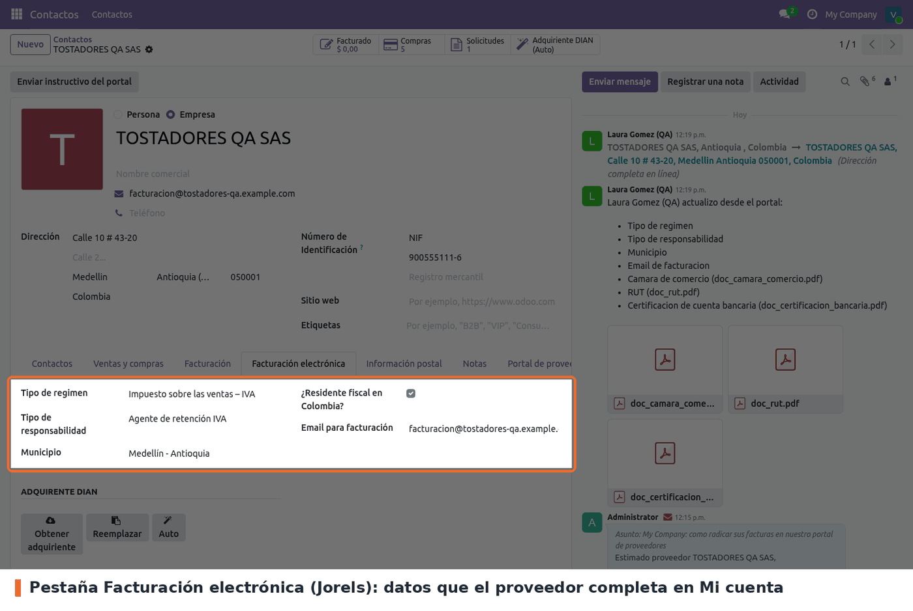
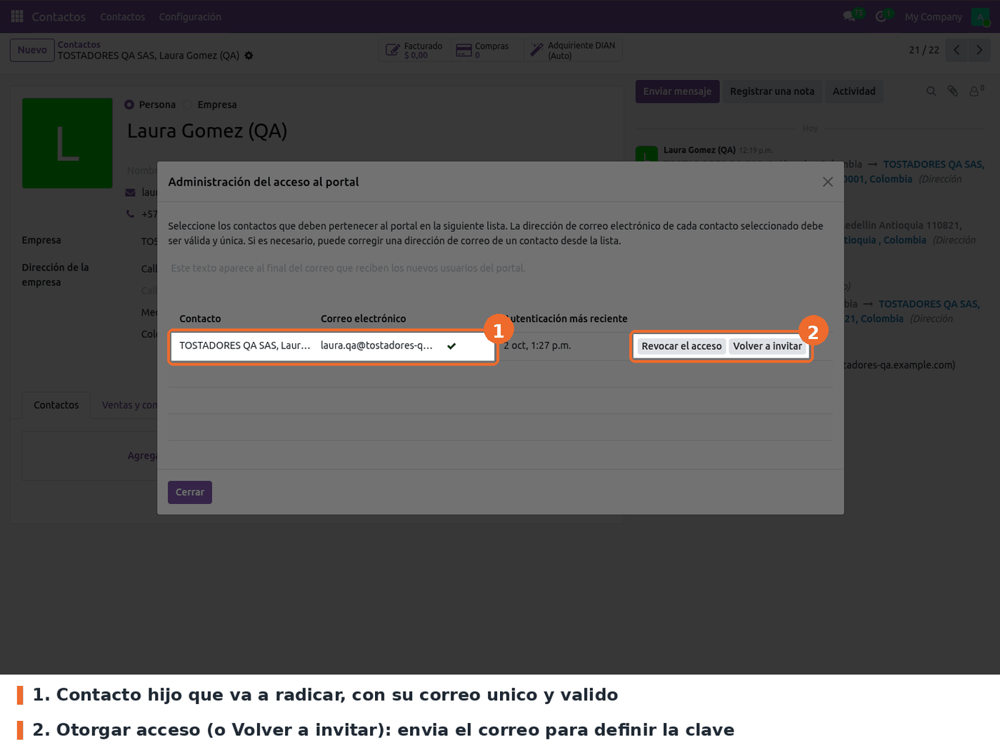
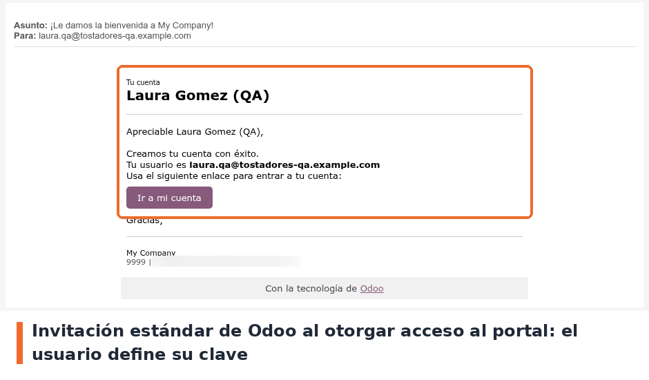
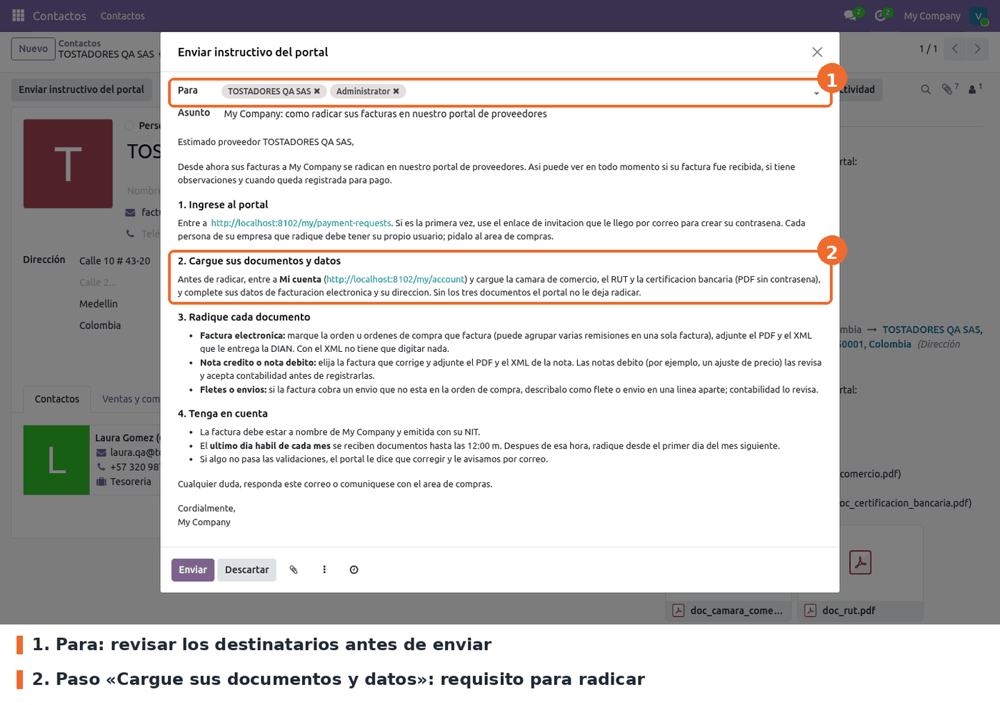

## Ajustes del módulo

*Compras › Configuración › Ajustes*, bloque **Portal de facturas de proveedor**. Ese menú es de
*Administración / Ajustes*: un *Compras: Administrador* sin ese permiso no lo ve.

- **Diario por defecto** (`spr.default_journal_id`): diario de compras donde se crean las
  facturas borrador.
- **Diario de documento soporte** (`spr.support_journal_id`): diario con la resolución DIAN de
  documento soporte. Ahí se registran las cuentas de cobro. Sin este diario, *Crear factura* no
  funciona para una cuenta de cobro.
- **Producto de flete** (`spr.freight_product_id`): producto de servicio para los fletes que la
  factura cobra y la orden no tiene. Sin él, *Crear factura* no funciona para una factura con
  flete.
- **Tolerancia de montos**: diferencia admitida entre la factura y lo pendiente de la orden. Pasa
  si está dentro del porcentaje **o** del monto absoluto. Por defecto 0,5 % o 1.000. La misma
  tolerancia porcentual vale para el **precio unitario** de cada línea: es la regla de negocio
  vigente. Un precio de 12.050 contra 12.000 de la orden (0,42 %) pasa sin observación.
- **NIT de la compañía**: dejarlo vacío si el NIT está bien puesto en la ficha de la compañía.
- **Verificar emisor y receptor**: activo por defecto. Compara el NIT del emisor con el proveedor
  y el del adquiriente con la compañía.
- **Cierre de radicación de fin de mes**: activo por defecto, con **hora de corte** a las 12:00.
  El último día hábil del mes, desde esa hora, el portal no recibe documentos hasta el día 1. Tiene
  en cuenta los festivos de Colombia.
- **Grupo validador**: el grupo cuyos usuarios reciben la actividad de revisión.
- **IVA como producto**: apagado por defecto. Activo, las líneas van con el impuesto exento y el
  IVA entra como una línea del producto de mayor valor IVA.
- **Verificar el CUFE en el catálogo DIAN**: apagado por defecto, porque la DIAN pide captcha.
- **OCR del PDF**, **Emparejamiento por IA** y **Conexión de prueba por CLI**: servicios externos
  opcionales. Ver `README.md` del módulo.

## Habilitar un proveedor

Se hace en la ficha de la **empresa**, o de la persona natural que no pertenece a ninguna empresa.
La ficha debe tener el NIT. En un contacto hijo la pestaña no aparece: ese contacto radica a
nombre de su empresa. La pestaña la ven solo los usuarios del grupo **Responsable**.

- **Puede radicar facturas en el portal** (`portal_invoice_enabled`). Sin esta casilla, el
  proveedor entra al portal pero no ve *Radicar facturas*.
- **No obligado a facturar (documento soporte)** (`spr_support_document`). Marcarla solo para
  quien radica cuentas de cobro: le agrega el tipo *Cuenta de cobro* y no le pide XML.
- **Documentos del proveedor**: cámara de comercio, RUT y certificación bancaria. Normalmente los
  carga el proveedor desde *Mi cuenta*. Desde el backend se adjunta el PDF en el chatter y se
  elige en el campo. Debajo se ve la vista previa de cada uno.
- La pestaña **Facturación electrónica** (Jorels) muestra los datos que el proveedor completa en
  *Mi cuenta*.

## Dar acceso al portal

- En la empresa, pestaña *Contactos*, crear un contacto hijo con correo para cada persona que va a
  radicar. Luego, en ese contacto, ir a *Acción › Otorgar acceso al portal*. Es el asistente
  estándar de Odoo y requiere permisos de administración: un *Compras: Administrador* recibe
  "No tiene suficientes permisos".

- Odoo envía la invitación y el usuario define su clave. Si hay varias bases sin `dbfilter`, el
  enlace hay que abrirlo después de entrar a `/web/login?db=<base>`.

- Pulsar **Enviar instructivo del portal** en la ficha de la empresa. Se abre el correo con el
  paso a paso y la guía en PDF ya adjunta: solo hay que revisar los destinatarios y enviar.

## Permisos

- **Validador**: ve las solicitudes, valida, empareja líneas a mano, toma la revisión y crea la
  factura borrador.
- **Responsable**: lo anterior, más rechazar, aceptar notas débito, devolver a borrador, cancelar
  y habilitar proveedores. *Compras: Administrador* es Responsable sin asignarlo.
- Los grupos se asignan en la ficha del usuario, sección *Portal de facturas de proveedor*.
- **Requisito con Jorels: los validadores deben tener *Facturación electrónica / Usuario*.** El
  personal de contabilidad y compras que revisa solicitudes tiene ese acceso. Sin él, *Crear
  factura* sí crea el borrador, pero al abrirlo Odoo muestra "Error de acceso … Eventos del
  Radian", y tampoco se puede confirmar.
- El proveedor (usuario del portal) solo ve las solicitudes de su empresa.
