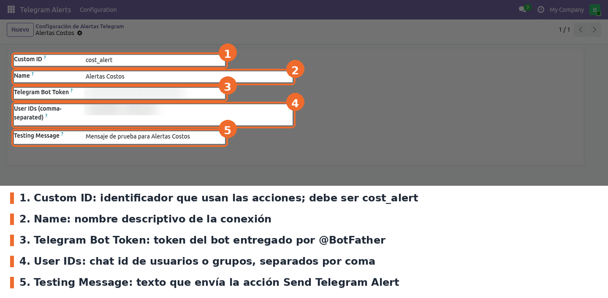
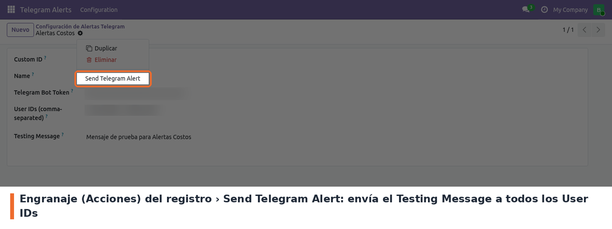
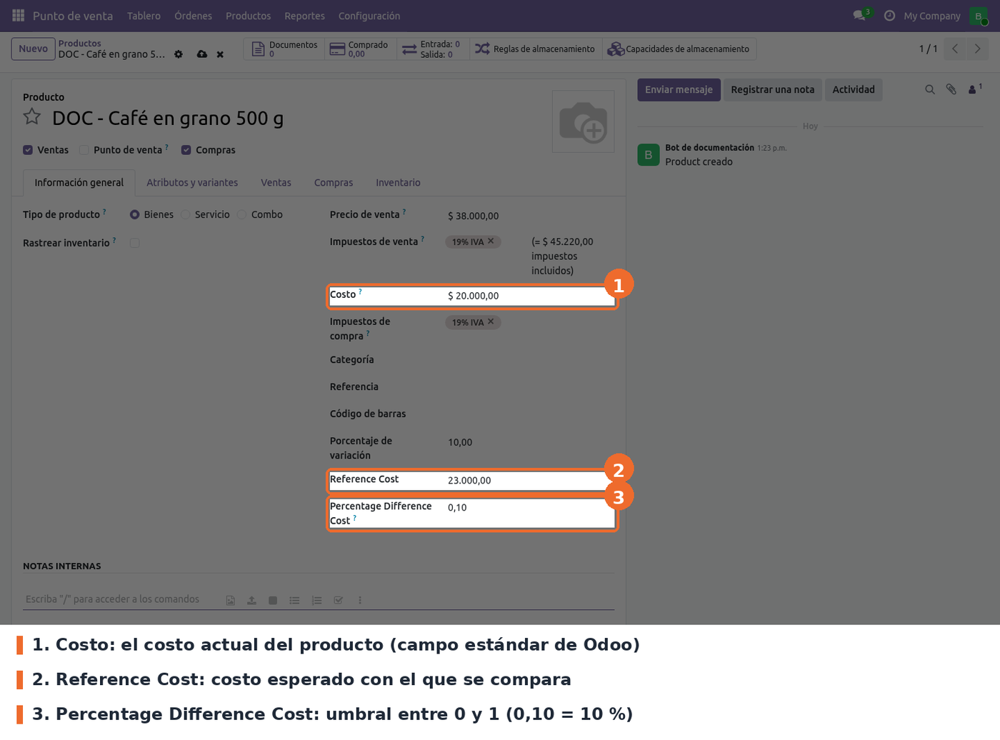
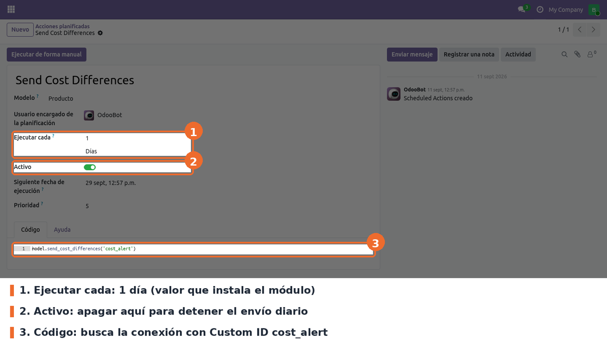

## Conexión con Telegram

Ir a **Telegram Alerts › Configuration** y abrir la conexión *Alertas Costos* (o crear una con
**Nuevo**). Todos los campos son obligatorios y ninguno tiene valor por defecto en el formulario.

- **Custom ID** (`identifier`). Obligatorio. Es la clave con la que las acciones encuentran la
  conexión. La acción planificada y la acción *Send Cost Differences* buscan exactamente
  `cost_alert`: si se cambia, dejan de enviar y fallan con *Telegram configuration not found*.
- **Name** (`name`). Obligatorio. Nombre descriptivo; no interviene en el envío.
- **Telegram Bot Token** (`token`). Obligatorio. El token que entrega @BotFather. Se muestra
  enmascarado en pantalla.
- **User IDs (comma-separated)** (`user_ids`). Obligatorio. Identificadores de chat de Telegram,
  separados por coma. Pueden ser usuarios (número positivo) o grupos (número negativo). Los
  espacios alrededor de cada coma se ignoran. Cada alerta se envía a todos.
- **Testing Message** (`msg_test`). Obligatorio. Texto que envía la acción de prueba.

Para probar la conexión, abrir el registro y, en el engranaje junto al nombre, elegir **Send
Telegram Alert**. Envía el *Testing Message* a cada chat de *User IDs*. Si no hay error, la
conexión funciona.

## Umbral de costo por producto

En el formulario del producto (por ejemplo desde **Punto de venta › Productos › Productos**),
pestaña *Información general*, debajo de *Costo*, aparecen dos campos nuevos. Un producto solo
entra en la revisión diaria si tiene **los dos** con valor distinto de cero.

- **Reference Cost** (`reference_cost`). Opcional; 0 por defecto. El costo esperado del producto.
- **Percentage Difference Cost** (`percentage_difference_cost`). Opcional; 0 por defecto. Umbral
  expresado **como fracción entre 0 y 1**: 0,10 significa 10 %. Un valor fuera de ese rango no se
  puede guardar (*The Percentage Difference Cost must be between 0 and 1*). Con la interfaz en
  español el separador decimal es la coma: escribir `0,10`, no `0.10`.

El campo *Porcentaje de variación* que se ve en la misma pantalla no es de este módulo (lo agrega
`purchase_price_validation`) y usa otra escala.

## Acción planificada

**Ajustes › Técnico › Automatización › Acciones planificadas** (requiere el modo desarrollador),
registro **Send Cost Differences**.

- **Ejecutar cada**: 1 día, valor que instala el módulo. La hora de envío es la de *Siguiente
  fecha de ejecución*.
- **Activo**: encendida al instalar. Apagarla detiene la alerta diaria.
- **Código**: `model.send_cost_differences('cost_alert')`, es decir, usa la conexión con Custom ID
  `cost_alert`.

**Atención:** la conexión de ejemplo y la acción planificada se cargan sin `noupdate`. Cada vez
que se actualiza el módulo, Odoo vuelve a escribir los valores del archivo de datos: el token, los
chats y el mensaje de *Alertas Costos*, y el intervalo y el estado *Activo* de la acción
planificada. Hay que revisarlos después de cada actualización (ver *Limitaciones conocidas*).
