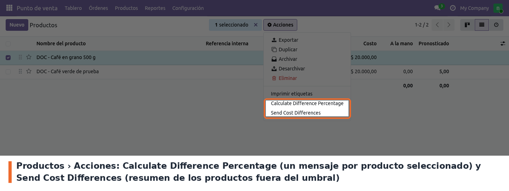

## Flujo

1. Cargar en cada producto a vigilar su *Reference Cost* y su *Percentage Difference Cost*.
2. Una vez al día la acción planificada revisa todos los productos activos que tienen los dos
   campos distintos de cero y compara el costo actual (*Costo*) con el de referencia.
3. Si hay productos por fuera del umbral, envía **un solo mensaje** a cada chat de la conexión
   `cost_alert`, con el encabezado *Productos con costo por fuera del umbral* y una línea por
   producto: nombre, costo actual y diferencia en porcentaje.
4. Si ningún producto está fuera del umbral, no se envía nada.

La diferencia es el valor absoluto de (referencia − costo) / costo × 100, y se compara con el umbral × 100.
Un producto con diferencia exactamente igual al umbral no se informa.

## Acciones manuales en productos

En la lista de productos, al seleccionar uno o más, el menú **Acciones** muestra dos opciones del
módulo. Las dos envían a Telegram en cuanto se eligen, sin pedir confirmación.

- **Send Cost Differences** hace exactamente lo mismo que la acción planificada, en el momento.
  **No tiene en cuenta la selección**: revisa todos los productos con umbral configurado.
- **Calculate Difference Percentage** envía **un mensaje por cada producto seleccionado** con la
  diferencia entre el costo de referencia y el costo (con signo), sin comparar contra el umbral.
  El mensaje no incluye el nombre del producto, así que conviene usarla con un solo producto a la
  vez. Usa la **primera conexión** que encuentre, sin importar su Custom ID.

## Casos especiales

- **Producto con costo en cero** y umbral configurado: la revisión diaria lo incluye igual en el
  mensaje, como *nombre with cost: 0.0*, para avisar que le falta el costo.
  *Calculate Difference Percentage* responde *Standard price is zero, cannot calculate
  difference*.
- **Productos archivados**: no se revisan.
- **Varias conexiones**: la revisión diaria usa solo la de Custom ID `cost_alert`. *Send Telegram
  Alert* prueba la conexión abierta (o las seleccionadas en la lista).

## Solución de problemas

- **Error *Telegram configuration not found*.** No existe una conexión con Custom ID `cost_alert`
  (o ninguna conexión, en el caso de *Calculate Difference Percentage*). Crearla o corregir el
  Custom ID.
- **Error *Client Error ... for url: https://api.telegram.org/...* al enviar.** Telegram rechazó
  el envío. Las causas habituales son un token inválido o revocado (generar uno nuevo con
  @BotFather), un chat de *User IDs* incorrecto, un bot que no está en el grupo o un usuario que
  nunca le escribió al bot. También lo provoca una coma sobrante al final de la lista, porque se
  intenta enviar a un chat vacío. El texto del error incluye el token: no compartirlo tal cual.
- **Llegó a unos chats y a otros no.** Los envíos son en orden; el primer chat que falla corta el
  resto. Corregir ese chat y volver a probar con *Send Telegram Alert*.
- **La alerta diaria dejó de llegar sin error visible.** Revisar en la acción planificada que
  siga *Activa*: Odoo 19 desactiva una acción planificada que falla al menos 5 veces seguidas
  durante más de 7 días. El detalle del fallo queda en el log del servidor.
- **La conexión volvió a tener otro token o otros chats.** Se actualizó el módulo y se recargaron
  los datos de instalación (ver *Configuración › Acción planificada*).
- **El servidor tarda o se queda esperando al enviar.** Ver *Limitaciones conocidas*: la llamada
  a Telegram no tiene tiempo límite.
